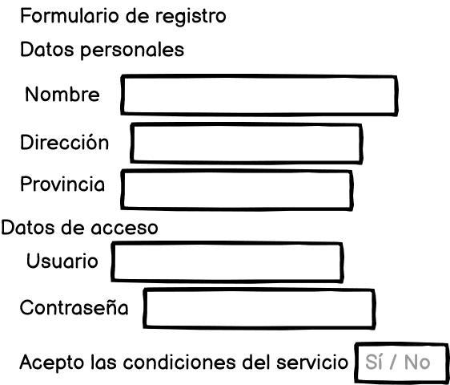
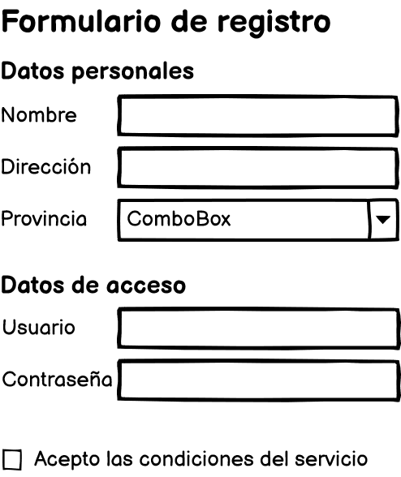

## 1. Interfícies d'usuari

### Activitat 1
T'han encarregat que faces el disseny de la interfície d'usuari per a l'aplicació d'una empresa de lloguer de cotxes amb oficina a l'aeroport. L'aplicació serà utilitzada pels empleats de l'oficina situada a la terminal d'arribades de l'aeroport, que atenen directament els viatgers que volen llogar un cotxe de manera presencial. És habitual que a l'oficina hi haja alumnes de pràctiques de Formació Professional realitzant les FCTs.

La primera decisió que has de prendre és el tipus d'interfície que plantejaràs en el teu disseny: CLI, GUI o NUI. Justifica la resposta.

!!! tip "Resposta"
    Com hem comentat a la teoria, les interfícies tipus GUI són les més habituals en l'àmbit empresarial i segurament seria la millor opció. A més, als usuaris amb poca experiència (com els estudiants en pràctiques) este tipus d'interfícies els facilitarà el seu aprenentatge. No obstrant, es podria combinar amb una interfície tipus CLI que permeta als usuaris experimentats un ús més eficient del sistema. 

<!-- ### Activitat 2 - Escola infantil

Participes en el projecte de desenvolupament d'una aplicació per als docents d'una escola bressol, i t'han encarregat elaborar l'anàlisi del context d'ús (primer pas del disseny centrat en l'usuari). L'aplicació estarà instal·lada en un ordinador a cada aula i l'objectiu és facilitar el màxim possible la tasca dels professors del centre.

!!! tip "CLAUS DE RESOLUCIÓ"
    Recorda que el context d'ús està format tant per les tasques que realitzen els usuaris, com per les característiques dels usuaris i de l'entorn d'ús que poden ser rellevants per al disseny de la solució.

     -->

## 2. Usabilitat

### Activitat 2

No tots els components de la usabilitat vistos en aquest apartat (aprenentatge, record, eficàcia, errors i satisfacció) tenen la mateixa importància a totes les aplicacions. Segurament, els components de la usabilitat amb més pes en un joc no seran els mateixos que els d'una aplicació de retoc fotogràfic.

En aquest cas pràctic hauràs d'ordenar de més a menys importància els cinc components de la usabilitat en una aplicació d'àmbit empresarial (per exemple, un programari de gestió de la comptabilitat).

!!! tip "Resposta"
    1. Eficàcia: és la més important per a l'empresa.
    2. Recuerd: una vegada apresa no haurien de fer un esforç per memoritzar com fer algunes tasques 
    3. Gestió dels errors: ja que pot tindre una repercussió important en la eficiència de l'usuari.
    4. Satisfacció: no és tan important ja que l'àmbit és laboral, no l'oci.
    5. L'aprenentatge:ja que es pressuposa que s'han de formar en el seu ús.

## 3. Pautes de disseny

### Activitat 3

Durant el disseny d'una aplicació per a la compra de peces de roba es planteja la qüestió de quin tipus de controls utilitzar per als camps següents:

- Quantitat de peces (el màxim és de 10).
- Talla (les possibles opcions són S, M i L).
- Si l'usuari vol que s'embolique la peça per a regal.
- En cas que siga per a regal, el missatge que es posarà a la targeta.

Quin tipus de control dels comentats en la teoria seria més adequat per a cada cas?

!!! tip "Resposta"
    - Quantitat: com que el màxim està limitat a 10, podríem utilitzar una llista desplegable amb les diferents opcions (els números del 0 al 10). Així, evitem un possible error de lusuari en introduir el valor.
    
    - Talla: com que es tracta únicament de tres opcions, ia més l'usuari ha de triar una opció i només una, els botons de ràdio serien adequats en aquest cas.
    
    - Regal?: en aquest cas una casella de verificació és la millor opció.
    
    - Missatge de la targeta: una entrada de text seria recomanable per a aquest camp.

### Activitat 4 - Formulari
Redissenya el següent formulari de manera que siga més usable per als usuaris. Indica quins controls utilitzaries en cada cas.  

!!! tip "Resposta"
    
