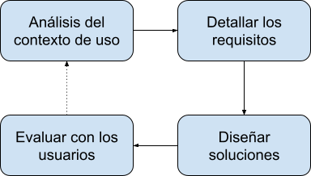
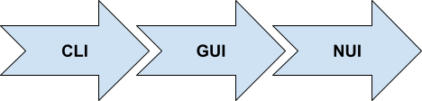

# 1. Interfícies d'usuari

La interfície d'usuari d'un sistema està definida per la manera com els usuaris interactuen amb els components del sistema. Quan parlem de sistemes informàtics, podem distingir dos tipus d'interfícies d'usuari:

- **Interfícies de maquinari**: els components físics que permeten a l'usuari introduir ordres i dades al sistema, i obtenir els resultats (com ara el teclat, el ratolí o el monitor).
- **Interfícies programari**: les aplicacions utilitzades pels usuaris per dur a terme una tasca concreta.

!!!note "HCI"
    La Interacció Persona-Ordinador (en anglés *Human-Computer Interaction o HCI*) és la disciplina científica que s'encarrega de l'estudi de les interfícies entre els humans i els ordinadors en l'ús de sistemes interactius.

Al mòdul de Desenvolupament d'Interfícies abordarem diferents qüestions relacionades amb la construcció d'interfícies de programari, així com alguns aspectes relacionats amb la implantació de les aplicacions. 

## 1.1 Disseny centrat en l'usuari

El disseny d'interfícies d'usuari actualment es regeix per l'anomenat disseny centrat en l'usuari, una filosofia de disseny on el focus se centra en les característiques i necessitats de les persones a qui va dirigit un producte o servei. Aquest corrent sorgeix en contraposició a altres com el disseny centrat en el producte, en què tot el procés gira al voltant del producte que es desenvolupa, i són els usuaris els que s'hi han d'adaptar. 

!!! note "Disseny centrat en l'usuari"
    L'enginyer americà Donald Norman va popularitzar el concepte de disseny centrat en l'usuari als anys 80 i 90. L'any 1999 es va crear la norma ISO 13407, que estandarditza el procés de disseny centrat en l'usuari per a sistemes interactius. L'any 2010, es va revisar i actualitzar com a ISO 9241-210.

El procés que s'associa al disseny centrat en l'usuari es resumeix en l'esquema següent:

- **Anàlisi del context d'ús**: s'investiguen totes les característiques del context dús del producte o servei, que inclou tant la tasca a realitzar com les particularitats dels usuaris i de l'entorn d'ús.
- **Detallar els requisits**: tenint en compte l'anàlisi realitzat al pas anterior, s'especifiquen els requisits que el producte o servei ha de complir. 
- **Dissenyar solucions**: a continuació, es començarà amb el disseny de possibles solucions (prototips) que complisquen els requisits detallats. S'evolucionarà des d'un disseny inicial aproximat fins a un disseny complet i detallat. 
- **Avaluar amb els usuaris**: l'avaluació de les solucions pels usuaris és un punt de vital importància en el disseny centrat en l'usuari i s'ha de fer des de les primeres versions de la solució. Com a resultat de l'avaluació, és probable que s'haja de tornar a una etapa anterior del procés.

!!! warning "Important"
    Tot i que l'aplicació del disseny centrat en l'usuari consumeix recursos i comporta un esforç extra en el desenvolupament d'un projecte, contribueix a assegurar l'èxit final i, per tant, s'ha de prendre sempre com a guia.

## 1.2 Evolució de les interfícies d'usuari

Tenint en compte l'evolució en el temps de les interfícies programari d'usuari, podem distingir tres grans tipus d'interfícies: CLI, GUI i NUI.

### A. Interfícies tipus CLI

Les interfícies tipus CLI (de l'anglés, *Command Line Interface*) o interfícies de línia d'ordres són les primeres que van sorgir, amb l'objectiu que l'usuari d'un ordinador pogués interactuar amb el sistema operatiu. Aquest tipus d'interfícies es basa en la introducció d'ordres mitjançant línies de text, i implica que l'usuari conega les regles sintàctiques per construir aquestes ordres.

Actualment es continuen utilitzant interfícies tipus CLI en diferents àmbits. I no només per interactuar amb els sistemes operatius, sinó que multitud d'entorns i aplicacions ofereixen la possibilitat a l'usuari d'interactuar mitjançant ordres de text. L'eficiència que s'aconsegueix amb aquest tipus d'interfícies, a més de les possibilitats d'automatització, són algunes de les raons perquè seguisquen tenint vigència.

!!! example "git"

    Un exemple clar dús actual d'interfícies de tipus CLI és el gestor de versions git, utilitzat en multitud de projectes de desenvolupament de programari. Tot i que hi ha diferents interfícies gràfiques per a git, el més habitual és utilitzar-lo per mitjà d'ordres.

!!! example "Cloud"
    La majoria de plataformes de núvol públic (com *Amazon Web Services, Microsoft Azure o Google Cloud*) ofereixen una interfície de tipus CLI per crear i mantenir la infraestructura de serveis al núvol. Aquesta possibilitat permet automatitzar tasques relacionades amb el núvol dins dels processos de desplegament de les aplicacions.

### B. Interfícies tipus GUI

Les interfícies gràfiques d'usuari (de l'anglés, *Graphical User Interface*) són aquelles que utilitzen imatges i objectes gràfics per representar la informació i les accions que els usuaris poden realitzar. Solen utilitzar metàfores del món real (com les finestres o els botons) i, a diferència de les interfícies CLI, donen llibertat d'exploració a l'usuari, que no necessita conéixer una estricta sintaxi. 

Les interfícies tipus GUI es van popularitzar durant els anys 80 gràcies a la seua introducció als sistemes operatius d'Apple i Microsoft, encara que el seu origen real es remunta a l'any 1973. Aquest any es va presentar l'ordinador *Xerox Alto*, el primer a utilitzar la metàfora de l'escriptori i un dispositiu apuntador (el ratolí). 

!!! info "GUIs"
    Actualment, les interfícies de tipus GUI són les més comunes a les aplicacions destinades a l'àmbit empresarial, i per això el mòdul de Desenvolupament d'Interfícies se centra en la construcció d'aquest tipus d'interfícies.

### C. Interfícies tipus NUI

Les interfícies NUI o interfícies naturals d'usuari (de l'anglès, *Natural User Interface*) es caracteritzen per oferir a l'usuari un estil d'interacció molt més directe i intuïtiu que amb els tipus d'interfícies anteriors. Solen mancar de dispositiu físic d'entrada (com teclat o ratolí), i en el seu lloc fan ús d'habilitats naturals com el moviment, els gestos o la veu. 

!!! example "NUI"
    Les interfícies tàctils dels dispositius mòbils (com els telèfons intel·ligents o les tauletes) són un clar exemple d'interfícies NUI, ja que permeten a l'usuari realitzar accions per mitjà de gestos naturals (per exemple, navegar entre imatges fent-les lliscar a la pantalla del dispositiu). També els assistents de veu (com Google Assistant o Amazon Alexa) són exemples d'interfícies naturals, en aquest cas controlades per mitjà de la veu.

