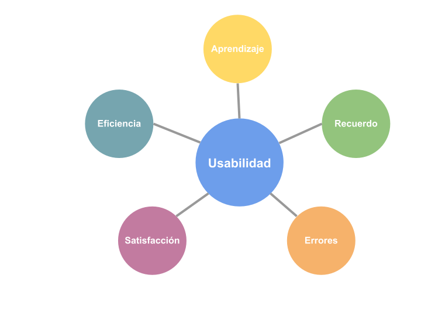
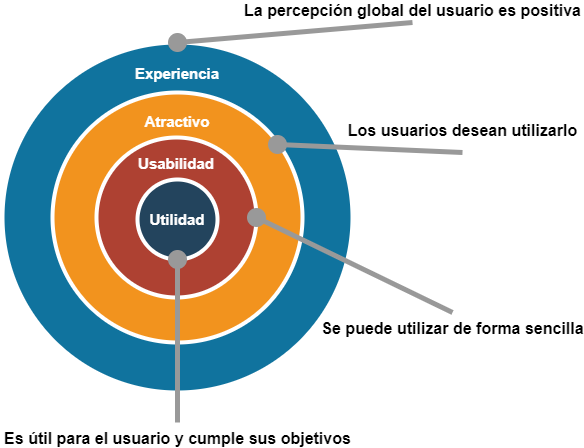

# 2. Usabilitat

No és senzill trobar una definició exacta d'usabilitat, però en termes generals es podria dir que la usabilitat d'un sistema és la **facilitat amb què els usuaris poden fer servir aquest sistema** per a dur a terme una tasca concreta. Però no hem de pensar que la usabilitat és simplement un sinònim de facilitat, ja que com veurem més endavant, hi ha molts altres factors que influeixen en la usabilitat d'una aplicació.

El terme usabilitat és un neologisme, adaptat del vocable anglés *usability*. Encara que la Reial Acadèmia Espanyola (RAE) no ho inclou al seu diccionari, el seu ús està acceptat i és molt habitual en l'àmbit tecnològic.

La usabilitat és un dels conceptes clau dins del procés de disseny centrat en l'usuari que vam veure a l'apartat anterior, i ha d'estar present tant en el disseny de les possibles solucions com en la seua avaluació posterior. 

Són diverses les normes internacionals que inclouen recomanacions relacionades amb la usabilitat, com ara:

- ISO 9241-11 (Usabilitat: definicions i conceptes).
- ISO/IEC 25010 (Qualitat en programari i sistemes).
- ISO/TR 16982 (Mètodes d'usabilitat com a base al disseny centrat en l'usuari).

## 2.1 Components de la usabilitat

La usabilitat d'un producte o sistema es considera habitualment formada per cinc components:

### A. Aprenentatge.

Un dels components principals de la usabilitat és la facilitat d'aprenentatge, determinada per l'esforç amb què un nou usuari de la nostra aplicació pot arribar a completar una tasca específica. També és important que en els usos successius de l'aplicació l'usuari trobe l'aplicació cada vegada més fàcil d'utilitzar.

Per facilitar l'aprenentatge, un dels aspectes clau és la consistència amb els estàndards establerts a la resta d'aplicacions. Per exemple, la majoria de les aplicacions associen la drecera de teclat Ctrl+C amb l'acció de copiar. Si ho fem així també al nostre producte, estarem facilitant l'aprenentatge.

### B. Eficiència.

Un altre requisit per a la bona usabilitat de l'aplicació és l'eficiència. L'usuari, un cop ha aprés el nostre disseny, ha de ser capaç d'executar les tasques per a les quals s'ha creat el producte tan ràpid com siga possible i sense impediments, seguint el procés més senzill.

Moltes aplicacions ofereixen als usuaris experimentats formes alternatives de dur a terme les tasques que ajuden a millorar l'eficiència, com ara la definició de dreceres de teclat personalitzades o la creació de macros per encadenar diverses accions.

### C. Record.

També és important que si un usuari està un temps sense utilitzar el nostre disseny, l'esforç de recordar quan el torna a fer servir el producte siga el mínim possible. Hem d'evitar que l'usuari haja de memoritzar la manera com es fan les tasques.

Un recurs que s'utilitza en algunes aplicacions per evitar memoritzar l'usuari són els assistents, que van guiant pas per pas per fer una tasca llarga o especialment complexa.

### D. Errors.

Una part fonamental de la usabilitat és la relacionada amb els errors. L'aplicació ha de ser capaç de tolerar un ampli ventall d'accions realitzades per l'usuari sense generar un error. En cas que l'error es produïsca, cal informar adequadament l'usuari del tipus d'error i la gravetat, i proporcionar informació per poder corregir l'error. Per a tal finalitat, ens pot ajudar molt un tractament d'excepcions adequat.

Hem de prestar especial atenció al llenguatge utilitzat en els missatges d'error que es mostren a l'usuari, ja que la forma d'expressar la situació produïda pot tindre una influència negativa. Cal evitar el llenguatge acusatori i intimidador, així com la descripció excessivament tècnica de l'error.

### E. Satisfacció.

El darrer component de la usabilitat és la satisfacció de l'usuari en utilitzar el nostre producte. El disseny ha d'aconseguir que l'experiència de l'usuari amb la nostra aplicació siga agradable i la seua sensació subjectiva després de l'ús siga positiva.

La satisfacció de l'usuari està en gran manera influenciada per l'aparença visual de la interfície, que hauria de ser estèticament agradable però minimalista. En aquest sentit és important seguir les pautes de disseny que veurem a l'últim apartat de la unitat.

## 2.2 Avaluació de la usabilitat

Com vam veure a l'apartat anterior, una de les fases del procés de disseny centrat en l'usuari és l'avaluació, i la usabilitat és un dels factors clau que cal avaluar. Des dels primers prototips del nostre producte hem de validar el disseny amb els nostres usuaris, cosa que ens aportarà informació molt valuosa per millorar i evolucionar cap a la solució final.

Podem destacar els tres objectius següents de l'avaluació de la usabilitat:

- Identificar problemes en el disseny del producte o servei.
- Descobrir noves oportunitats de millora del disseny que no ens havíem plantejat.
- Aprendre sobre el comportament i les preferències dels nostres usuaris.

### A. Què hem d'avaluar?

La primera pregunta que hem de respondre a l'hora de plantejar l'avaluació de la usabilitat d'un disseny és què avaluarem. Les sessions d'avaluació de la usabilitat consisteixen a plantejar a un grup d'usuaris la realització d'una sèrie de tasques realistes que podrien fer a la feina diària amb l'aplicació.

Les tasques que es plantegen poden ser molt específiques o amb un resultat obert, depenent dels objectius de la prova. Però sempre haurem de ser molt curosos amb la manera d'especificar la tasca, per evitar malentesos i confusions a l'usuari. També hem d'evitar dirigir l'usuari excessivament, i permetre que utilitze lliurement el disseny.

!!! warning "Important"
    A l'hora d'escollir les tasques que els usuaris hauran de realitzar a la sessió d'avaluació de la usabilitat, hem de prioritzar les més rellevants per a la nostra aplicació. Es recomana que no siguen més de cinc tasques per participant, i que la durada total de la sessió no supere una hora.

A més de les tasques que es plantejaran a l'usuari, hem de decidir què ens interessa mesurar durant la prova. En termes generals, se sol distingir entre dos tipus de mètriques:

- **Qualitatives**: aquest tipus de mètriques són especialment importants a les primeres fases del disseny, i consisteixen en valoracions subjectives que realitza l'usuari durant la prova o en observacions que podem realitzar del seu comportament . 

    !!! example "Exemple"
        Exemples de mètriques qualitatives són el nivell d'estrès de l'usuari (determinat pels seus moviments, gestos o expressions) o la satisfacció de l'usuari després de la prova (que podeu comentar directament o podem recollir amb un qüestionari).

- **Quantitatives**: aquestes mètriques es basen en paràmetres quantificables, i s'utilitzen més quan el disseny està quasi acabat o fins i tot quan el producte ja està en funcionament. 

    !!! example "Exemple"
        Algunes mètriques quantitatives podrien ser el temps que li costa a un usuari dur a terme una tasca, el nombre de tasques que completa en una sessió o la quantitat de vegades que ha hagut d'anar a l'ajuda.

### B. Qui participa en l'avaluació?

A les sessions d'avaluació de la usabilitat podem distingir els rols següents:

- **Moderador**: és l'encarregat de guiar els usuaris participants durant la sessió d'avaluació. Presentarà les tasques a realitzar, resoldrà els dubtes dels usuaris i obtindrà informació mitjançant l'observació o preguntant als usuaris. És recomanable que siga algú extern a l'equip de desenvolupament del producte, i fins i tot de vegades es recorre a professionals especialitzats en aquest tipus d'avaluacions.

    !!! warning "Important"
        El moderador ha de procurar mantenir-se neutral i no influir en els participants. Ha d'intervenir tan poc com siga possible, i quan ho faça ha d'utilitzar un estil d'interacció obert, que permeta a l'usuari expressar-se amb llibertat. Per exemple, en lloc de preguntar si us sembla bé una funcionalitat és millor preguntar per la vostra opinió sobre aquesta funcionalitat.

- **Usuaris**: els participants a la sessió han de ser usuaris potencials del producte o servei que estem dissenyant. Es recomana que a cada sessió d'avaluació participen al voltant de cinc usuaris, ja que a partir d'aquest nombre els problemes d'usabilitat detectats se solen repetir. 

### C. Com es fa l'avaluació?

Hi ha diferents opcions a l'hora de plantejar l'avaluació de la usabilitat:

- **Presencial**: el moderador i els usuaris estan físicament al mateix lloc. Tot i que el moderador sol prendre notes durant la sessió, també és habitual gravar la sessió en vídeo per poder fer una anàlisi més detallada amb posterioritat.
- **Remota**: els participants a la sessió estan en llocs diferents. Solen ser menys costoses que les sessions presencials, i en estar els usuaris en el seu propi entorn de treball solen sentir-se més segurs davant de les tasques a realitzar. Podem distingir dos tipus d'avaluacions remotes:
    - **Moderades**: encara que el moderador i els usuaris estan en ubicacions físiques diferents, interactuen de manera semblant a les sessions presencials, utilitzant algun programari de comunicació que permeta compartir la pantalla de l'usuari.
    - **No moderades**: es fa servir algun programari especialitzat per a avaluacions d'usabilitat, on es configuren les tasques a realitzar. Un cop acabada la sessió, el moderador rep el resultat de l'avaluació (normalment, l'enregistrament de la sessió, un test de valoració de l'usuari i les mètriques quantitatives que s'hagen definit).

## 2.3 Experiència dusuari (UX)

El concepte d'experiència d'usuari o *UX* (de l'anglés, *User Experience*) fa referència a l'experiència completa de l'usuari en relació amb un producte o servei. Una bona experiència d'usuari donarà com a resultat una percepció subjectiva positiva de l'usuari cap a la nostra aplicació.

!!! warning "Important"
    No s'han de confondre els conceptes d'experiència d'usuari i usabilitat, encara que hi ha relació entre ells. La usabilitat és un dels factors que influeixen en una bona experiència d'usuari, però també seran determinants factors com ara la utilitat (que el producte permeta a l'usuari resoldre un problema concret), la credibilitat (que l'usuari confie en el nostre producte) o l'accessibilitat (que el disseny tinga en compte la varietat d'usuaris i dispositius).

Donald Norman (del que ja parlàrem a l'apartat anterior) juntament amb Jakob Nielsen (un dels principals referents en el món de la usabilitat) van proposar els nivells següents en parlar d'experiència d'usuari.

Com veiem, aconseguir una bona experiència d'usuari comença creant un producte o servei que siga útil per a l'usuari i li permeta resoldre un problema concret. El següent pas seria aconseguir que el disseny siga usable, aplicant tot el que hem aprés als apartats anteriors. Una vegada tenim un disseny útil i usable, l'objectiu seria aconseguir un producte atractiu per als usuaris, que han de desitjar utilitzar-lo. L'últim nivell és on s'assoleix una experiència global positiva, aconseguint que la seua opinió subjectiva cap al nostre producte siga bona.

