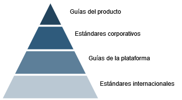
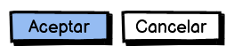
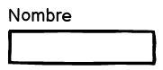
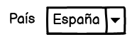
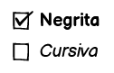
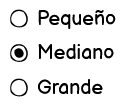

# 3. Pautes de disseny

Com hem vist als apartats anteriors, la interfície d'usuari d'una aplicació ha de ser dissenyada amb l'usuari sempre en ment, i tenir com a objectiu que l'experiència global dels usuaris amb la nostra aplicació siga la més satisfactòria possible. Per aconseguir-ho, és de vital importància conéixer les pautes i recomanacions existents per a cadascun dels components de la interfície, que ens ajudaran sobre manera a aconseguir un disseny exitós.

Les pautes de disseny es troben en diferents tipus de documents, que podem organitzar en els següents nivells:

Al nivell més baix tenim els estàndards internacionals, com les normes ISO comentades en apartats anteriors. Serveixen de base per a la resta de pautes, encara que no són documents amb què els dissenyadors d'interfícies treballen habitualment. 

Prenent com a referència els estàndards internacionals s'elaboren les guies de cada plataforma. Per exemple, Microsoft ha desenvolupat una guia de disseny per a aplicacions d'escriptori per al sistema operatiu Windows i Apple una guia per a cadascuna de les seues plataformes (com macOS o iOS). A l'entorn de les aplicacions per a Linux, hi ha una guia per al GNOME i una altra per al KDE.

!!! warning "Important"
    Les guies de disseny de cada plataforma contenen informació molt útil a l'hora de plantejar el disseny de la interfície d'usuari, i s'han de conéixer i utilitzar per part dels dissenyadors. A les referències de la unitat es pot trobar un enllaç a cadascuna de les guies comentades.

En algunes organitzacions, s'elaboren estàndards corporatius propis relatius al disseny de la interfície, que solen incloure aspectes com la tipografia a utilitzar o les paletes de colors permeses. I respectant aquests estàndards corporatius, de vegades es desenvolupen fins i tot guies de disseny per a aplicacions concretes dins una organització.

Els apartats següents recullen algunes pautes generals que cal tenir en compte a l'hora de fer el disseny de la nostra interfície.

## 3.1 Estructura de la interfície

### A. Principis de disseny

Pel que fa a com estructurar i organitzar els elements que formen la interfície de la nostra aplicació, s'han de tenir presents en tot moment els principis de disseny següents:

- **Contrast**: cal utilitzar els contrastos de color i mida per organitzar la informació i dirigir l'atenció de l'usuari.

    !!! example "Exemple"
        S'utilitza habitualment el color roig per advertir l'usuari d'una acció destructiva o que no es pot desfer, ja que contrasta fortament amb els colors que se solen utilitzar com a fons.

- **Jerarquia**: agrupar els elements que formen la interfície, ordenant-los segons la seua importància.

    !!! example "Exemple"
        Els menús són un exemple típic de jeràrquica a la interfície, ja que ens permeten organitzar les funcionalitats de l'aplicació en categories i subcategories.

- **Proximitat**: podem crear una relació entre diferents elements de la interfície si els situem a prop els uns dels altres. De la mateixa manera, quan dos components de la interfície estan allunyats, l'usuari entendrà que no hi ha relació entre ells.

    !!! example "Exemple"
        A les barres de ferramentes els diferents botons solen estar agrupats segons la seva funcionalitat, de manera que els usuaris els poden localitzar més fàcilment. Per exemple, les opcions de negreta, cursiva i subratllat en un processador de text sempre estan juntes.

- **Alineació**: la correcta alineació dels diferents components de la interfície facilita a l'usuari processar la informació i ens permet guiar-los més fàcilment per les diferents zones de la interfície. L'alineació entre els elements propers és especialment important per evitar errors i sobreesforços a l'usuari.

    !!! example "Exemple"
        Quan dissenyem un formulari perquè l'usuari introdueixi informació, és especialment important l'alineació entre els diferents elements. D'una banda, les etiquetes han d'estar correctament alineades amb els controls que acompanyen. I de l'altra, hem d'alinear uns camps amb els altres per facilitar a l'usuari la seva tasca.

### B. Menús, menús contextuals i barres de ferramentes

Gran part de les aplicacions amb interfície gràfica d'usuari compten amb menús i barres de ferramentes per permetre a l'usuari accedir a les diferents funcionalitats de l'aplicació. Veurem algunes de les pautes més importants a tenir en compte quan fem servir aquests elements:

#### Menús
Si el menú té poques opcions principals (tres o menys) és millor considerar una altra alternativa, com ara una barra amb botons. Si teniu massa opcions principals (més de 10) cal intentar reorganitzar les opcions de menú per reduir-les.

Cal intentar simplificar l'estructura de menús i de submenús, ja que compliquen a l'usuari trobar l'opció desitjada. Si la jerarquia és massa profunda haurem d'intentar reorganitzar les opcions.

Les etiquetes han de ser tan simples com siga possible, recomanant-se una sola paraula a les opcions principals del menú.

Si l'acció associada a una opció de menú requereix obrir una finestra o diàleg, la vostra etiqueta ha d'acabar amb punts suspensius (per exemple, Desa com…).

#### Menús contextuals
Han d'aparéixer en prémer amb el botó dret del ratolí sobre una zona de la interfície, i oferiran un xicotet conjunt d'opcions (no més de 10) relacionades amb l'element sobre el qual heu premut.
Les opcions del menú contextual també han d'estar disponibles des del menú principal de l'aplicació.

Ordenar les opcions de més a menys rellevància per a l'usuari.
Evitar l'ús de submenús als menús contextuals.

#### Barres de ferramentes
Incloure a la barra de ferramentes només les opcions més utilitzades pels usuaris. És recomanable permetre a l'usuari personalitzar els botons presents a les barres de ferramentes.

Com que, en la majoria de les aplicacions, les barres de ferramentes es poden ocultar, les opcions han de ser accessibles d'altres maneres (per exemple, amb el menú principal de l'aplicació).
Les icones utilitzades han de ser consistents amb les que l'usuari sol trobar a la majoria de les aplicacions (per exemple, un disquet per a l'opció de guardar). També és recomanable afegir una descripció de cada acció a manera de *tooltip*.

## 3.2 Controls

Els controls són els components bàsics amb què construïm la interfície gràfica d'una aplicació. 

!!! example "Exemple"
    Alguns exemples de controls són els botons, les caselles de selecció o les llistes desplegables.

La taula següent recull informació sobre l'ús dels principals controls, indicant quan han de ser usats i algunes pautes importants en cadascun.

!!! tip "Pautes d'ús dels controls"

    === "Botons"
        

        Els botons permeten a l'usuari iniciar una acció de manera immediata.

        - Utilitzar etiquetes descriptives de lacció.
        - Ser consistent en tota l'aplicació (posició, colors, icones, mida,...).
        - Situar-los a prop d'altres controls relacionats.
        - Agrupar-los de manera lògica.

    === "Entrada de text"
        

        Permet introduir text de forma lliure. No ho utilitzarem quan hi hagi un control especialitzat més adequat (per exemple, un selector de dates) o quan els possibles valors estiguin restringits (per exemple, la província d'una adreça).

        - L'etiqueta ha d'indicar clarament a l'usuari què ha d'introduir i ser tan curta com siga possible.
        - És preferible situar lʻetiqueta sobre el control, encara que també es pot posar a la seva esquerra.
        - L'amplada del control ha de ser adequada al tipus de dada que conté.

    === "Llista desplegable"
        

        S'utilitzen per triar un valor d'una llista de valors possibles. Són especialment útils quan una de les opcions és la predeterminada, o quan lespai disponible és limitat.

        - Cadascuna de les opcions ha d'estar formada per poques paraules.
        - Les opcions han d'estar ordenades de manera lògica. 
        - Les meta-opcions (com Cap) s'han de situar a l'inici de la llista i entre parèntesis. 
        
    === "Casella de selecció"
        

        S'utilitzen per activar o desactivar una opció, o per seleccionar o deseleccionar una opció dins d'un grup d'opcions. És molt útil quan lusuari pot triar diverses opcions, o no triar cap opció.

        - Les diferents caselles d‟un grup han d‟estar alineades verticalment.
        - Limitar a 10 el número de caselles en un grup.
        - En un grup de caselles totes les etiquetes han de ser homogènies en extensió i en format.
        
    === "Botó de ràdio"
        

        Permet a l'usuari seleccionar una única opció dins d'un grup d'opcions. Són recomanables quan volem que l'usuari vegi totes les opcions alhora, i quan les etiquetes de les opcions sigan extenses.

        - El nombre d'opcions ha de ser inferior a 7.
        - Ordenar les diferents opcions en un ordre lògic per a l'usuari.
        - Seleccionar per defecte l'opció més adequada per a l'usuari.

A les guies de disseny de cada plataforma s'ofereix informació per a altres tipus de controls més específics, com ara les barres de progrés, els controls lliscants o els selectors de data i hora.

## 3.3 Aspecte visual

En aquest apartat es mostren algunes pautes de disseny importants relacionades amb l'aspecte visual de l'aplicació, concretament relatives al color, el text i les icones.

### A. Color

L'ús de diferents colors a la interfície amb fins estètics ha de ser reduït, i s'utilitzarà principalment per comunicar alguna cosa a l'usuari (per exemple, utilitzarem el color roig per comunicar un error o situació perillosa). No obstant això, mai no ha de ser l'única via per comunicar alguna cosa.

Mai referenciar un element de la interfície pel seu color (per exemple, seria incorrecte indicar a l'usuari “Ha de prémer el botó roig”).

La interpretació que fem dels diferents colors pot variar depenent de la cultura dels usuaris, per la qual cosa ens haurem d'assegurar que el significat dels colors siga el que pretenem.

El conjunt de colors que utilitzem en el nostre disseny (conegut com a esquema de color o paleta) han de contrastar de forma adequada.

!!! tip "Paleta de colors"
    S'aconsella utilitzar les paletes del sistema, o un generador de paletes de colors com el que s'inclou a les referències de la unitat.

### B. Text

Es recomana utilitzar les fonts predeterminades de la plataforma a què va destinada l'aplicació (per exemple, les fonts *Segoe UI* a *Microsoft Windows* o *San Francisco* a *Apple macOS*).

La mida del text s'ha de determinar de manera que ajude l'usuari a establir la jerarquia entre els elements de la interfície.

Utilitzar les propietats del text (com la negreta, la cursiva o el subratllat) de forma consistent dins de l'aplicació, i també amb la resta d'aplicacions. Per exemple, els enllaços sempre han d'estar subratllats.

### C. Icones

Com a regla general, no s'han d'usar etiquetes i icones alhora al mateix control. Cal triar una de les dues opcions.
Es recomana utilitzar icones fàcilment identificables per l'usuari, que seguisquen les convencions de la resta d'aplicacions (per exemple, una paperera per a l'acció d'esborrar).

Algunes icones són fàcilment reconeixibles dins d'un grup d'icones, però no fora del grup. Per exemple, una icona amb un quadrat negre representa l'acció de parar en un reproductor multimèdia, però difícilment serà associada a aquesta acció fora del context.

Convé adaptar-se a l'estil visual de les icones de cada plataforma, encara que actualment el més habitual és utilitzar icones amb un disseny simple que representen clarament una acció.

## 3.4 Missatges a l'usuari

La majoria de les aplicacions necessiten mostrar diferents tipus de missatges a l'usuari amb diferents propòsits. Són molt habituals els missatges de confirmació, error o advertència i les notificacions. 

A continuació es llisten algunes recomanacions relacionades amb els missatges a l'usuari:

!!! tip "Missatges a l'usuari"
    - Cal avisar l'usuari abans de començar una acció irreversible i que podria causar una pèrdua d'informació.
    - Cal evitar interrompre l'usuari amb missatges que no siguen importants.
    - Sempre hem d'utilitzar un llenguatge proper a l'usuari, sense incloure informació interna de l'aplicació (com ara codis d'error que no siguen útils per a l'usuari).
    - La manera d'expressar els missatges ha de ser respectuosa amb l'usuari, i utilitzar un estil d'escriptura directe i concís. 
