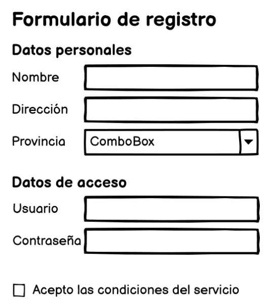
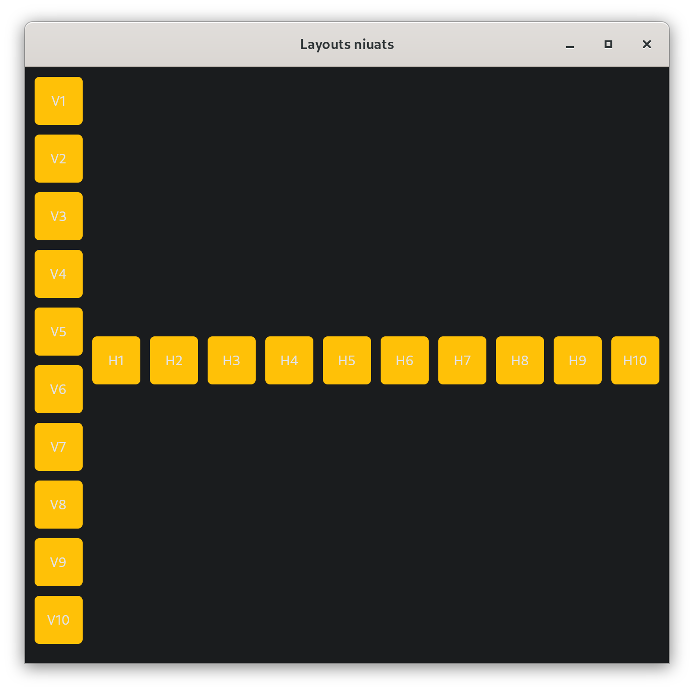
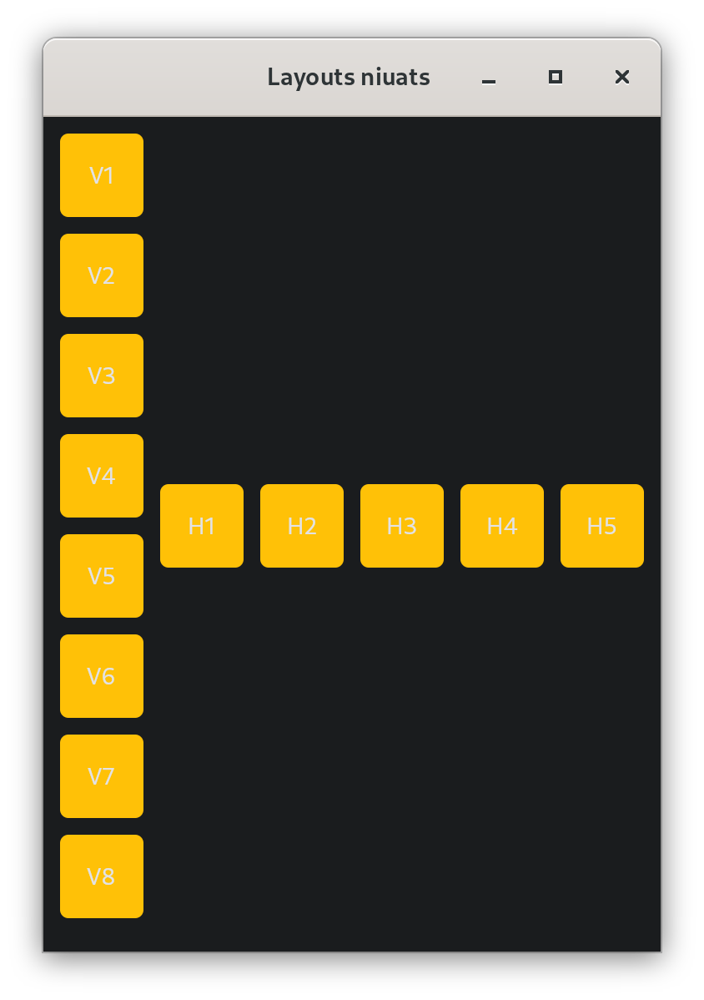

## 1. Activitat 1 - Habilitació i deshabilitació de controls

Partint del següent codi vist en la teoria:

```python
import flet as ft

def main(page):
    def add_clicked(e):
        page.add(ft.Checkbox(label=new_task.value))
        new_task.value = ""
        new_task.focus()
        new_task.update()

    new_task = ft.TextField(label="Tasca pendent", width=300)
    page.add(ft.Row([new_task, ft.ElevatedButton("Afegir", on_click=add_clicked)]))

ft.app(target=main)
```

Modifica'l per a que el botó `Afegir` es desactive **sempre** que la caixa de text *new_task* estiga en blanc.

!!! tip "Pistes"
    - La caixa de text estarà buida en diferents ocasions, al principi, en afegir una tasca i en borrar un text introduït.
    - Fes ús de `disabled` per a canviar l'estat del control.
    - Investiga quins esdeveniments es produixen al borrar el text. 

## 2. Activitat 2 - Formulari

Fes un formulari d'alta d'usuari semblant al que es mostra a la següent imatge. Cada control de tipus caixa de text inclourà un text d'ajuda. La contrasenya es mostrarà oculta, excepte quan es pulse el botó per a mostrar-la.

Inclou també un botó d'enviar, situat al final del formulari a la dreta i inicialment deshabilitat. El botó s'habilitarà quan tots els controls tinguen informació introduïda.
Al donar-li al botó enviar, es comprovaran certes restriccions sobre la informació intruduïda. Si es cumplixen totes les condicions, s'imprimirà per consola el missatge *Formulari enviat*, en cas contrari indicarà quin és l'error que s'ha produït, per exemple, *La contrassenya ha de tindre almenys huit caràcters*.

Usuari:

- comença per lletra
- no conté espais
- no conté caràcters especials

Contrasenya:

- és almenys de llongitud 8
- té almenys una majúscula
- té almenys una minúscula
- té almenys un número
- té almenys un caràcter especial

<center>

{width=50%}

</center>

## 3. Activitat 3 - Layouts niuats

Un layout és un control que a la vegada pot contindre altres controls. Aleshores, podem niuar diversos layouts per dissenyar la nostra aplicació com desitgem.

Desenvolupa una aplicació on pugam canviar (modificant una variable al codi) el nombre d'elements en una columna i en una fila. El tamany de la finestra s'ha de calcular automàticament segons el nombre d'elements que definim, encara que després es podrà reassignar el seu tamany:


<figure markdown>
  { width="300" }
  <figcaption>10 elements en la columna i 10 en la fila</figcaption>
</figure>

<figure markdown>
  { width="300" }
  <figcaption>8 elements en la columna i 5 en la fila</figcaption>
</figure>

!!! tip "Pista"
    - Per a canviar el tamany fes ús de la propietat page.window_width i page.window_height.
    - Pensa quants i de quin tipus són els layouts abans de començar a desenvolupar.


    
## 4. Activitat 4 - Navegació entre vistes

Partint del code viste en teoria:

!!! example "Navegació entre dues rutes amb diferent vista"

    ```python
    '''Exemple de navegació entre vistes de Flet'''
    import flet as ft

    def main(page: ft.Page):
        '''Funció principal'''
        page.title = "Routes Example"

        def route_change(route):
            page.views.clear()
            page.views.append(
                ft.View(
                    "/",
                    [
                        ft.AppBar(title=ft.Text("Flet app"), bgcolor=ft.colors.SURFACE_VARIANT),
                        ft.ElevatedButton("Visit Store", on_click=lambda _: page.go("/store")),
                    ],
                )
            )
            if page.route == "/store":
                page.views.append(
                    ft.View(
                        "/store",
                        [
                            ft.AppBar(title=ft.Text("Store"), bgcolor=ft.colors.SURFACE_VARIANT),
                            ft.ElevatedButton("Go Home", on_click=lambda _: page.go("/")),
                        ],
                    )
                )
            page.update()

        def view_pop(view):
            page.views.pop()
            top_view = page.views[-1]
            page.go(top_view.route)

        page.on_route_change = route_change
        page.on_view_pop = view_pop
        page.go(page.route)


    ft.app(target=main, view='web_browser', port=8080)
    ```

Fes les modificacions pertinents per a que el comportament siga el que es mostra al següent vídeo (simula una tenda amb un carro, es pot tornar sempre al home amb el botó, des del carro també es pot tornar a la tenda, i amb el botó automàtic de l'AppBar, es pot seguir el camí Carro -> Tenda -> Home):

<center>


</center>

## Activitat 5 - Dialeg d'alerta

Partint del codi de l'activitat 1