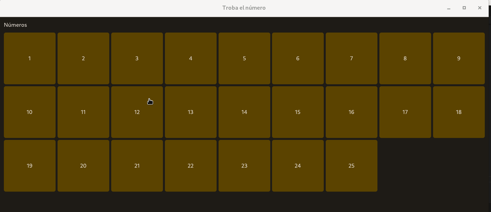
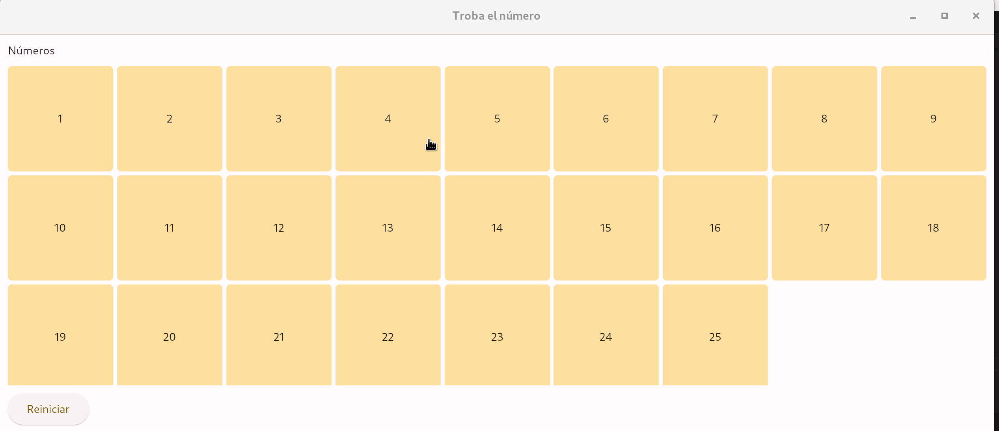

## Pràctica 1 - "Troba el número"

Es pretén implementar un joc l'objectiu del qual és trobar el número buscat. A la pantalla es veuran una sèrie de números que al clicar sobre ells et portaran a una nova vista indicant si és el número trobat o per contra no és el número que es buscava. El joc acabarà en trobar el número buscat, moment en què es ja no es podrà clicar sobre estos i apareixerà un botó per reiniciar el joc. El número de ítems es podrà canviar programàticament simplement canviant el valor d'una de les variables al codi.

!!! tip "Aplica la POO"
	Fins ara hem utilitzat la programació estructurada per als nostres desenvolupaments amb Flet. Passa al paradigma de programació orientat a objectes per a facilitar el desenvolupament del joc.

	```python
	import flet as ft
	

	class App:
		def __init__(self) -> None:
			ft.app(target=self.main)
			...

		def main(self, page: ft.Page):
			self.page = page
			...

	if __name__ == "__main__":
    app = App(25)
	```
  

Observeu el següent vídeo on es mostra el comportament del joc:

<center>

  { width=100% }
  <figcaption>Dark Theme</figcaption>

</center>


<center>

  { width=100% }
  <figcaption>Light Theme</figcaption>

</center>

