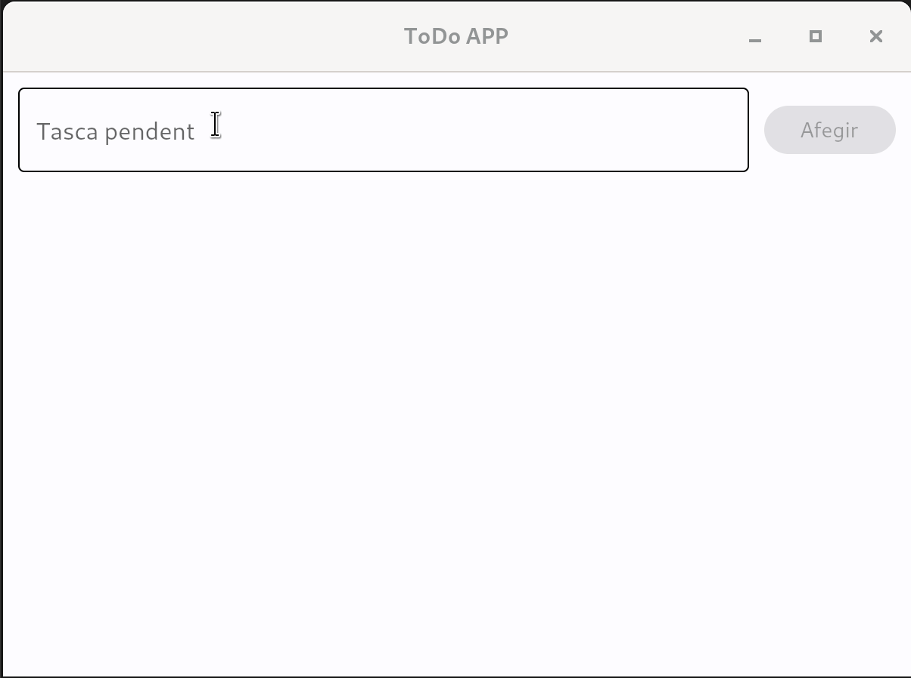
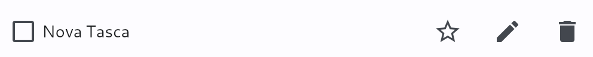
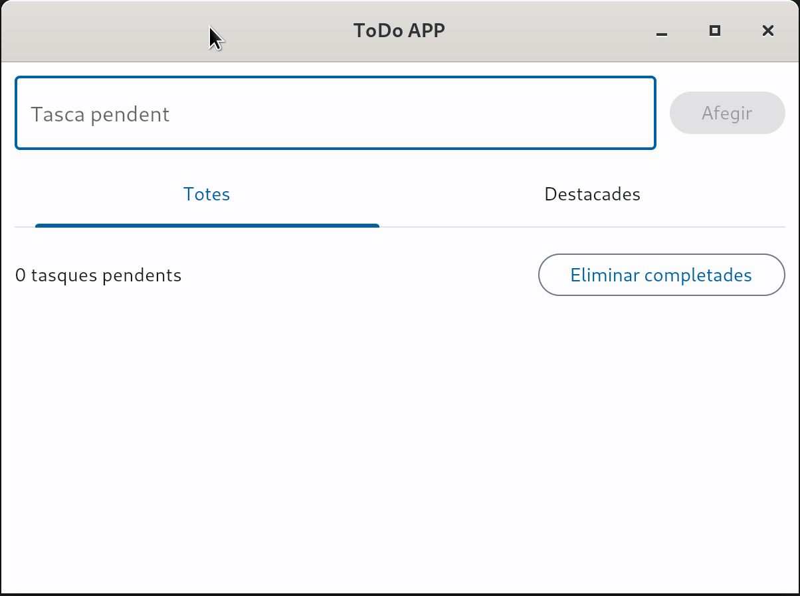

## 1. Pràctica 1 - "Troba el número"

Es pretén implementar un joc l'objectiu del qual és trobar el número buscat. A la pantalla es veuran una sèrie de números que al clicar sobre ells et portaran a una nova vista indicant si és el número trobat o per contra no és el número que es buscava. El joc acabarà en trobar el número buscat, moment en què es ja no es podrà clicar sobre estos i apareixerà un botó per reiniciar el joc. El número de ítems es podrà canviar programàticament simplement canviant el valor d'una de les variables al codi.

!!! tip "Aplica la POO"
	Fins ara hem utilitzat la programació estructurada per als nostres desenvolupaments amb Flet. Passa al paradigma de programació orientat a objectes per a facilitar el desenvolupament del joc.

	```python
	import flet as ft
	

	class App:
		def __init__(self) -> None:
			...

	def main(page: ft.Page):
		app = App()
		page.title = "Flet APP"
		page.add(app)

	if __name__ == "__main__":
		ft.app(target=main)
	```
  

Observeu el següent vídeo on es mostra el comportament del joc:

<center>

  { width=100% }
  <figcaption>Dark Theme</figcaption>

</center>


<center>

  { width=100% }
  <figcaption>Light Theme</figcaption>

</center>

## 2. Projecte ToDo APP

Anem a desenvolupar, a través d'una sèrie de pràctiques, una aplicació completa ToDo. 

### 2.1. Pràctica 2 - Editar i modificar tasques

Partint del teu codi de l'activitat 1, anem a afegir la funcionalitat de destacar la tasca (de moment no farà res), editar-la i eliminar-la, tal com es mostra a continuació:

<center>



</center>

Fixeu-se que abans d'eliminar la tasca, l'usuari ha de confirmar que la vol eliminar.

Fes que no calga utilitzar el clic a `Afegir` per a afegir la tasca, ni fer el clic al `check` per a confirmar el canvi en la descripció de la tasca. En els dos casos, s'ha d'executar automàticament en donar-li a la tecla `Enter`.

!!! tip "Pulsació de Enter en un TextField"

	El control TextField llança un esdeveniment on_submit en donar-li a la tecla `Enter`.

!!! tip "Focus"
	Fes que el focus vagen adoptant-lo els controls adequats en cada situació. Per exemple, en editar el nom de la tasca, el textfield deuria prendre el focus per evitar que l'usuari haja de fer clic per a començar a escriure. Idem per a botons en dialegs,...

!!! tip "Aplica la POO"
	Defineix una classe Task (o Tasca) que herede de ft.ControlUser i retorne la següent interfície:

	

	Defineix una classe TodoApp per a construir l'aplicació principal, que importarà la classe Task. Esta contindrà una llista de tasques. Al fer clic al control de la paperera, s'eliminarà de l'aplicació TodoApp la tasca sobre la que s'ha fet clic. Per tant necessitem en TodoApp una llista de tasques, i en la classe tasques, necessitem una referència a TodoApp per poder accedir a aquesta llista.

	Traduït a programació:

	```python
	class Task(ft.UserControl):
		def __init__(self, ..., todo_app) -> None:
			super().__init__()
			self.text = text
			self.todo_app = todo_app

			...

	def remove_task(self, e):
        ...
		self.todo_app.tasks.remove(self)
		...
	```

!!! tip "Utilitza el decorador @property"
	L'ús del [decorador property](https://www.freecodecamp.org/espanol/news/python-decorador-property/) serà molt útil, o millor dit  quasi imprescindible, en els nostres desenvolupaments. Ens serviran per a mantindre l'estat intern de l'aplicació en consonància amb la interfície.

	Vos pose un exemple:

	En la classe Task tindrem una propietat *featured* que ens indica si la tasca està marcada com a destacada o no. Ídem per a completada a través del seu checkbox. 
	
	Aleshores, la millor forma de gestionar la interfície, per a que reflectisca el valor de les propietats, és utilitzar una propietat privada i a través del seu setter, definit utilitzant els decoradors @propietat.setter, fer que la propietat canvie al fer un clic sobre la interfície i viceversa, fer que canvie  la interfície al canviar el valor de la propietat.

	Traduït a codi:

	```python
	@completed.setter
    def completed(self, value):
        self._completed = value
		# canviem el valor del checkbox per a que es corresponga amb el valor de _completed
        self.completed_checkbox.value = self._completed
        self.update()

    @featured.setter
    def featured(self, value):
        self._featured = value
        # canviem la interfície
		... 
		self.update()
	```
	


### 2.2. Pràctica 3 - Organitzem les tasques

La funcionalitat principal de l'aplicació està més o menys desenvolupada. En esta pràctica anem a desenvolupar la resta de la interfície gràfica.

El primer canvi serà afegir un text al final per a indicar quantes tasques ens queden pendents. Per a implementar este canvi és recomanable també utilitzar el decorador property a una nova propietat de TodoApp que continga quantes tasques tenim pendents. En canviar el valor d'esta propietat, canviarà la interfície per a indicar el nou valor.

El segon canvi que farem serà afegir un botó per a borrar les tasques completades. De nou, necessitarem confirmació de l'usuari ja que estem davant un esdeveniment que destruirà informació (almenys de moment).

El tercer canvi serà afegir a la interfície unes pestanyes a mode de filtre per tal de poder veure totes les tasques o només les destacades.

El següent gif mostra el comportament de l'aplicació:



### 2.3. Pràctica 4 - Organitzem les tasques (opcional)

En esta pràctica anem a modificar la nostra aplicació per a organitzar encara més les nostres tasques. En esta ocasió afegirem la possibilitat de crear una llista de tasques per temàtica. Per exemple, si la utilitza un alumne de 2n de DAM, podria organitzar-se les tasques per mòduls (DI, AD, SGE,...). D'esta forma afegim un nou filtre dinformació per temàtica. És a dir, en seleccionar per temàtica (també inclourem l'opció *totes*), i en filtrar per totes/destacades.

Tingau en compte que haureu de filtrar correctament. Per exemple, si tinc una temàtica DI (Desenvolupament d'interfícies) i seleccionem la pestanya totes, ens mostrarà totes les tasques de temàtica DI. Si seleccionem destacades, ens mostrarà les de temàtica DI destacades.

En esta ocasió el disseny de la interfície serà lliure. Seleccioneu correctament els controls i no oblideu fer proves al vostre desenvolupament.

### 2.4. Pràctica 5 - Login mitjançant google