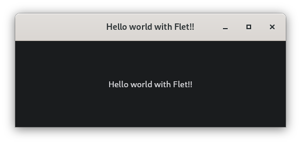
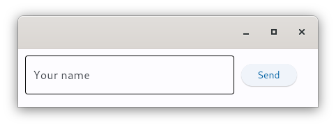

## 1. Components de programari

En el desenvolupament de circuits electrònics, el grau de reutilització de components és molt alt, de manera que la construcció d'un circuit electrònic es limita a la integració i acoblament de diferents components comercials. Per exemple, una placa base conté components com resistències, condensadors, relés, xips…, que no han estat fabricats pel fabricant de la placa. Així que, hi ha fabricants especialitzats en components i altres en producte final. Això permet reduir costos quant a temps i diners es refereix.

En el desenvolupament de programari, la reutilització de codi continua sent relativament escassa, però amb la utilització de components aquest problema es redueix, reduint alhora el temps de desenvolupament, el cost econòmic i els errors de programació.

El desenvolupament de la interfície d'una aplicació es basa en la construcció d'una aplicació a partir de components programari ja existents, anomenats normalment **controls**, limitant al mínim necessari el desenvolupament de codi nou. Podem imaginar-nos els components com les peces d'un Lego que podem connectar entre ells en una jerarquia d'arbre. Qualsevol aplicació pot estar composta per múltiples components, i els components principals tenen components secundaris niats dins seu. 

Vam veure una llista dels principals controls d'usuari a la unitat anterior. En aquesta unitat posarem en pràctica l'ús dels controls o components esmentats amb Flet.


## 2. Instal·lació de Flet

Flet necessita com a mínim la versió 3.7 de Python, així que el que recomanem és crear un entorn virtual conda amb l'última versió de Python. Una vegada creat i activat, instal·larem flet.
```bash
$ conda create --name NOM python=3.11
$ conda activate NOM
$ conda install -c conda-forge flet
```

??? warning "Ús de Flet amb WSL"
    Si executeu Flet amb WSL i obteniu l'error `error while loading shared libraries: libgstapp-1.0.so.0: cannot open shared object file: No such file or directory`, necessitareu instal·lar les llibreries *GStreamer*.

    ```bash
    $ sudo apt update
    $ sudo apt-get install libgstreamer1.0-dev libgstreamer-plugins-base1.0-dev libgstreamer-plugins-bad1.0-dev gstreamer1.0-plugins-base gstreamer1.0-plugins-good gstreamer1.0-plugins-bad gstreamer1.0-plugins-ugly gstreamer1.0-libav gstreamer1.0-doc gstreamer1.0-tools gstreamer1.0-x gstreamer1.0-alsa gstreamer1.0-gl gstreamer1.0-gtk3 gstreamer1.0-qt5 gstreamer1.0-pulseaudio
    ```

## 3. Estructura bàsica d'un programa Flet

L'estructura mínima d'un programa Flet és la següent:

```python
import flet as ft

def main(page: ft.Page):
    # add/update controls on Page
    pass

ft.app(target=main)
```

Un programa típic de Flet acaba amb una crida a flet.app() on comença l'aplicació esperant noves sessions d'usuari. La funció main() és el punt d'entrada de l'aplicació. Per a cada sessió d'usuari es crearà un fil d'execució, que se li passarà la instància de Page. 

Quan s'executa l'aplicació Flet al navegador, s'inicia una nova sessió d'usuari per a cada pestanya o pàgina oberta. Quan s'executa com a aplicació d'escriptori, només es crea una sessió.

Page és com un *llenç* específic per a cada usuari, un estat visual d'una sessió d'usuari. Per crear una GUI, afegim i suprimim controls a una pàgina.

Per defecte, l'aplicació Flet s'inicia en una finestra del sistema operatiu natiu, però, podem obrir-la en una finestra del navegador modificant la crida a flet.app() i indicant el port desitjat (aleatori en cas de no especificar-lo):

```python
ft.app(target=main, view="web_browser", port=8080)
```

<!-- !!! info ""
    Internament, cada aplicació Flet és una aplicació web i, encara que es mostre en una finestra del sistema operatiu, s'iniciarà un servidor web en segon pla. El servidor web de Flet s'anomena "Fletd" i, per defecte, escolta en un port TCP aleatori. Podeu especificar un port TCP personalitzat i després obrir l'aplicació al navegador juntament amb la vista d'escriptori:

    ```python
    flet.app(port=8550, target=main)
    ```

    Obriu http://localhost:<port> al vostre navegador per veure la versió web de la vostra aplicació Flet. -->

### 3.1. Hello world!!

Els controls són els elements bàsics i principals per crear interfícies d'usuari a Flutter. Podeu mostrar informació, rebre informació de l'usuari i organitzar altres controls de forma agrupada. 

!!!example "Exemple"
    ~~~Python
    import flet as ft

    def main(page: ft.Page):
        page.title = "Hello world with Flet!!"
        page.vertical_alignment = ft.MainAxisAlignment.CENTER
        page.horizontal_alignment = ft.CrossAxisAlignment.CENTER

        text = ft.Text(value='Hello world with Flet!!', text_align=ft.TextAlign.LEFT)

        page.add(
            text
        )

    ft.app(target=main)
    ~~~
 
Si executem el codi anterior obtindrem una aplicació com la següent:




Dins la finestra estarà continguda tota la interfície de l'usuari. En aquest cas, només conté un component Text centrar tant verticalment com horitzontalment, sense interacció possible. Cada aplicació gràfica tindrà almenys una finestra, però en podrà tenir més. Això ho veurem en seccions posteriors de la unitat. Normalment una aplicació acabarà en tancar la darrera de les finestres.

## 4. Controls

La interfície d'usuari està feta de controls (també coneguts com *widgets*). Per fer visibles els controls per a un usuari, s'han d'afegir a un Page o dins d'altres controls que ja siguen visibles. La pàgina és el control superior, i la resta de controls pengen d'aquesta *arrel* formant una estructura d'arbre.

Els controls són classes de Python, simplement els instanciarem mitjançant els seus constructors amb els paràmetres que ens convinga, per exemple:

```python
text = ft.Text(value="Hello, world!", color="green")
```

Per mostrar el control anterior, l'afegim a la llista de controls de *Page* i fem una crida a *page.update()* per enviar els canvis de pàgina a un navegador o client d'escriptori:

```python
import flet as ft

def main(page: ft.Page):
    t = ft.Text(value="Hello, world!", color="green")
    page.controls.append(t)
    page.update()

ft.app(target=main)
```

Podem modificar les propietats del control i la interfície d'usuari s'actualitzarà en la següent crida a page.update():

```python
t = ft.Text()
page.add(t) # és una abreviatura de page.controls.append(t) i page.update()

for i in range(10):
    t.value = f"Pas número {i}"
    page.update()
    time.sleep(1)
```

??? warning "Actualització de controls"
    El mètode *Page.update()* només actualitzarà els canvis fets des de l'última crida al mateix mètode. Podeu afegir, eliminar o modificar tants controls com vulgau abans de la seua crida, de forma que l'actualització siga en lot.    

Alguns controls són *contenidor* d'altres controls (com *Page*). Per exemple, el control *Row* permet organitzar els controls en fila:

```python
page.add(
    ft.Row(controls=[
        ft.TextField(label="Your name"),
        ft.ElevatedButton(text="Send")
    ])
)
```



### 4.1. Esdeveniments

Cada interacció de l'usuari amb la interfície, per exemple un clic de ratolí, un doble clic, l'ús d'una tecla, etc. generarà un esdeveniment. Aquest esdeveniment serà afegit a la cua d'esdeveniments (*event queue*) per ser gestionat.

El bucle d'esdeveniments (*event loop*), que és un bucle infinit, comprovarà a cada iteració si hi ha esdeveniments pendents de ser gestionats. En cas de ser així, l'esdeveniment serà gestionat pel gestor d'esdeveniments (event handler) que executarà el vostre controlador. Quan aquest acaba, el control torna al bucle d'esdeveniments per esperar més esdeveniments. Açò ja ho vam utilitzar al joc que desenvoluparem amb PyGame.

Tot aquest procés complex, s'oculta al programados, que simplement haurà de programar quina funcionalitat s'executa en produir-se cert esdeveniment. 

```python
import flet as ft

def main(page):
    def add_clicked(e):
        page.add(ft.Checkbox(label=new_task.value))
        new_task.value = ""
        new_task.focus()
        new_task.update()

    new_task = ft.TextField(hint_text="Tasca pendent", width=300)
    page.add(ft.Row([new_task, ft.ElevatedButton("Afegir", on_click=add_clicked)]))

ft.app(target=main)
```

??? warning "Flet vs Flutter"
    **Flet** implementa un model d'interfície d'usuari **imperatiu** on creeu "manualment" la interfície d'usuari de l'aplicació amb controls d'estat i després la modifiqueu actualitzant les propietats de control. En canvi, **Flutter** implementa un model **declaratiu** on la interfície d'usuari es reconstrueix automàticament amb els canvis de dades de l'aplicació. La gestió de l'estat de l'aplicació a les aplicacions frontend modernes és una tasca inherentment complexa i l'enfocament de la *vella escola* de Flet és més atractiu i simple per als programadors sense experiència en el frontend.

??? tip "Propietat *visible*"
    Cada control té la propietat *visible* que és *True* per defecte. La configuració *visible* a *False* impedeix que el control (i tots els seus fills, si hi ha) es mostren. Els controls ocults no es poden enfocar, ni seleccionar amb un teclat o ratolí i no emeten cap esdeveniment.

??? tip "Propietat *disabled*"
    Cada control té la propietat *disabled* que és *False* per defecte, el control i tots els seus fills estan habilitats. S'utilitza principalment amb controls d'entrada de dades com els botons, TextField, Dropdown, Checkbox,... Tanmateix, *disabled* es podria establir en un control pare i el seu valor es propagarà a tots els fills de forma recursiva.

    ```python
    first_name = ft.TextField()
    last_name = ft.TextField()
    column = ft.Column(controls=[
        first_name,
        last_name
    ])
    column.disabled = True
    page.add(c)
    ```

### 4.2. Referències a Controls

Els controls Flet són objectes i per accedir a les seves propietats hem de mantenir les referències (variables) a aquests objectes. Quan s'afegeixen molts controls i controladors d'esdeveniments, es fa difícil mantindre totes les definicions de control en un sol lloc, de manera que es dispersen pel cos del *main()*. Mirant els paràmetres de *page.add()*, és difícil imaginar (sense mirar constantment a les definicions de variables) com seria la forma final de la interfície (ahí pot ajudar molt el nom de la variable).

```python
page.add(
    first_name,
    last_name,
    ft.ElevatedButton("Say hello!", on_click=btn_click),
    greetings,
)
```

Flet proporciona una classe **Ref** que permet definir una referència al control, utilitzar aquesta referència als controladors d'esdeveniments i establir la referència a un control.

Per definir una nova referència a un control:

```python
first_name = ft.Ref[ft.TextField]()
```

Per accedir al control referenciat (desreferència del control), utilitzem la propietat **Ref.current**:
```python
first_name.current.value = ""
```

Per utilitzar la referència al control:

```python
page.add(
    ft.TextField(ref=first_name, label="First name", autofocus=True)
)
```

Compareu els següents fragments de codi:

 
!!!example "Variables de control vs Referències a controls"
    **Sense Refs**
    ```python
    import flet as ft

    def main(page):

        first_name = ft.TextField(label="First name", autofocus=True)
        last_name = ft.TextField(label="Last name")
        greetings = ft.Column()

        def btn_click(e):
            greetings.controls.append(ft.Text(f"Hello, {first_name.value} {last_name.value}!"))
            first_name.value = ""
            last_name.value = ""
            page.update()
            first_name.focus()

        page.add(
            first_name,
            last_name,
            ft.ElevatedButton("Say hello!", on_click=btn_click),
            greetings,
        )

    ft.app(target=main)
    ```

    **Amb Refs**
    ```python
    import flet as ft

    def main(page):

        first_name = ft.Ref[ft.TextField]()
        last_name = ft.Ref[ft.TextField]()
        greetings = ft.Ref[ft.Column]()

        def btn_click(e):
            greetings.current.controls.append(
                ft.Text(f"Hello, {first_name.current.value} {last_name.current.value}!")
            )
            first_name.current.value = ""
            last_name.current.value = ""
            page.update()
            first_name.current.focus()

        page.add(
            ft.TextField(ref=first_name, label="First name", autofocus=True),
            ft.TextField(ref=last_name, label="Last name"),
            ft.ElevatedButton("Say hello!", on_click=btn_click),
            ft.Column(ref=greetings),
        )

    ft.app(target=main)
    ```

!!! tip ""
    
    En este punt pots realitzar [l'activitat 1](../../tasques/1%20-%20Activitats/#activitat-1-habilitacio-i-deshabilitacio-de-controls).

## 5. Principals controls en formularis

A la primera unitat vam veure un llistat de controls habituals juntament amb el seu ús habitual. Farem un llistat amb els controls més habituals de Flet usats en formularis, juntament amb algun dels seus esdeveniments. Practicarem amb exemples i exercicis en altres apartats de la unitat. Per obtenir una llista completa i més informació de cadascun, cal consultar la documentació de Flet.


!!!example "Controls"
    === "QCheckBox"

        ```python
        import flet as ft

        def main(page):
            def checkbox_changed(e):
                output_text.value = (
                    f"You have learned how to ski :  {todo_check.value}."
                )
                page.update()

            output_text = ft.Text()
            todo_check = ft.Checkbox(label="ToDo: Learn how to use ski", value=False, on_change=checkbox_changed)
            page.add(todo_check, output_text)

        ft.app(target=main)
        ```

    === "Text"

        ```python
        import flet as ft

        def main(page: ft.Page):
            page.title = "Hello world with Flet!!"
            page.vertical_alignment = ft.MainAxisAlignment.CENTER
            page.horizontal_alignment = ft.CrossAxisAlignment.CENTER

            text = ft.Text(value='Hello world with Flet!!', text_align=ft.TextAlign.LEFT)

            page.controls.append(
                text
            )

            page.update()

        ft.app(target=main)
        ```
    
    === "Dropdown"

        ```python
        import flet as ft


        def main(page: ft.Page):
            def button_clicked(e):
                output_text.value = f"Dropdown value is:  {color_dropdown.value}"
                page.update()

            output_text = ft.Text()
            submit_btn = ft.ElevatedButton(text="Submit", on_click=button_clicked)
            color_dropdown = ft.Dropdown(
                width=100,
                options=[
                    ft.dropdown.Option("Red"),
                    ft.dropdown.Option("Green"),
                    ft.dropdown.Option("Blue"),
                ],
            )
            page.add(color_dropdown, submit_btn, output_text)

        ft.app(target=main)
        ```

    === "RadioGroup"

        ```python
        import flet as ft

        def main(page):
            def button_clicked(e):
                t.value = f"Your favorite color is:  {cg.value}"
                page.update()

            t = ft.Text()
            b = ft.ElevatedButton(text='Submit', on_click=button_clicked)
            cg = ft.RadioGroup(content=ft.Column([
                ft.Radio(value="red", label="Red"),
                ft.Radio(value="green", label="Green"),
                ft.Radio(value="blue", label="Blue")]))

            page.add(ft.Text("Select your favorite color:"), cg, b, t)

        ft.app(target=main)
        ```

    === "TextButton"

        ```python
        import flet as ft

        def main(page: ft.Page):
            page.title = "Text button with 'click' event"

            def button_clicked(e):
                b.data += 1
                t.value = f"Button clicked {b.data} time(s)"
                page.update()

            b = ft.TextButton("Button with 'click' event", on_click=button_clicked, data=0)
            t = ft.Text()

            page.add(b, t)

        ft.app(target=main)
        ```

    === "Tabs"

        ```python
        import flet as ft

        def main(page: ft.Page):

            t = ft.Tabs(
                selected_index=1,
                animation_duration=300,
                tabs=[
                    ft.Tab(
                        text="Tab 1",
                        content=ft.Container(
                            content=ft.Text("This is Tab 1"), alignment=ft.alignment.center
                        ),
                    ),
                    ft.Tab(
                        tab_content=ft.Icon(ft.icons.SEARCH),
                        content=ft.Text("This is Tab 2"),
                    ),
                    ft.Tab(
                        text="Tab 3",
                        icon=ft.icons.SETTINGS,
                        content=ft.Text("This is Tab 3"),
                    ),
                ],
                expand=1,
            )

            page.add(t)

        ft.app(target=main)
        ```

    === "TextField"

        ```python
        import flet as ft

        def main(page: ft.Page):
            def button_clicked(e):
                t.value = f"Textboxes values are:  '{tb1.value}', '{tb2.value}', '{tb3.value}', '{tb4.value}', '{tb5.value}'."
                page.update()

            t = ft.Text()
            tb1 = ft.TextField(label="Standard")
            tb2 = ft.TextField(label="Disabled", disabled=True, value="First name")
            tb3 = ft.TextField(label="Read-only", read_only=True, value="Last name")
            tb4 = ft.TextField(label="With placeholder", hint_text="Please enter text here")
            tb5 = ft.TextField(label="With an icon", icon=ft.icons.EMOJI_EMOTIONS)
            b = ft.ElevatedButton(text="Submit", on_click=button_clicked)
            page.add(tb1, tb2, tb3, tb4, tb5, b, t)

        ft.app(target=main)
        ```

    === "Slider"

        ```python
        import flet as ft

        def main(page):

            def slider_changed(e):
                t.value = f"Slider changed to {e.control.value}"
                page.update()

            t = ft.Text()
            page.add(
                ft.Text("Slider with 'on_change' event:"),
                ft.Slider(min=0, max=100, divisions=10, label="{value}%", on_change=slider_changed), t)

        ft.app(target=main)
        ```
    === "Switch"

        ```python
        import flet as ft

        def main(page):
            def button_clicked(e):
                t.value = (
                    f"Switch values are:  {c1.value}, {c2.value}, {c3.value}, {c4.value}."
                )
                page.update()

            t = ft.Text()
            c1 = ft.Switch(label="Unchecked switch", value=False)
            c2 = ft.Switch(label="Checked switch", value=True)
            c3 = ft.Switch(label="Disabled switch", disabled=True)
            c4 = ft.Switch(
                label="Switch with rendered label_position='left'", label_position=ft.LabelPosition.LEFT
            )
            b = ft.ElevatedButton(text="Submit", on_click=button_clicked)
            page.add(c1, c2, c3, c4, b, t)

        ft.app(target=main)
        ```

    === "FilePicker"

        ```python
        import flet as ft

        def main(page: ft.Page):
            def pick_files_result(e: ft.FilePickerResultEvent):
                selected_files.value = (
                    ", ".join(map(lambda f: f.name, e.files)) if e.files else "Cancelled!"
                )
                selected_files.update()

            pick_files_dialog = ft.FilePicker(on_result=pick_files_result)
            selected_files = ft.Text()

            page.overlay.append(pick_files_dialog)

            page.add(
                ft.Row(
                    [
                        ft.ElevatedButton(
                            "Pick files",
                            icon=ft.icons.UPLOAD_FILE,
                            on_click=lambda _: pick_files_dialog.pick_files(
                                allow_multiple=True
                            ),
                        ),
                        selected_files,
                    ]
                )
            )

        ft.app(target=main)
        ```
!!! tip ""
    
    En este punt pots realitzar [l'activitat 2](../../tasques/1%20-%20Activitats/#activitat-2-formulari).