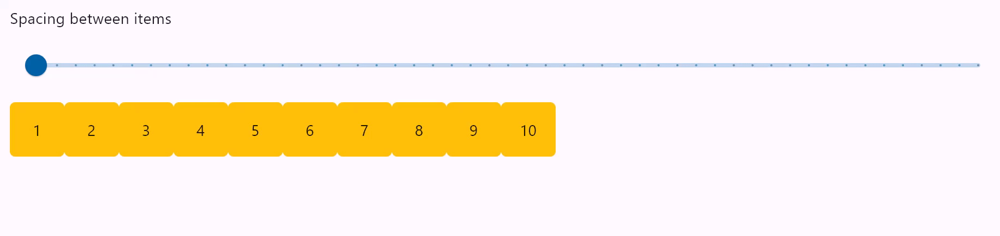
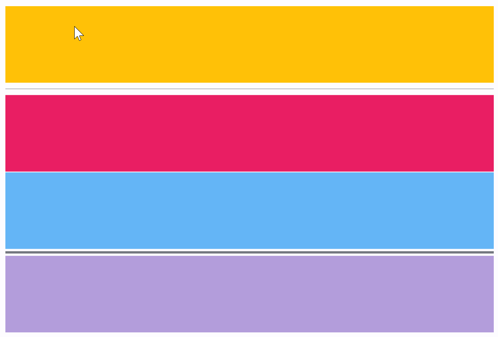

## 1. Layouts

Els controls tipus *layout* són controls especials que servixen per a contindre i organitzar la resta de controls a la interfície. Veurem els principals controls tipus *layout* a esta secció.

## 2. Container

El contenidor permet decorar un control amb color de fons i vora i posicionar-lo amb farciment, marge i alineació. També permet decorar-lo amb gradients radials o linials, animar-lo,...

!!! example "Exemple de *Container*"

    ```python
    import flet as ft

    def main(page: ft.Page):
        page.title = "Containers - clickable and not"
        page.vertical_alignment = ft.MainAxisAlignment.CENTER
        page.horizontal_alignment = ft.CrossAxisAlignment.CENTER

        page.add(
            ft.Row(
                [
                    ft.Container(
                        content=ft.Text("Non clickable"),
                        margin=10,
                        padding=10,
                        alignment=ft.alignment.center,
                        bgcolor=ft.colors.AMBER,
                        width=150,
                        height=150,
                        border_radius=10,
                    ),
                    ft.Container(
                        content=ft.Text("Clickable without Ink"),
                        margin=10,
                        padding=10,
                        alignment=ft.alignment.center,
                        bgcolor=ft.colors.GREEN_200,
                        width=150,
                        height=150,
                        border_radius=10,
                        on_click=lambda e: print("Clickable without Ink clicked!"),
                    ),
                    ft.Container(
                        content=ft.Text("Clickable with Ink"),
                        margin=10,
                        padding=10,
                        alignment=ft.alignment.center,
                        bgcolor=ft.colors.CYAN_200,
                        width=150,
                        height=150,
                        border_radius=10,
                        ink=True,
                        on_click=lambda e: print("Clickable with Ink clicked!"),
                    ),
                    ft.Container(
                        content=ft.Text("Clickable transparent with Ink"),
                        margin=10,
                        padding=10,
                        alignment=ft.alignment.center,
                        width=150,
                        height=150,
                        border_radius=10,
                        ink=True,
                        on_click=lambda e: print("Clickable transparent with Ink clicked!"),
                    ),
                ],
                alignment=ft.MainAxisAlignment.CENTER,
            ),
        )

    ft.app(target=main)
    ```

    

## 3. Row

Un control que mostra els seus fills en una matriu horitzontal. 

Amb les seues propietats es poden modificar la forma en que es col·loquen, l'espai entre els components,...

!!! example "Espai entre controls"

    ```python
    import flet as ft

    def main(page: ft.Page):
        def items(count):
            items = []
            for i in range(1, count + 1):
                items.append(
                    ft.Container(
                        content=ft.Text(value=str(i)),
                        alignment=ft.alignment.center,
                        width=50,
                        height=50,
                        bgcolor=ft.colors.AMBER,
                        border_radius=ft.border_radius.all(5),
                    )
                )
            return items

        def gap_slider_change(e):
            row.spacing = int(e.control.value)
            row.update()

        gap_slider = ft.Slider(
            min=0,
            max=50,
            divisions=50,
            value=0,
            label="{value}",
            on_change=gap_slider_change,
        )

        row = ft.Row(spacing=0, controls=items(10))

        page.add(ft.Column([ ft.Text("Spacing between items"), gap_slider]), row)

    ft.app(target=main)
    ```

    

!!! example "Amplària de la fila"

    ```python
    import flet as ft

    def main(page: ft.Page):
        def items(count):
            items = []
            for i in range(1, count + 1):
                items.append(
                    ft.Container(
                        content=ft.Text(value=str(i)),
                        alignment=ft.alignment.center,
                        width=50,
                        height=50,
                        bgcolor=ft.colors.AMBER,
                        border_radius=ft.border_radius.all(5),
                    )
                )
            return items

        def slider_change(e):
            row.width = float(e.control.value)
            row.update()

        width_slider = ft.Slider(
            min=0,
            max=page.window_width,
            divisions=20,
            value=page.window_width,
            label="{value}",
            on_change=slider_change,
        )

        row = ft.Row(
            wrap=True,
            spacing=10,
            run_spacing=10,
            controls=items(30),
            width=page.window_width,
        )

        page.add(
            ft.Column(
                [
                    ft.Text(
                        "Change the row width to see how child items wrap onto multiple rows:"
                    ),
                    width_slider,
                ]
            ),
            row,
        )

    ft.app(target=main)
    ```

    

!!! example "Aliniació horitzontal"

    ```python
    import flet as ft

    def main(page: ft.Page):
        def items(count):
            items = []
            for i in range(1, count + 1):
                items.append(
                    ft.Container(
                        content=ft.Text(value=str(i)),
                        alignment=ft.alignment.center,
                        width=50,
                        height=50,
                        bgcolor=ft.colors.AMBER_500,
                    )
                )
            return items

        def row_with_alignment(align: ft.MainAxisAlignment):
            return ft.Column(
                [
                    ft.Text(str(align), size=16),
                    ft.Container(
                        content=ft.Row(items(3), alignment=align),
                        bgcolor=ft.colors.AMBER_100,
                    ),
                ]
            )

        page.add(
            row_with_alignment(ft.MainAxisAlignment.START),
            row_with_alignment(ft.MainAxisAlignment.CENTER),
            row_with_alignment(ft.MainAxisAlignment.END),
            row_with_alignment(ft.MainAxisAlignment.SPACE_BETWEEN),
            row_with_alignment(ft.MainAxisAlignment.SPACE_AROUND),
            row_with_alignment(ft.MainAxisAlignment.SPACE_EVENLY),
        )


    ft.app(target=main)
    ```

    

!!! example "`expand` igual a *True*"

    ```python
    import flet as ft

    def main(page: ft.Page):
        row = ft.Row([
            ft.TextField(hint_text="Enter your name", expand=True),
            ft.ElevatedButton(text="Join chat")
            ])

        page.add(
            row
        )


    ft.app(target=main)
    ```

    

!!! example "Expanció proporcional"

    ```python
    import flet as ft

    def main(page: ft.Page):
        row = ft.Row([
            ft.Container(bgcolor=ft.colors.YELLOW, expand=2, content=ft.Text(
                "expand = 2", text_align=ft.TextAlign.CENTER)),
            ft.Container(bgcolor=ft.colors.RED, expand=3, content=ft.Text(
                "expand = 3", text_align=ft.TextAlign.CENTER)),
            ft.Container(bgcolor=ft.colors.PURPLE, expand=1, content=ft.Text(
                "expand = 1", text_align=ft.TextAlign.CENTER))
        ])

        page.add(
            row
        )


    ft.app(target=main)
    ```    

    

[Més informació](https://flet.dev/docs/controls/row)

## 4. Column

Un control que mostra els seus fills en una matriu vertical. El funcionament és molt similar a *Row*, on el *width* de *Row* serà el *height* de *Column*.

!!! example "Scroll infinit"

    ```python
    import threading
    import flet as ft

    class State:
        i = 0

    s = State()
    sem = threading.Semaphore()

    def main(page: ft.Page):
        def on_scroll(e: ft.OnScrollEvent):
            if e.pixels >= e.max_scroll_extent - 100:
                if sem.acquire(blocking=False):
                    try:
                        for i in range(0, 10):
                            cl.controls.append(ft.Text(f"Text line {s.i}", key=str(s.i)))
                            s.i += 1
                        cl.update()
                    finally:
                        sem.release()

        cl = ft.Column(
            spacing=10,
            height=200,
            width=200,
            scroll=ft.ScrollMode.ALWAYS,
            on_scroll_interval=0,
            on_scroll=on_scroll,
        )
        for i in range(0, 50):
            cl.controls.append(ft.Text(f"Text line {s.i}", key=str(s.i)))
            s.i += 1

        page.add(ft.Container(cl, border=ft.border.all(1)))

    ft.app(main)
    ```
    <center>
      { width=50% }
    </center>
    

[Més informació](https://flet.dev/docs/controls/column)


!!! tip ""
    
    En este punt pots realitzar [l'activitat 3](../../tasques/1%20-%20Activitats/#activitat-3-layouts-niuats). 

## 5. Stack

Un control que situa els seus fills uns sobre els altres, apilats.

Aquest control és útil si volem superposar diversos fills d'una manera senzilla, per exemple, tenint text i una imatge.

Stack també és útil si voleu implementar animacions implícites que requereixen conèixer la posició absoluta d'un valor objectiu.

!!! example "Layout apilat"

    ```python
    import flet as ft

    def main(page: ft.Page):
        st = ft.Stack(
            [
                ft.Image(
                    src=f"https://picsum.photos/300/300",
                    width=300,
                    height=300,
                    fit=ft.ImageFit.CONTAIN,
                ),
                ft.Row(
                    [
                        ft.Text(
                            "Image title",
                            color="white",
                            size=40,
                            weight="bold",
                            opacity=0.5,
                        )
                    ],
                    alignment=ft.MainAxisAlignment.CENTER,
                ),
            ],
            width=300,
            height=300,
        )

        page.add(st)

    ft.app(target=main)
    ```
    <center>
      { width=50% }
    </center>

## 6. ListView

*ListView* és el control de desplaçament més utilitzat. Mostra els seus fills un darrere l'altre en la direcció de desplaçament.

!!! example "Exemple de ListView"

    ```python
    import flet as ft

    def main(page: ft.Page):
        page.title = "ListView"

        listview = ft.ListView(expand=1, spacing=10, padding=20, auto_scroll=False)
        page.add(listview)

        for i in range(0, 60):
            listview.controls.append(ft.Text(f"Element {i}"))
            
        page.update()

    ft.app(target=main)
    ```
    <center>
      { width=50% }
    </center>

## 7. ListTile

Una única fila d'alturaa fixa que normalment conté text, així com una icona inicial o final.

!!! example "ListTile"

    ```python
    import flet as ft

    def main(page):
        page.title = "ListTile Examples"
        page.add(
            ft.Card(
                content=ft.Container(
                    width=500,
                    content=ft.Column(
                        [
                            ft.ListTile(
                                title=ft.Text("One-line list tile"),
                            ),
                            ft.ListTile(title=ft.Text("One-line dense list tile"), dense=True),
                            ft.ListTile(
                                leading=ft.Icon(ft.icons.SETTINGS),
                                title=ft.Text("One-line selected list tile"),
                                selected=True,
                            ),
                            ft.ListTile(
                                leading=ft.Image(src="/icons/icon-192.png", fit="contain"),
                                title=ft.Text("One-line with leading control"),
                            ),
                            ft.ListTile(
                                title=ft.Text("One-line with trailing control"),
                                trailing=ft.PopupMenuButton(
                                    icon=ft.icons.MORE_VERT,
                                    items=[
                                        ft.PopupMenuItem(text="Item 1"),
                                        ft.PopupMenuItem(text="Item 2"),
                                    ],
                                ),
                            ),
                            ft.ListTile(
                                leading=ft.Icon(ft.icons.ALBUM),
                                title=ft.Text("One-line with leading and trailing controls"),
                                trailing=ft.PopupMenuButton(
                                    icon=ft.icons.MORE_VERT,
                                    items=[
                                        ft.PopupMenuItem(text="Item 1"),
                                        ft.PopupMenuItem(text="Item 2"),
                                    ],
                                ),
                            ),
                            ft.ListTile(
                                leading=ft.Icon(ft.icons.SNOOZE),
                                title=ft.Text("Two-line with leading and trailing controls"),
                                subtitle=ft.Text("Here is a second title."),
                                trailing=ft.PopupMenuButton(
                                    icon=ft.icons.MORE_VERT,
                                    items=[
                                        ft.PopupMenuItem(text="Item 1"),
                                        ft.PopupMenuItem(text="Item 2"),
                                    ],
                                ),
                            ),
                        ],
                        spacing=0,
                    ),
                    padding=ft.padding.symmetric(vertical=10),
                )
            )
        )

    ft.app(target=main)
    ```
    <center>
      { width=50% }
      <figcaption>List Tile</figcaption>
    </center>
    
## 8. GridView

Es tracta d'un layout en forma de graella.

!!! tip "Informació"
    GridView és molt eficient per a llistes grans (milers d'elements). Pot substituir el niuament de layouts tipus *Row* i *Column*.

!!! example "Exemple de GridView"

    ```python
    import flet as ft

    def main(page: ft.Page):
        page.title = "GridView Example"
        page.theme_mode = ft.ThemeMode.DARK
        page.padding = 50
        page.update()

        images = ft.GridView(
            expand=1,
            runs_count=5,
            max_extent=150,
            child_aspect_ratio=1.0,
            spacing=5,
            run_spacing=5,
        )

        page.add(images)

        for i in range(0, 60):
            images.controls.append(
                ft.Image(
                    src=f"https://picsum.photos/150/150?{i}",
                    fit=ft.ImageFit.NONE,
                    repeat=ft.ImageRepeat.NO_REPEAT,
                    border_radius=ft.border_radius.all(10),
                )
            )
        page.update()

    ft.app(target=main)
    ```

    <center>
          
    </center>
    

## 9. Responsive Row

ResponsiveRow pren la idea del disseny en quadrícula de Bootstrap. Permet alinear els controls en columnes virtuals. Per defecte, una quadrícula virtual té 12 columnes, però que es poden personalitzar amb la propietat ResponsiveRow.columns.

De manera similar a  la propietat `expand`, cada control ara té la propietat `col` que permet especificar quantes columnes ha d'abastar un control. Per exemple, per fer un disseny format per dues columnes que abasten 6 columnes virtuals cadascuna:

```python
ft.ResponsiveRow([
    ft.Column(col=6, controls=[ft.Text("Column 1")]),
    ft.Column(col=6, controls=[ft.Text("Column 2")])
])
```

`ResponsiveRow` és *responsiu* perquè pot adaptar la mida dels seus fills a una mida de pantalla (pàgina, finestra) dinàmica o canviant. La propietat `col` de l'exemple anterior és un nombre constant, la qual cosa significa que el control ocuparà 6 columnes per a qualsevol mida de pantalla.

Si als descendents en l'arbre de controls no tenen especificada la propietat *col*, ocuparan el nombre màxim de columnes.

*col* es pot configurar per tenir un valor diferent per a "punts d'interrupció" específics. Els punts d'interrupció s'anomenen intervals de dimensions:

<center>

| Punt d'interrupció | Dimensió    |
| :----------------- | :---------- |
| xs                 | <576 píxels |
| sm                 | ≥576px      |
| md                 | ≥768px      |
| lg                 | ≥992px      |
| xl                 | ≥1200px     |
| xxl                | ≥1400px     |

</center>

!!! example "Exemple amb `ResponsiveRow`"

    ```python
    import flet as ft

    def main(page: ft.Page):
        def page_resize(e):
            if page.width < 576:
                size = "XS"
            elif page.width < 768:
                size = "SM"
            elif page.width < 992:
                size = "MD"
            elif page.width < 1200:
                size = "LG"
            elif page.width < 1400:
                size = "XL"
            else:
                size = "XXL"
            pw.value = f"Tamany de pantalla: {size} -> {page.width} px"
            pw.update()

        page.on_resize = page_resize

        pw = ft.Text(bottom=50, right=50, style="displaySmall")
        page.overlay.append(pw)
        page.add(
            ft.ResponsiveRow(
                [
                    ft.Container(
                        ft.Text("Column 1"),
                        padding=5,
                        bgcolor=ft.colors.YELLOW,
                        col={"sm": 6, "md": 4, "xl": 2},
                    ),
                    ft.Container(
                        ft.Text("Column 2"),
                        padding=5,
                        bgcolor=ft.colors.GREEN,
                        col={"sm": 6, "md": 4, "xl": 2},
                    ),
                    ft.Container(
                        ft.Text("Column 3"),
                        padding=5,
                        bgcolor=ft.colors.BLUE,
                        col={"sm": 6, "md": 4, "xl": 2},
                    ),
                    ft.Container(
                        ft.Text("Column 4"),
                        padding=5,
                        bgcolor=ft.colors.PINK_300,
                        col={"sm": 6, "md": 4, "xl": 2},
                    ),
                ],
            ),
            ft.ResponsiveRow(
                [
                    ft.TextField(label="TextField 1", col={"md": 4}),
                    ft.TextField(label="TextField 2", col={"md": 4}),
                    ft.TextField(label="TextField 3", col={"md": 4}),
                ],
                run_spacing={"xs": 12},
            ),
        )
        page_resize(None)

    ft.app(target=main)
    ```

## 10. DataTable

Una taula de dades, és un control per a mostrar informació de forma ordenada.

!!! example "Exemple de taula"

    ```python
    import flet as ft

    def main(page: ft.Page):
        page.add(
            ft.DataTable(
                columns=[
                    ft.DataColumn(ft.Text("First name")),
                    ft.DataColumn(ft.Text("Last name")),
                    ft.DataColumn(ft.Text("Age"), numeric=True),
                ],
                rows=[
                    ft.DataRow(
                        cells=[
                            ft.DataCell(ft.Text("John")),
                            ft.DataCell(ft.Text("Smith")),
                            ft.DataCell(ft.Text("43")),
                        ],
                    ),
                    ft.DataRow(
                        cells=[
                            ft.DataCell(ft.Text("Jack")),
                            ft.DataCell(ft.Text("Brown")),
                            ft.DataCell(ft.Text("19")),
                        ],
                    ),
                    ft.DataRow(
                        cells=[
                            ft.DataCell(ft.Text("Alice")),
                            ft.DataCell(ft.Text("Wong")),
                            ft.DataCell(ft.Text("25")),
                        ],
                    ),
                ],
            ),
        )

    ft.app(target=main)
    ```
    <center>
    
    {width=50%}
    
    </center>

## 11. Tabs
El control `Tab` s'utilitza per navegar per categories de continguts diferents d'accés freqüent. Les pestanyes permeten la navegació entre dues o més visualitzacions de contingut i es basen en les capçaleres de text per articular les diferents seccions de contingut.

!!! example "Exemple amb *Tabs*"

    ```python
    import flet as ft

    def main(page: ft.Page):

        t = ft.Tabs(
            selected_index=1,
            animation_duration=300,
            tabs=[
                ft.Tab(
                    text="Tab 1",
                    content=ft.Container(
                        content=ft.Text("This is Tab 1"), alignment=ft.alignment.center
                    ),
                ),
                ft.Tab(
                    tab_content=ft.Icon(ft.icons.SEARCH),
                    content=ft.Text("This is Tab 2"),
                ),
                ft.Tab(
                    text="Tab 3",
                    icon=ft.icons.SETTINGS,
                    content=ft.Text("This is Tab 3"),
                ),
            ],
            expand=1,
        )

        page.add(t)

    ft.app(target=main)
    ```
    <center>
    
    {width=50%}
    
    </center>

## 12. Card

El control de targeta és un panell amb vore lleugerament arrodonides i una ombra d'elevació.

!!! example "Exemple de `card`"

    ```python
    import flet as ft

    def main(page):
        page.title = "Card Example"
        page.add(
            ft.Card(
                content=ft.Container(
                    content=ft.Column(
                        [
                            ft.ListTile(
                                leading=ft.Icon(ft.icons.ALBUM),
                                title=ft.Text("The Enchanted Nightingale"),
                                subtitle=ft.Text(
                                    "Music by Julie Gable. Lyrics by Sidney Stein."
                                ),
                            ),
                            ft.Row(
                                [ft.TextButton("Buy tickets"), ft.TextButton("Listen")],
                                alignment=ft.MainAxisAlignment.END,
                            ),
                        ]
                    ),
                    width=400,
                    padding=10,
                )
            )
        )

    ft.app(target=main)
    ```
    
    <center>
    
    {width=50%}
    
    </center>

## 13. Divisor (horitzontal o vertical)

Una línia horitzontal fina, amb encoixinat a banda i banda.

Poden ser:
- Horitzontals: `Divider`
- Verticals: `VerticalDivider`

!!! example "Exemple de `Divisor`"

    ```python
    import flet as ft

    def main(page: ft.Page):

        page.add(
            ft.Column(
                [
                    ft.Container(
                        bgcolor=ft.colors.AMBER,
                        alignment=ft.alignment.center,
                        expand=True,
                    ),
                    ft.Divider(),
                    ft.Container(bgcolor=ft.colors.PINK, alignment=ft.alignment.center, expand=True),
                    ft.Divider(height=1, color="white"),
                    ft.Container(
                        bgcolor=ft.colors.BLUE_300,
                        alignment=ft.alignment.center,
                        expand=True,
                    ),
                    ft.Divider(height=9, thickness=3),
                    ft.Container(
                        bgcolor=ft.colors.DEEP_PURPLE_200,
                        alignment=ft.alignment.center,
                        expand=True,
                    ),
                ],
                spacing=0,
                expand=True,
            ),
        )

    ft.app(target=main)
    ```
    
    <center>
    
    {width=50%}
    
    </center>