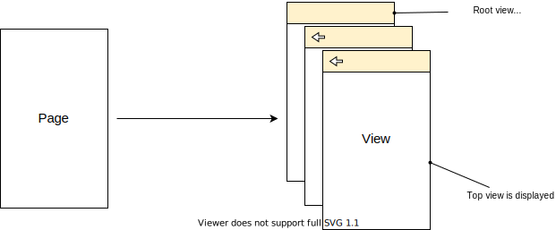

## Navegació i enrutament.

La navegació i l'enrutament és una característica essencial de les aplicacions de pàgina única (SPA) que permet organitzar la interfície d'usuari de l'aplicació en pàgines virtuals (*views*) i navegar entre elles mentre que l'URL de l'aplicació reflecteix l'estat actual de l'aplicació.

### `Route` de Page

La ruta de l'aplicació per defecte, si l'usuari no la redefineix, és /. Totes les rutes comencen per /, per exemple /store, /authors/1/books/2. Es pot obtenir llegint la propietat `page.route`.

```python
import flet as ft

def main(page: ft.Page):
    page.add(ft.Text(f"Ruta inicial: {page.route}"))

ft.app(target=main, view='web_browser', port=8080)
```

Executeu l'anterior codi a un navegador. Obriu una nova pestanya o finestra i afegiu a la URL del navegador la paraula prova, per exemple: http://127.0.0.1:8080/prova. 

El resultat ara serà `Ruta inicial: /prova`

### L'esdeveniment `on_route_change`

Cada vegada que es canvia la ruta a l'URL, ja siga editant l'URL o navegant per l'historial del navegador amb els botons Enrere/Endavant, Flet crida al controlador de l'esdeveniment  `page.on_route_change`:

```python
import flet as ft

def main(page: ft.Page):
    page.add(ft.Text(f"Ruta inicial: {page.route}"))

    def route_change(e: ft.RouteChangeEvent):
        page.add(ft.Text(f"Nova ruta: {e.route}"))

    page.on_route_change = route_change
    page.update()

ft.app(target=main, view='web_browser', port=8080)
```

La ruta també es pot canviar per codi, assignant la propietat `page.route`.

```python
import flet as ft

def main(page: ft.Page):
    page.add(ft.Text(f"Ruta inicial: {page.route}"))

    def route_change(e: ft.RouteChangeEvent):
        page.add(ft.Text(f"Nova ruta: {e.route}"))

    def go_store(e):
        page.route = "/store"
        page.update()

    page.on_route_change = route_change
    page.add(ft.ElevatedButton("Go to Store", on_click=go_store))

ft.app(target=main, view='web_browser', port=8080)
```

Fem clic al botó "Anar a la tenda" i veurem que l'URL de l'aplicació canvia i s'introdueix un element nou a l'historial del navegador. Ara també podem utilitzar el botó "Enrere" del navegador per navegar a una ruta anterior.

## Page views (vistes)

Ara `Page` no és només una pàgina única, sinó un contenidor per a les diferents vistes, apilades en capes una sobre l'altra com un sandvitx:

<center>



</center>

L'historial de navegació és una llista de vistes. `Page` té la propietat `page.views` per accedir a aquesta llista.

L'última vista de la llista és la que es mostra actualment, i la llista de visualitzacions ha de tindre almenys un element (vista arrel).

Per simular una transició entre pàgines canviem `page.route` i afegim una nova vista al final de la llista `page.views`.

Obrim l'última vista de la col·lecció i canviem la ruta a una anterior al controlador `page.on_view_pop` per tornar enrere.

### Navegació entre vistes. Control AppBar

Per construir una navegació fiable, ha d'haver un únic lloc al programa que construisca la llista de vistes en funció de la ruta actual. En altres paraules, la pila d'historial de navegació (representada per la llista de visualitzacions) ha de ser una funció d'una ruta. El lloc adequat per fer-ho serà el controlador d'esdeveniments `page.on_route_change`.

!!! example "Navegació entre dues rutes amb diferent vista"

    ```python
    '''Exemple de navegació entre vistes de Flet'''
    import flet as ft

    def main(page: ft.Page):
        '''Funció principal'''
        page.title = "Routes Example"

        def route_change(route):
            page.views.clear()
            page.views.append(
                ft.View(
                    "/",
                    [
                        ft.AppBar(title=ft.Text("Flet app"), bgcolor=ft.colors.SURFACE_VARIANT),
                        ft.ElevatedButton("Visit Store", on_click=lambda _: page.go("/store")),
                    ],
                )
            )
            if page.route == "/store":
                page.views.append(
                    ft.View(
                        "/store",
                        [
                            ft.AppBar(title=ft.Text("Store"), bgcolor=ft.colors.SURFACE_VARIANT),
                            ft.ElevatedButton("Go Home", on_click=lambda _: page.go("/")),
                        ],
                    )
                )
            page.update()

        def view_pop(view):
            page.views.pop()
            top_view = page.views[-1]
            page.go(top_view.route)

        page.on_route_change = route_change
        page.on_view_pop = view_pop
        page.go(page.route)


    ft.app(target=main, view='web_browser', port=8080)
    ```

Proveu a navegar entre les pàgines mitjançant els botons `Visit Store` i `Go home`. Utilitzant els botons del navegador Enrere/Endavant i canviant manualment la ruta a l'URL funciona igualment.

!!! info "`Page.go(route)`"
    Per navegar entre les pàgines hem utilitzat `page.go(route)`, un mètode que ens ajuda actualitzar `page.route`, crida automàticament al controlador d'esdeveniments `page.on_route_change` per a actualitzar les vistes i, finalment, crida a `page.update()`.

!!! info "El controlador `page.on_view_pop`"
    Observeu l'ús del controlador d'esdeveniments `page.on_view_pop`. S'activa quan l'usuari fa clic al botó automàtic `Enrere` al control AppBar. Al controlador, eliminem l'últim element de la col·lecció de vistes i naveguem fins a l'arrel de la vista.

## Plantilla de rutes (TemplateRoute)

La classe `TemplateRoute` és una classe d'utilitat basada en la biblioteca `repath` que permet fer coincidir rutes semblants a ExpressJS i analitzar els seus paràmetres, per exemple /account/:account_id/orders/:order_id.

TemplateRoute s'integra molt bé amb l'esdeveniment de canvi de ruta:

```python
    def route_change(self, e):
        troute = TemplateRoute(self.page.route)
        if troute.match("/"):
            self.page.go("/notes")
        elif troute.match("/notes/:id"):
            if int(troute.id) > len(self.get_notes()):
                self.page.go("/")
                return
            self.layout.set_note_view(int(troute.id))
        elif troute.match("/notes"):
            self.layout.set_all_notes_view()
        self.page.update()
```

A l'anterior codi, depenent de la ruta a la que es vol anar, es construiria una vista o una altra. Si anem a l'arrel o a `/notes`, veurem la vista de totes les notes, en canvi, si anem a la ruta `/notes/2` mostrarà la segona nota.

<center>

{width=50%}

</center>

