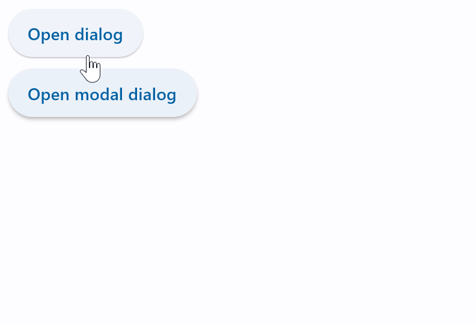
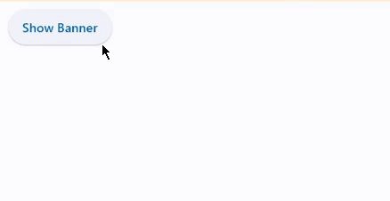
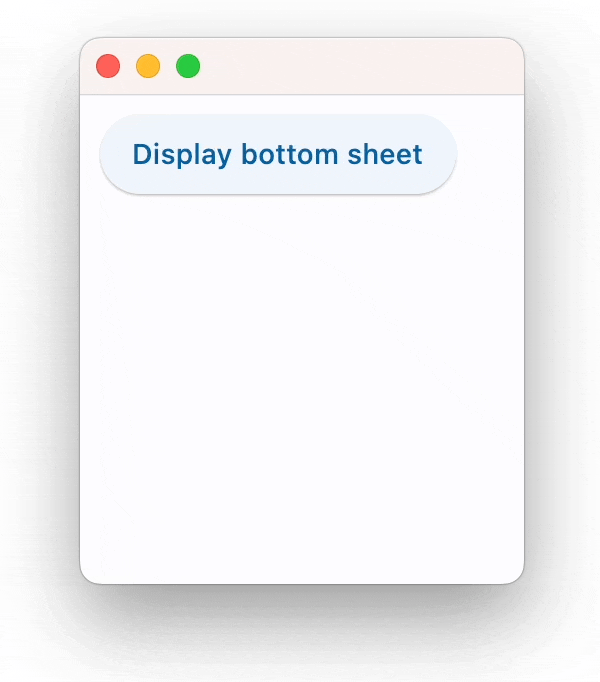
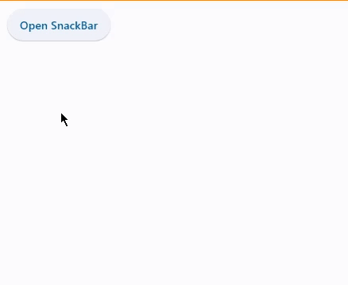

## Diàlegs, alertes i panells

### AlertDialog

És un control per informar l'usuari sobre situacions que requereixen la seua atenció o intervenció. Té un títol opcional i una llista d'accions, opcional també. El títol es mostra dalt del contingut i les accions es mostren baix del contingut.

!!! example "Exemple"
    
    ```python
    import flet as ft

    def main(page: ft.Page):
        page.title = "AlertDialog examples"

        dlg = ft.AlertDialog(
            title=ft.Text("Hello, you!"), on_dismiss=lambda e: print("Dialog dismissed!")
        )

        def close_dlg(e):
            dlg_modal.open = False
            page.update()

        dlg_modal = ft.AlertDialog(
            modal=True,
            title=ft.Text("Please confirm"),
            content=ft.Text("Do you really want to delete all those files?"),
            actions=[
                ft.TextButton("Yes", on_click=close_dlg),
                ft.TextButton("No", on_click=close_dlg),
            ],
            actions_alignment=ft.MainAxisAlignment.END,
            on_dismiss=lambda e: print("Modal dialog dismissed!"),
        )

        def open_dlg(e):
            page.dialog = dlg
            dlg.open = True
            page.update()

        def open_dlg_modal(e):
            page.dialog = dlg_modal
            dlg_modal.open = True
            page.update()

        page.add(
            ft.ElevatedButton("Open dialog", on_click=open_dlg),
            ft.ElevatedButton("Open modal dialog", on_click=open_dlg_modal),
        )

    ft.app(target=main)
    ```

    <center>
    
    {width=50%}
    
    </center>

!!! info "Control Modal vs No modal"
    **Finestra Modal**:

    - Una finestra modal és una finestra que bloqueja la interacció amb la resta de la interfície de l'aplicació mentre està oberta.
    - Les finestres modals són útils quan es requereix l'atenció immediata de l'usuari o quan és necessari obtenir informació crítica abans de continuar.

    **Finestra No Modal**:

    - Una finestra no modal, d'altra banda, no bloqueja la interacció amb la resta de la interfície.

### Banner

Un bàner mostra un missatge que requereix una acció de l'usuari. El missatge és important i concís, i ofereix accions als usuaris per acceptar (o descartar el bàner). Es mostren a la part superior de la pantalla. Són persistents i no modals, permetent a l'usuari ignorar-los o interactuar amb ells en qualsevol moment.

!!! example "Exemple"

    ```python
    import flet as ft

    def main(page):
        def close_banner(e):
            page.banner.open = False
            page.update()

        page.banner = ft.Banner(
            bgcolor=ft.colors.AMBER_100,
            leading=ft.Icon(ft.icons.WARNING_AMBER_ROUNDED, color=ft.colors.AMBER, size=40),
            content=ft.Text(
                "Oops, there were some errors while trying to delete the file. What would you like me to do?"
            ),
            actions=[
                ft.TextButton("Retry", on_click=close_banner),
                ft.TextButton("Ignore", on_click=close_banner),
                ft.TextButton("Cancel", on_click=close_banner),
            ],
        )

        def show_banner_click(e):
            page.banner.open = True
            page.update()

        page.add(ft.ElevatedButton("Show Banner", on_click=show_banner_click))

    ft.app(target=main)
    ```

    <center>
    
    {width=50%}
    
    </center>

### BottomSheet

Un *BottomSheet* és una alternativa modal a un menú o un diàleg.

!!! example "Exemple"
    
    ```python
    import flet as ft

    def main(page: ft.Page):
        def bs_dismissed(e):
            print("Dismissed!")

        def show_bs(e):
            bs.open = True
            bs.update()

        def close_bs(e):
            bs.open = False
            bs.update()

        bs = ft.BottomSheet(
            ft.Container(
                ft.Column(
                    [
                        ft.Text("This is sheet's content!"),
                        ft.ElevatedButton("Close bottom sheet", on_click=close_bs),
                    ],
                    tight=True,
                ),
                padding=10,
            ),
            open=True,
            on_dismiss=bs_dismissed,
        )
        page.overlay.append(bs)
        page.add(ft.ElevatedButton("Display bottom sheet", on_click=show_bs))

    ft.app(target=main)
    ```

    <center>
    
    {width=50%}
    
    </center>

### SnackBar

Un missatge lleuger amb una acció opcional que es mostra breument a la part inferior de la pantalla.

!!! example "Exemple"
    
    ```python
    import flet as ft

    class Data:
        def __init__(self) -> None:
            self.counter = 0

    d = Data()

    def main(page):

        def on_click(e):
            page.snack_bar = ft.SnackBar(ft.Text(f"Hello {d.counter}"))
            page.snack_bar.open = True
            d.counter += 1
            page.update()

        page.add(ft.ElevatedButton("Open SnackBar", on_click=on_click))

    ft.app(target=main)
    ```

    <center>
    
    {width=50%}
    
    </center>