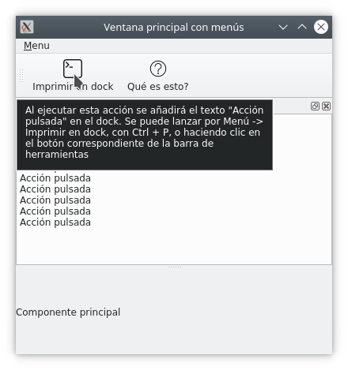

## 2. Components d'ús comú

### **Activitat 1** - Conexió entre senyals i ranures

Desenvolupa una aplicació amb una finestra que continga un QLineEdit i un QLabel. Assigna una mida màxima de text de 5 caràcters al QLineEdit i una mida fixa de 50x30 píxels. El QLabel també tindrà una mida fixa de 50x30 i es desplaçarà 50 píxels a la dreta per no solapar-se amb el QLineEdit. Quan canvieu el text del QLineEdit, l'etiqueta mostrarà el text introduït.

!!!info "Documentació"
    A la documentació de cada component, es pot consultar si els seus senyals i ranures passen i reben arguments respectivament i de quin tipus són.

## 3. Contenidors de components. Disseny.

### **Activitat 2** - Layouts imbricats

Els layouts no només poden contenir widgets, sinó també altres layouts que al seu torn poden contenir widgets i layouts. Per afegir un layout com a layout fill, farem servir el mètode addLayout del pare, i li passarem el layout fill com a argument.

Desenvolupa una aplicació que tinga l'aspecte següent:

## 4. Barres de ferramentes, barra d'estat i menús.

### **Activitat 3** - Sistema d'ajuda

L'ajuda "What's This?" o "Qué es esto?" és part del sistema d'ajuda en línia d'una aplicació i brinda als usuaris informació sobre la funcionalitat i l'ús d'un control en particular. 

QWhatsThis proporciona una sola finestra amb un text explicatiu que apareix quan l'usuari fa clic sobre "What's this?" seguit d'un altre clic sobre un control. La forma per defecte perquè els usuaris facen la pregunta és prémer Shift+F1 per activar el mode *ajuda*. El text d'ajuda apareix al fer clic, amb el mode d'ajuda activat, sobre un control; desapareix quan l'usuari torna a fer clic. 

Per entrar en el mode ajuda necessitem cridar al mètode estàtic (no necessites declarar un objecte de la classe) **enterWhatsThisMode()** mentre que per ixir es cridarà a **leaveWhatsThisMode()**. Podem saber si el tenim activat o no usant **inWhatsThisMode()**.

Creeu una aplicació amb un component tipus *dock* (flotant) que continga un **QTextEdit** i un component principal. Per defecte el *dock* se situarà a la part superior de la finestra.

Afegeix una acció “Imprimeix en *dock*” que imprimirà “Acció Polsada” al component flotant en fer clic sobre ella. La drecera serà Ctrl + P i a més apareixerà en una barra d'eines i en un menú. El vostre text d'ajuda serà "En executar aquesta acció s'afegirà el text "Acció polsada" al *dock*. 

En resum, es pot llançar per Menú -> Imprimir a *dock*, amb Ctrl + P o fent clic al botó corresponent de la barra d'eines.

Afegeix un botó *Què és això?* a l'aplicació amb el comportament habitual, és a dir, entrar o eixir del mode ajuda.

## 5. Diàlegs i altres finestres.

### **Activitat 4** - Dialegs per obrir o guardar.

A la pràctica de l'apartat anterior [(Pràctica 3)](../tasques/2%20-%20Pràctiques.md#practica-3-editor-de-text), havíem començat a desenvolupar un editor de text molt simple que permetia carregar i guardar “arxiu.txt” situat a la mateixa ruta des de la qual executàvem el codi.

En aquest cas pràctic, utilitzarem dos diàlegs, un per demanar quin fitxer obrir i un altre per demanar en quin fitxer volem desar els canvis. En cas que ja hi haja un fitxer obert, en donar a desar no demanarà la ruta al fitxer, sinó que utilitzarà la ruta del fitxer obert anteriorment, sobreescrivint-lo.

A més, afegirem una entrada de menú “Tancar” per tancar l'arxiu obert actualment i començar-ne un de nou.
