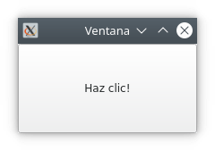

# 2. Components d'ús comú.

## 2.1 Components programari

En el desenvolupament de circuits electrònics, el grau de reutilització de components és molt alt, de manera que la construcció d'un circuit electrònic es limita a la integració i acoblament de diferents components comercials. Per exemple, una placa base conté components com resistències, condensadors, relés, xips…, que no han estat fabricats pel fabricant de la placa. Així que, hi ha fabricants especialitzats en components i altres en producte final. Això permet reduir costos quant a temps i diners es refereix.

En el desenvolupament de programari, la reutilització de codi continua sent relativament escassa, però amb la utilització de components aquest problema es redueix, reduint alhora el temps de desenvolupament, el cost econòmic i els errors de programació.

El desenvolupament de la interfície d'una aplicació es basa en la construcció d'una aplicació a partir de components programari ja existents, limitant al mínim necessari el desenvolupament de codi nou. Podem imaginar-nos els components com les peces d'un Lego que podem connectar entre ells en una jerarquia d'arbre de components. Qualsevol aplicació pot estar composta per múltiples components, i els components principals tenen components secundaris niats dins seu. 

Vam veure una llista dels principals controls d'usuari a la unitat anterior. En aquesta unitat posarem en pràctica l'ús dels controls o components esmentats amb PySide6.

A l'exemple anterior, veiem sis components diferents que formen el formulari.

## 2.2 Components a PySide6

Els controls són els elements bàsics i principals per crear interfícies d'usuari a Qt. Podeu mostrar informació, rebre informació de l'usuari i contenir altres controls de forma agrupada. Un control que no està incrustat en un control pare es mostra en forma de finestra independent.
Vegem la implementació de “Hola Món!” amb PySide6.

!!!example "Exemple"
    ~~~Python
    # Importem les classes QApplication, QLabel i QWidget
    # del mòdul QtWidgets del paquet PySide6
    from PySide6.QtWidgets import QApplication, QLabel, QWidget
    
    class Finestra(QWidget):
        '''
        Classe Finestra, hereta de QWidget, component base.
        '''
    
        # Constructor de la classe Finestra
        def __init__(self):
            # Crida al constructor de la superclasse
            super().__init__()
            # Assignem el títol de la finestra
            self.setWindowTitle("finestra")
            # Creem una etiqueta amb la finestra com a parent.
            self.etiqueta1 = QLabel("Hola món!", self)
    
    if __name__ == "__main__":
        # Cada aplicació serà una sola instància de QApplication.
        app = QApplication([])
        # Creem un objecte Finestra.
        finestra1 = Finestra()
        # Mostrem la Finestra, per defecte els components estan ocults.
        finestra1.show()
        # Iniciem el bucle d'esdeveniments.
        app.exec()
    ~~~
 
L'aspecte que presenta en executar-lo en un escriptori Kde és el d'una finestra com la següent:

Dins la finestra estarà continguda tota la interfície de l'usuari. En aquest cas, només conté un component QLabel sense interacció possible, ja que és una etiqueta que mostra un text.  
Cada aplicació gràfica tindrà almenys una finestra, però en podrà tenir més. Això ho veurem en seccions posteriors de la unitat. Normalment una aplicació acabarà en tancar la darrera de les finestres.

Algunes coses que cal tenir en compte del codi:

- Per crear una classe derivada d'una altra, es passa la classe base entre parèntesis. En aquest cas heretem de la classe QWidget per crear la nostra pròpia finestra. super() es refereix a la classe de què s'hereta.
- El constructor de classe és el mètode especial __init__.
- El paràmetre *self* fa referència a si mateixa, és a dir a la classe que estem implementant.
- Els components estan ocults per defecte. Si els passem el parent en la seua creació es mostraran en mostrar el parent. En cas contrari els podem mostrar amb el mètode show, però es mostraran com una finestra independent.
- Per accedir o canviar les propietats dels widgets ho fem a través dels seus mètodes públics. Els mètodes d'assignació de valors a propietats, *setters*, comencen per set seguit del nom de la propietat que volem assignar (setText, setAlignement, setSizePolicy, ...), mentre que els de lectura de valors, *getters*, solen començar pel nom del domini a llegir (text, alignement, sizePolicy, ...).

## 2.3 Esdeveniments

Cada interacció de l'usuari amb la interfície, per exemple un clic de ratolí, un doble clic, l'ús d'una tecla, etc. generarà un esdeveniment. Aquest esdeveniment serà afegit a la cua d'esdeveniments (*event queue*) per ser gestionat.

El bucle d'esdeveniments (*event loop*), que és un bucle infinit, comprovarà a cada iteració si hi ha esdeveniments pendents de ser gestionats. En cas de ser així, l'esdeveniment serà gestionat pel gestor d'esdeveniments (event handler) que executarà el vostre manejador. Quan aquest acaba, el control torna al bucle d'esdeveniments per esperar més esdeveniments.

El bucle d'esdeveniments estarà gestionat per l'objecte QApplication i es llançarà en executar el mètode exec(). En fer clic sobre l'aspa, gestionarà l'esdeveniment de tancar, de manera que la finestra es tancarà i l'aplicació s'acabarà.

## 2.3.1 Senyals i ranures

A l'aplicació de l'exemple anterior, en produir-se un esdeveniment sobre l'etiqueta, l'aplicació no executava cap funcionalitat associada a aquest esdeveniment. Necessitem connectar els esdeveniments a alguna funcionalitat concreta. A Qt, això s'implementa mitjançant senyals i ranures.

!!!important "Signals"
    Un senyal (signal) a Qt s'emet quan l'usuari produeix un esdeveniment. 
    
!!!important "Slots"
    Les ranures (slots) són escoltadors de senyals que s'executaran en llançar-se l'emissió del senyal al qual estan connectats.

!!!example "Exemple"
    ~~~Python
    '''
    Unidad 2. Generación de interfaces. Arxiu 2.
    "Exemple de signal-slot"
    '''
    from PySide6.QtWidgets import QApplication, QPushButton, QMainWindow

    class FinestraPrincipal(QMainWindow):
        '''
        Classe FinestraPrincipal, hereta de QMainWindow.
        El QMainWindow és un component pensat per ser
        la finestra principal d'una aplicació.
        '''

        def __init__(self):
            super().__init__()
            self.setWindowTitle("finestra")
            self.boton1 = QPushButton("Fes clic!", self)
            # Configurem el botó com a element principal de la finestra.
            # Això és perquè estem usant un QMainWindow. No calia
            # passar-li el parent en la seua creació.
            self.setCentralWidget(self.boton1)
            # Connectem l'esdeveniment clic del botó a la ranura clic_de_boton
            self.boton1.clicked.connect(self.clic_de_botó)

        # Definim la ranura que s'executarà amb el clic del botó
        def clic_de_botó(self):
            print("Senyal de clic rebut -> Execució de la ranura")

    if __name__ == "__main__":
        app = QApplication([])
        finestra1 = FinestraPrincipal()
        finestra1.show()
        app.exec()
    ~~~
 
Ara, l'aspecte de l'aplicació serà el mateix, però en fer clic sobre el botó, la consola des de la qual hem llançat l'aplicació mostrarà el text “Senyal de clic rebut -> Execució de la ranura”.

!!!info "Slots predefinits"
    Alguns components tenen ranures predefinides que podem fer servir directament. Farem ús d'aquesta característica en el cas pràctic d'aquest apartat.

## 2.4 Principals components en formularis

A la primera unitat vam veure un llistat de components habituals juntament amb el seu ús habitual. Farem un llistat amb els components més habituals de PySide6 usats en formularis, juntament amb algun dels seus senyals i funcions més útils. Pel nom de les funcions se'n pot deduir l'ús i el comportament. Veurem i practicarem amb exemples de molts en altres apartats de la unitat. Per obtenir una llista completa i més informació de cadascun, cal consultar la documentació de Qt, disponible als enllaços.

!!!example "Widgets"
    === "QCheckBox"

        Senyals:
        
        - stateChanged()
        
        Funcions:
        
        - isChecked()
        - setCheckState()

        [+info](https://doc.qt.io/qt-6/qcheckbox.html)

    === "QLabel"

        Funcions:
        
        - setText()

        [+info](https://doc.qt.io/qt-6/qlabel.html)
    
    === "QComboBox"

        Senyals:
        
        - currentIndexChanged()
        - currentTextChanged()
        
        Funcions:
        
        - addItem()
        - setCurrentIndex()

        [+info](https://doc.qt.io/qt-6/qcombobox.html)

    === "QRadioButton"

        Senyals:
        
        - toggled()
        
        Funcions:
        
        - isChecked()

        [+info](https://doc.qt.io/qt-6/qradiobutton.html)

    === "QPushButton"

        Senyals:
        
        - clicked()
                
        Funcions:
        
        - setCheckable()

        [+info](https://doc.qt.io/qt-6/qpushbutton.html)

    === "QTabWidget"

        Senyals:
        
        - currentChanged ()
        - tabBarClicked()
                
        Funcions:
        
        - addTab(widget, label)
        - setCurrentIndex()
        - setCurrentWidget()

        [+info](https://doc.qt.io/qt-6/qtabwidget.html)

    === "QTableWidget"

        Senyals:
        
        - cellChanged()
        - currentCellChanged()
                
        Funcions:
        
        - clear()
        - insertColumn()
        - insertRow()
        - removeColumn()
        - removeRow()

        [+info](https://doc.qt.io/qt-6/qtablewidget.html)

    === "QLineEdit"

        Senyals:
        
        - textChanged()
                
        Funcions:
        
        - setText()
        - clear()

        [+info](https://doc-snapshots.qt.io/qt6-dev/qlineedit.html)

    === "QTextEdit"

        Senyals:
        
        - textChanged()
                
        Funcions:
        
        - setText()
        - clear()

        [+info](https://doc-snapshots.qt.io/qt6-dev/qtextedit.html)

    === "QProgressBar"

        Senyals:
        
        - valueChanged()
                
        Funcions:
        
        - setValue()
        - setOrientation()
        - setMaximum()
        - setMinimum()

        [+info](https://doc.qt.io/qt-6/qprogressbar.html)

    === "QDateTimeEdit"

        Senyals:
        
        - dateChanged()
        - dateTimeChanged()
        - timeChanged()
                
        Funcions:
        
        - setDate()
        - setDateTime()
        - setTime()

        [+info](https://doc.qt.io/qt-6/qdatetimeedit.html)

    === "QSlider"

        Senyals:
        
        - valueChanged()
        
        Funcions:
        
        - setValue()

        [+info](https://doc.qt.io/qt-6/qslider.html)

    === "QDial"

        Senyals:
        
        - valueChanged()
        
        Funcions:
        
        - setValue()

        [+info](https://doc.qt.io/qt-6/qdial.html)