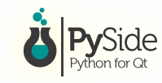

# 1. Introducció
En aquest primer apartat de la unitat introduirem les tecnologies que utilitzarem per als nostres desenvolupaments, Python, Qt i PySide6.

## 1.1 Python

™/®Python Software Foundation, GPL <http://www.gnu.org/licenses/gpl.html>, via Wikimedia Commons

Python és un llenguatge de programació multiparadigma, interpretat, multiplataforma i lliure. Va nàixer de la mà de Guido Van Rossum, un programador holandés, i la seua primera versió va ser publicada el 1991. 

Característiques:

- **D'alt nivell**: proper a llenguatge de l'ésser humà i no al llenguatge màquina binari.
- **Interpretat**: s'executa en qualsevol màquina que tinga un intèrpret de Python. Això suposa un gran avantatge a l'hora de fer petits canvis de forma ràpida, ja que elimina la necessitat de recompilar el codi.
- **Multiparadigma**: podem fer servir la programació modular, estructurada o l'orientació a objectes segons les nostres necessitats.
- **Multiplataforma**: permet que el codi siga executat en diferents sistemes operatius.
- **Lliure**: és propietat de la Python Software Foundation i està publicat sota llicència PSF-License que és compatible amb GPL (General Public License), la qual cosa significa que és de lliure ús i distribució, fins i tot per a ús comercial.
- **Net i llegible**: posa l'accent en la seua llegibilitat, cosa que ho fa fàcilment comprensible i fàcil d'aprendre. Si ja heu treballat amb qualsevol altre llenguatge de programació, us resultarà fàcil l'ús de Python.
- **Tipat fort i dinàmic**: encara que les variables són d'un tipus concret, no tenim la necessitat de declarar-los, sinó que l'assignació de tipus s'anirà en temps d'execució.
- **Àmplia comunitat**: gràcies a la seua popularitat compta amb un ampli suport i es pot trobar fàcilment molta documentació, esdeveniments, conferències, etc.

Actualment ocupa el **primer lloc al rànquing TIOBE**, que és un prestigiós indicador de la popularitat dels llenguatges de programació que s'actualitza un cop al mes. No només això, sinó que a més mostra una tendència creixent davant de llenguatges com C o Java, que mostren la tendència contrària. Això és degut en gran manera al seu ús majoritari en camps com la Intel·ligència Artificial, el Big Data, el Machine Learning o la Ciberseguretat, àrees predominants en un futur proper. 

!!!warning "TIOBE"
    És important assenyalar que l'índex TIOBE no tracta d'escollir el millor llenguatge de programació o el llenguatge en què s'han escrit la majoria de les línies de codi.

Tot això ens ha portat a escollir aquest llenguatge de programació per al present curs.

!!!example "Vegem la comparació entre “Hola Món!” de Java i de Python"

    === "Java"
        ~~~Java
        public class HolaMón {
            public static void main(String[] args) {
                System.out.println("Hola Món!");
            }
        }
        ~~~

    === "Python"
        ~~~Python
        print("Hola món!")
        ~~~

!!!warning "Versions de Python"
    Hi ha dues versions de python no compatibles entre elles, la versió 2 i la versió 3.
    **Nosaltres utilitzarem la versió 3 de python.**

## 1.2 Qt

Qt és un framework de desenvolupament d'aplicacions multiplataforma per a escriptori, sistemes de paret i sistemes mòbils. Els seus desenvolupaments permeten executar-se a plataformes com Linux, OS X, Windows, VxWorks, QNX, Android, iOS, BlackBerry, Sailfish OS i altres.
No és un llenguatge de programació sinó un conjunt d'eines per al desenvolupament d'interfícies gràfiques d'usuari multiplataforma mitjançant C++.

El desenvolupament de Qt va ser iniciat el 1990 pels programadors noruecs Eirik Chambe-Eng i Haavard Nord. La seua empresa, Trolltech, que venia llicències de Qt i donava suport. Va passar per diverses adquisicions al llarg dels anys. Avui, l'antiga Trolltech es diu *The Qt Company*. 

Encara que The Qt Company és el principal impulsor de Qt, ara Qt és desenvolupat per un conjunt de companyies més gran: *The Qt Project*. Està format per moltes empreses i persones de tot el món i segueix un model de govern meritocràtic. Tots els que vulguen, particulars i empreses, poden sumar-se al projecte col·laboratiu, escrivint codi o documentació, informant d'errors, ajudant altres usuaris al fòrum o mantenint pàgines al seu wiki.

Qt està disponible sota diverses llicències: The Qt Company ven llicències comercials, però Qt també està disponible com a programari lliure sota diverses versions de GPL i LGPL.

Alguns exemples d'aplicacions desenvolupades amb Qt són:

- Adobe Photoshop Album, per organitzar imatges.
- L'escriptori Kde de les distribucions Linux.
- Last.fm Player, el client descriptori per a streaming de música i ràdio.
- Skype, per a missatgeria i VOIP.
- TeamSpeak, per a la comunicació amb veu àmpliament usada per gamers.
- VirtualBox, per a la virtualització de sistemes.
- LibreOffice, paquet ofimàtic lliure. Alternativa a Microsoft Office.
- OnlyDesktops, paquet ofimàtic lliure competidor de LibreOffice.

## 1.3 PySide6

PySide és la unió de Python i Qt . Va ser desenvolupat per The Qt Company, com a part del projecte Qt for Python. És una de les alternatives al paquet estàndard Tkinter de Python per crear interfícies. Com Qt, PySide és programari lliure. PySide és compatible amb Linux/X11, macOS i Microsoft Windows, per tant, els nostres desenvolupaments seran compatibles amb qualsevol d'aquestes plataformes amb només un desenvolupament de codi.

!!!warning "Documentació"
    Encara que hi ha documentació específica de PySide disponible, també podem i recomanem utilitzar la documentació de Qt per a C++, tenint en compte que caldrà traduir la sintaxi d'objectes i mètodes C++ per adaptar-lo a Python.

Hi ha hagut tres versions principals de PySide:

- PySide: compatible amb Qt 4
- PySide2: compatible amb Qt 5
- PySide6: compatible amb Qt 6
  
La versió 1 de PySide va ser llançada a l'agost de 2009 sota llicència LGPL per Nokia, llavors propietària de Qt, després de no arribar a un acord amb els desenvolupadors de PyQt, Riverbank Computing. Va recolzar Qt 4 sota els sistemes operatius Linux/X11, Mac US X, Microsoft Windows, Maemo i MeeGo, mentre que la comunitat PySide va afegir suport per a Android.

Christian Tismer va iniciar PySide2 per portar PySide de Qt 4 a Qt 5 el 2015. Aleshores, el projecte es va incorporar al projecte Qt. Va ser llançat el desembre del 2018.

PySide6 es va llançar el desembre del 2020. Va afegir suport per Qt 6 i va eliminar el suport per a totes les versions de Python anteriors a la 3.6.

Nosaltres farem ús de PySide6 durant aquest curs.
