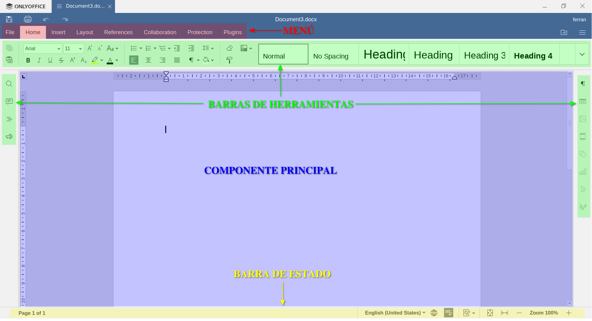
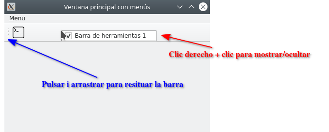

# 4. Menús, barres d'eines, barres d'estat i components flotants.

Si ens fixem a la finestra principal de qualsevol aplicació, la seva estructura bàsica sol seguir un esquema semblant al següent:

- Un menú, normalment en forma de desplegable, però pot ser en forma de pestanyes, com en aquest cas.
- Barres d'eines, amb funcionalitat habitual en un sol clic, a les quals accedir mitjançant menú seria més tediós.
- Component principal, que ocupa la part central de l'aplicació.
- Barra d'estat, que indica l'estat o la configuració activa de l'aplicació.

En aquest apartat afegirem aquestes parts a la nostra finestra principal, fent ús, com en apartats anteriors, de QMainWindow.

## 4.1 QActions

Abans de començar a abordar els menús i les barres d'eines, convé estudiar les QActions de Qt. A les aplicacions es pot executar una mateixa funcionalitat interaccionant amb diferents interfícies d'usuari, ja sigui a través de menús, botons de la barra d'eines o dreceres de teclat. Aquí és on entren en joc les QAction de Qt. A més, se us pot assignar un text d'estat, que s'utilitzarà a la barra d'estats.

!!!example "Exemple"
    En un processador de textos, en utilitzar el menú “Fitxer -> Guardar”, el botó “Guardar” de la barra d'eines o utilitzar la drecera de teclat, Ctrl + s normalment, el fitxer que estem editant es guardarà a disc. La funcionalitat és la mateixa en els tres casos, però la interfície utilitzada és diferent. A la barra d'estats sol ser visible si el document en qüestió està desat o ha estat modificat.

Un objecte QAction pot contenir una icona, un text de menú, una drecera de teclat, un text d'estat i un text d'ajuda. Alguns d'aquests elements es poden establir al constructor, però també es poden configurar de manera independent amb setIcon(), setText(), setIconText(), setShortcut(), setStatusTip(), setWhatsThis() i setToolTip(). Es pot canviar la font del menú amb setFont().

Quan s'ha creat una QAction, l'afegim al menú i a la barra d'eines que volem utilitzar i després el connectem a la ranura que executarà la seua funcionalitat.

## 4.2 Barra de menús
Per afegir menús a QMainWindow, utilitzarem el mètode .addMenu() de la barra de menús menuBar(). A aquest nou menú podem afegir nous submenús amb addMenu() i separadors, per organitzar de forma més coherent les opcions, amb addSeparator().

Per afegir una opció de menú que responga a una funcionalitat, utilitzarem els QAction. 

!!!example "Exemple"
    ~~~Python
    from PySide6.QtWidgets import QApplication, QMainWindow
    from PySide6.QtGui import QAction, QKeySequence

    # Nuestra ventana principal hereda de QMainWindow
    class VentanaPrincipal(QMainWindow):
        def __init__(self):
            super().__init__()
            self.setWindowTitle("Ventana principal con menú")
            # Obtenemos la referencia a la barra de menú
            barra_menus = self.menuBar()
            # Añadimos la opción "Menu" al menú principal
            menu = barra_menus.addMenu("&Menu")
            # Definimos el QAction con el texto "Imprimir por consola"
            accion = QAction("&Imprimir por consola", self)
            # Asignamos un atajo de teclado a la acción
            accion.setShortcut(QKeySequence("Ctrl+p"))
            # Connectamos la accion con la ranura "imprimir_por_consola"
            accion.triggered.connect(self.imprimir_por_consola)
            # Añadimos la acción al menú
            menu.addAction(accion)

        def imprimir_por_consola(self):
            print("Acción lanzada a través del menú o del atajo")

    if __name__ == "__main__":
        app = QApplication([])
        ventana1 = VentanaPrincipal()
        ventana1.show()
        app.exec()
    ~~~
 

El símbol “&” al text del Menú, ens facilita obrir el menú desplegable corresponent amb la combinació de tecles Alt + caràcter. Fixa't que el caràcter en qüestió apareix subratllat al text del menú.

Així, en el nostre exemple, en prémer Alt+M obrirem el desplegable d'aquest menú. Si tornem a prémer la tecla “i”, que apareix subratllada al desplegable, ens llançarà l'acció definida al QAction, imprimir per consola.
Fixa't que al codi hem assignat una combinació de tecles a l'acció, és a dir una drecera de teclat per llançar-la. Així doncs, aquesta drecera ve indicada a l'opció del menú. Això ens permet, sense desplegar el menú, llançar aquesta acció.

## 4.3 Barra d'eines
Ampliarem l'exemple anterior afegint l'acció a una barra d'eines. Els passos a seguir serien els següents:

1. Creem una barra d'eines instant la classe QToolBar
2. Afegim l'acció a la barra d'eines amb el mètode addAction
3. Afegim la barra d'eines a la finestra principal amb addToolBar

Per defecte, els botons a les barres d'eines segueixen el mateix estil que tinguem configurat al sistema, però si volem canviar aquest comportament, podem fer-ho amb la funcio setToolButtonStyle. Les opcions disponibles, que es troben al mòdul Qt de Qt.Core, són:

| Flag                        | Resultat                                               |
| --------------------------- | ------------------------------------------------------ |
| Qt.ToolButtonIconOnly       | Només mostra la icona                                  |
| Qt.ToolButtonTextOnly       | Només mostra el text                                   |
| Qt.ToolButtonTextBesideIcon | Mostra el text al costat de la icona                   |
| Qt.ToolButtonTextUnderIcon  | Mostra el text de la icona                             |
| Qt.ToolButtonFollowStyle    | Opció per defecte. Segueix la configuració del sistema |

!!!example "Afegim l'acció d'imprimir per consola a la barra d'eines 1."
    ~~~Python
    import os

    from PySide6.QtGui import QAction, QIcon, QKeySequence
    from PySide6.QtWidgets import QApplication, QMainWindow, QToolBar

    # Nuestra ventana principal hereda de QMainWindow
    class VentanaPrincipal(QMainWindow):
        def __init__(self):
            super().__init__()
            self.setWindowTitle(
                "Ventana principal con menú i barra de herramientas")
            barra_menus = self.menuBar()
            menu = barra_menus.addMenu("&Menu")
            ruta_a_icono = os.path.join(os.path.dirname(
                __file__), "images/console.png")
            # Añadimos a la acción, un icono
            accion = QAction(QIcon(ruta_a_icono), "Imprimir por consola", self)
            accion.setWhatsThis(
                "Al pulsar sobre el botón se imprimirá un texto por consola")
            accion.setShortcut(QKeySequence("Ctrl+p"))
            accion.triggered.connect(self.imprimir_por_consola)
            menu.addAction(accion)

            # Creamos la barra de herramientas
            barra_herramientas = QToolBar("Barra de herramientas 1")
            # Añadimos el QAction a la barra de herramientas
            barra_herramientas.addAction(accion)
            # Añadimos la barra de herramientas a la aplicación
            self.addToolBar(barra_herramientas)

        def imprimir_por_consola(self):
            print("Acción lanzada a través del menú, del atajo" +
                " o de la barra de herramientas")

    if __name__ == "__main__":
        app = QApplication([])

        ventana1 = VentanaPrincipal()
        ventana1.show()

    app.exec()
    ~~~
 

El resultat és la mateixa aplicació però amb una barra d'eines, la qual podem situar a dalt o als laterals, punxant i arrossegant-la, i fer-la visible o invisible fent clic dret sobre ella i de nou clic sobre el botó de verificació.

Si us fixeu en el menú, amb la incorporació de la icona a l'acció, veureu que apareix la icona també al desplegable. Si no vols que apareguin, podem configurar l'aplicació perquè no ho faci, fent ús del mètode setAttribute() i passant-li Qt.AA_DontShowIconsInMenus del mòdul Qt com a paràmetre.

## 4.4 Barra d'estat
En aquesta secció mostrarem com utilitzar la barra d'estat. El seu ús principal serà mostrar informació a l'usuari, i els mètodes més utilitzats addWidget, addPermanentWidget showMessage i clearMessage que ens serviran per afegir components i mostrar/ocultar missatges.

Cada indicador d'estat pot ser d'una de les tres categories següents:

- **Temporal**: ocupa la barra d'estat mentre el punter està sobre una acció on s'ha configurat un statusTip. També es pot mostrar utilitzant showMessage, en aquest cas s'oculta en véncer el timeout passat al constructor o en trucar al mètode clearMessage. S'utilitza per donar informació sobre eines o entrades de menú.
- **Normal**: mostra informació a través de components (QLabel, QProgressBar o fins i tot QToolButton) afegits a la barra d'eines. Un missatge temporal els pot ocultar i s'utilitza normalment per donar informació a l'usuari sobre l'estat de la vostra aplicació, per exemple número de pàgina en un document.
- **Permanent**: mai no s'amaga i s'utilitza cridant al mètode addPermanentWidget. S'utilitza per a indicacions importants, per exemple, algunes aplicacions col·loquen un indicador de bloqueig de majúscules a la barra d'estat.

!!!example "Exemple"
    ~~~Python
    import os
    import platform

    from PySide6.QtGui import QAction, QIcon, QKeySequence
    from PySide6.QtWidgets import QApplication, QMainWindow, QToolBar, QLabel

    class VentanaPrincipal(QMainWindow):
        def __init__(self):
            super().__init__()
            self.setWindowTitle(
                "Ventana principal con menú, barra de herramientas " +
                " y barra de estado")
            barra_menus = self.menuBar()
            menu = barra_menus.addMenu("&Menu")
            ruta_a_icono = os.path.join(os.path.dirname(
                __file__), "images/console.png")
            accion = QAction(QIcon(ruta_a_icono), "Imprimir por consola", self)
            accion.setWhatsThis(
                "Al pulsar sobre el botón se imprimirá un texto por consola")
            accion.setStatusTip("Imprimir por consola")
            accion.setShortcut(QKeySequence("Ctrl+p"))
            accion.triggered.connect(self.imprimir_por_consola)
            menu.addAction(accion)

            barra_herramientas = QToolBar("Barra de herramientas 1")
            barra_herramientas.addAction(accion)
            self.addToolBar(barra_herramientas)

            # Obtenemos la referencia a la barra de estado
            barra_estado = self.statusBar()
            # Agregamos un componente permanente con la plataforma
            barra_estado.addPermanentWidget(QLabel(platform.system()))
            # Mostramos un mensage durante 3 segundos
            # que se sobrescibirá al pasar el puntero por una acción
            barra_estado.showMessage("Listo. Esperando acción ...", 3000)

        def imprimir_por_consola(self):
            print("Acción lanzada a través del menú, del atajo " +
                " o de la barra de herramientas")

    if __name__ == "__main__":
        app = QApplication([])

        ventana1 = VentanaPrincipal()
        ventana1.show()

        app.exec()
    ~~~

## 4.5 Components flotants

Finalment, estudiarem els components flotants, que ens aporten gran versatilitat a les aplicacions. Són components que poden canviar d'ubicació, desacoblar-se i fins i tot tancar-se.

!!!example "Exemple"
    ~~~Python
    import os
    import platform

    from PySide6.QtCore import Qt
    from PySide6.QtGui import QAction, QIcon, QKeySequence
    from PySide6.QtWidgets import (
        QApplication, QMainWindow, QToolBar, QLabel, QDockWidget, QTextEdit)

    class VentanaPrincipal(QMainWindow):
        def __init__(self):
            super().__init__()
            self.setWindowTitle(
                "Ventana principal con menú, barra de herramientas " +
                " y barra de estado")

            barra_menus = self.menuBar()
            menu = barra_menus.addMenu("&Menu")
            ruta_a_icono = os.path.join(os.path.dirname(
                __file__), "images/console.png")
            accion = QAction(QIcon(ruta_a_icono), "Imprimir por consola", self)
            accion.setWhatsThis(
                "Al pulsar sobre el botón se imprimirá un texto por consola")
            accion.setStatusTip("Imprimir por consola")
            accion.setShortcut(QKeySequence("Ctrl+p"))
            accion.triggered.connect(self.imprimir_por_consola)
            menu.addAction(accion)

            barra_herramientas = QToolBar("Barra de herramientas 1")
            barra_herramientas.addAction(accion)
            self.addToolBar(barra_herramientas)

            barra_estado = self.statusBar()
            barra_estado.addPermanentWidget(QLabel(platform.system()))
            barra_estado.showMessage("Listo. Esperando acción ...", 3000)

            # Creamos un componente flotante
            dock1 = QDockWidget()
            # Agregamos título a este componente
            dock1.setWindowTitle("Componente base 1")
            # Asignamos el componente que contendrà
            dock1.setWidget(QTextEdit(""))
            # Le asignamos una anchura mínima de 50
            dock1.setMinimumWidth(50)
            # Lo posicionamos a la derecha de la ventana principal
            self.addDockWidget(Qt.RightDockWidgetArea, dock1)

            self.setCentralWidget(QLabel("Componente principal"))

        def imprimir_por_consola(self):
            print("Acción lanzada a través del menú, del atajo " +
                " o de la barra de herramientas")

    if __name__ == "__main__":
        app = QApplication([])

        ventana1 = VentanaPrincipal()
        ventana1.show()

        app.exec()

    ~~~ 

El nou component Dock, pot ser resituat punxant i arrossegant sobre la barra de títol cap a un dels cantons de la finestra principal. Podem també desacoblar-ho per mostrar-ho furea de la finestra i mostrar-ho o amagar-ho, igual que les barres d'eines. 

