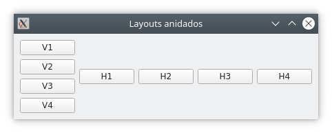

## 2. Components d'ús comú

### **Activitat 1** - Conexió entre senyals i ranures

Desenvolupa una aplicació amb una finestra que continga un QLineEdit i un QLabel. Assigna una mida màxima de text de 5 caràcters al QLineEdit i una mida fixa de 50x30 píxels. El QLabel també tindrà una mida fixa de 50x30 i es desplaçarà 50 píxels a la dreta per no solapar-se amb el QLineEdit. Quan canvieu el text del QLineEdit, l'etiqueta mostrarà el text introduït.

!!!info "Documentació"
    A la documentació de cada component, es pot consultar si els seus senyals i ranures passen i reben arguments respectivament i de quin tipus són.

## 3. Contenidors de components. Disseny.

### **Activitat 2** - Layouts imbricats

Els layouts no només poden contenir widgets, sinó també altres layouts que al seu torn poden contenir widgets i layouts. Per afegir un layout com a layout fill, farem servir el mètode addLayout del pare, i li passarem el layout fill com a argument.

Desenvolupa una aplicació que tinga l'aspecte següent:

