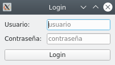

## 3. Contenidors de components. Disseny.

### Pràctica 1 - Login

Crearem una aplicació que simule una finestra de login amb l'aspecte següent:

En cas d'introduir l'usuari “admin” amb la contrasenya “admin”, l'aspecte canviarà al següent:

Si l'usuari o la contrasenya és qualsevol altre, l'aspecte seria el següent:

!!!warning "Credencial *harcodejades*"
    Tingues en compte que posar els usuaris i contrasenyes al codi no és una bona pràctica, ja que per canviar-lo caldria editar el codi. A més, suposa un gran risc de seguretat, perquè en fer enginyeria inversa i obtenir el codi original de l'aplicació, s'obtindrien les credencials. A les aplicacions reals es consultaria un servidor de bases de dades o algun fitxer protegit.

## 4. Barres de ferramentes, barra d'estat i menús.

### Pràctica 2.1 - Editor de text

En aquesta pràctica anem a desenvolupar un editor de text molt simple, que tindrà el següent aspecte:

Tindrà tres accions:

- Obrir fitxer, al menú i a la barra d'eines. Drecera Ctrl + o
- Guarda fitxer, al menú i a la barra d'eines. Drecera Ctrl + s
- Sortir, al menú. Drecera Ctrl + q

L'arxiu on guardeu o que podeu carregar sempre serà el mateix, “arxiu.txt”, i estarà situat a la mateixa ruta que l'executable. En desar, se sobreescriurà el fitxer.

!!!info "Ajuda"
    Defineix tres QAction per a les accions. Cadascuna anirà connectada a una ranura amb la funcionalitat especificada i la situaràs a la barra d'eines i al menú segons corresponga.

    Per llegir/escriure en un fitxer, utilitza el mètode de python “open” com corresponga:

    - “r+” per a lectura i actualització.
    - “w” per a escriptura

    Per ixir de l'aplicació recorda que les aplicacions acaben normalment en tancar la última de les finestres visibles.

## 5. Diàlegs i altres finestres.

### Pràctica 2.2 - Editor de text: No perdre els canvis.

Anem a continuar afegint funcionalitat al nostre editor de text de la [pràctica 3](#practica-3-editor-de-text). 

En sortir de l'aplicació, tancar el fitxer o obrir un altre fitxer, hem de comprovar si hem guardat els canvis. En cas de no haver-los guardat, hauríem de demanar a l'usuari si vol guardar-los, de manera que els canvis no es perden.

### Pràctica 2.3 - Editor de text: Dialegs per obrir i tancar arxius.

A la pràctica de l'apartat anterior [(Pràctica 3)](../tasques/2%20-%20Pràctiques.md#practica-3-editor-de-text), havíem començat a desenvolupar un editor de text molt simple que permetia carregar i guardar “arxiu.txt” situat a la mateixa ruta des de la qual executàvem el codi.

En aquesta activitat, utilitzarem dos diàlegs, un per demanar quin fitxer obrir i un altre per demanar en quin fitxer volem desar els canvis. En cas que ja hi haja un fitxer obert, en donar a desar no demanarà la ruta al fitxer, sinó que utilitzarà la ruta del fitxer obert anteriorment, sobreescrivint-lo.

A més, afegirem una entrada de menú “Tancar” per tancar l'arxiu obert actualment i començar-ne un de nou.

### Pràctica 3 - Diàleg en login

A la [pràctica 2](#practica-2-login) de l'apartat 3 havíem creat una finestra per demanar l'usuari i la contrasenya en una finestra de *login*. Canviarem la implementació, fent que siga un diàleg, de manera que si l'usuari i la contrasenya són “admin”, “admin”, entrarem a l'aplicació, que mostrarem de forma maximitzada. Però si no, mostrarem un quadre de diàleg nou indicant que “l'usuari o la contrasenya són incorrectes”.

La finestra de l'aplicació simplement contindrà un QLabel amb el text Finestra principal.

!!!info "Ajuda"
    El diàleg es mostrarà en llançar el seu bucle d'esdeveniments, funció exec(). Aquesta funció ens tornarà el resultat del diàleg, així que podem utilitzar la ranura accept() quan el login siga correcte, que ens tornarà el valor QDialog.Accepted. En cas de tornar una altra cosa, mostrarem el missatge de login incorrecte indicat a l'enunciat, utilitzant un QMessageBox. 
