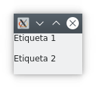
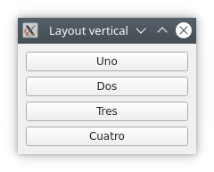
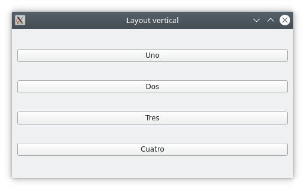
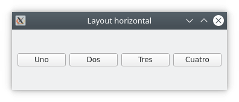
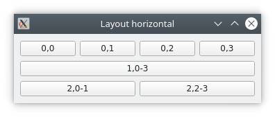
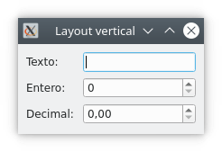

# 1. Contenidors de components. Disseny.

## 1.1. Layouts

Fins ara hem vist finestres amb un sol component o components continguts dins d'un altre component, com és el cas del següent exemple:

!!!example "Exemple"
    ~~~py
    from PySide6.QtWidgets import QApplication, QLabel, QWidget
 
    class Finestra(QWidget):
        def __init__(self):
            QWidget.__init__(self)
            self.setWindowTitle("finestra")
    
            # Creem dues etiquetes amb el component com a parent
            self.label1 = QLabel("Etiqueta 1", self)
            self.label2 = QLabel("Etiqueta 2", self)
            # Necessitem moure la segona perquè no es solapi amb la primera
            self.label2.move(0, 30)
    
    if __name__ == "__main__":
        app = QApplication([])
        finestra = Finestra()
        # Mostrem la finestra
        finestra.show()
        app.exec()
    ~~~

El resultat és una finestra com la següent:

Però què passa si volem afegir més components tant horitzontalment com verticalment? Què passa si redimensionem la finestra? Hauríem d'anar calculant el nombre de píxels a desplaçar-los i l'espai que ocupen a la interfície no queda modificat. Així que estudiarem en aquest apartat una forma més eficient de gestionar tot això a través de layouts. Són dissenys o disposicions que podem aplicar a una interfície per ordenar-ne els components. Amb la combinació d'aquests layouts és possible definir el disseny de qualsevol interfície gràfica d'usuari.

## 1.2. QVBoxLayout

La primera disposició que estudiarem serà la disposició en vertical. Hi anirà afegint els components al final d'una pila de components, un a sobre de l'altre.

!!!example "Exemple"
    ~~~py
    from PySide6.QtWidgets import (
        QApplication, QMainWindow, QWidget, QVBoxLayout, QPushButton
    )

    class VentanaPrincipal(QMainWindow):

        def __init__(self):
            super().__init__()

            self.setWindowTitle("Layout vertical")

            # Creem un layout vertical
            layout_vertical = QVBoxLayout()

            componente_principal = QWidget()
            componente_principal.setLayout(layout_vertical)
            self.setCentralWidget(componente_principal)

            layout_vertical.addWidget(QPushButton('Uno'))
            layout_vertical.addWidget(QPushButton('Dos'))
            layout_vertical.addWidget(QPushButton('Tres'))
            layout_vertical.addWidget(QPushButton('Cuatro'))

    app = QApplication([])

    ventana = VentanaPrincipal()
    ventana.show()

    app.exec()
    ~~~

Hem definit un component principal de tipus QWidget al qual assignem un layout vertical. A aquest layout hi afegim els components que utilitzarem. 

Si ara provem de redimensionar la finestra, els components canvien automàticament de mida per ajustar-se a l'amplada de la finestra i repartir-se de forma equitativa verticalment.

## 1.3. QHBoxLayout
En aquest apartat ens centrem en la disposició horitzontal dels components, fent ús d'un layout horitzontal:

!!!example "Exemple"
    ~~~py
    from PySide6.QtWidgets import (
        QApplication, QMainWindow, QWidget, QHBoxLayout, QPushButton
    )

    class VentanaPrincipal(QMainWindow):

        def __init__(self):
            super().__init__()

            self.setWindowTitle("Layout horitzontal")

            # Creem un layout vertical
            layout_horitzontal = QHBoxLayout()

            componente_principal = QWidget()
            componente_principal.setLayout(layout_horitzontal)
            self.setCentralWidget(componente_principal)

            layout_horitzontal.addWidget(QPushButton('Uno'))
            layout_horitzontal.addWidget(QPushButton('Dos'))
            layout_horitzontal.addWidget(QPushButton('Tres'))
            layout_horitzontal.addWidget(QPushButton('Cuatro'))

    app = QApplication([])

    ventana = VentanaPrincipal()
    ventana.show()

    app.exec()
    ~~~

Si redimensionem la finestra, els botons no creixen verticalment, però si ho fan horitzontalment de forma proporcional.

## 1.4. QGridLayout
Tot i que amb l'ús de layouts verticals i horitzontals podríem aconseguir gairebé qualsevol disposició, pot no resultar còmode de gestionar en algunes ocasions. En aquests casos, pot ser més útil fer servir el layout en forma de quadrícula.

!!!example "Exemple"
    ~~~py
    from PySide6.QtWidgets import (
        QApplication, QMainWindow, QWidget, QGridLayout, QPushButton
    )

    class VentanaPrincipal(QMainWindow):

        def __init__(self):
            super().__init__()

            self.setWindowTitle("Layout cuadrícula")

            layout_cuadrícula = QGridLayout()
            componente_principal = QWidget()
            componente_principal.setLayout(layout_cuadrícula)
            self.setCentralWidget(componente_principal)

            layout_cuadrícula.addWidget(QPushButton('0,0'), 0, 0)
            layout_cuadrícula.addWidget(QPushButton('0,1'), 0, 1)
            layout_cuadrícula.addWidget(QPushButton('0,2'), 0, 2)
            layout_cuadrícula.addWidget(QPushButton('0,3'), 0, 3)
            layout_cuadrícula.addWidget(QPushButton('1,0-3'), 1, 0, 1, 4)
            layout_cuadrícula.addWidget(QPushButton('2,0-1'), 2, 0, 1, 2)
            layout_cuadrícula.addWidget(QPushButton('2,2-3'), 2, 2, 1, 2)

    app = QApplication([])

    ventana = VentanaPrincipal()
    ventana.show()

    app.exec()
    ~~~
    

El resultat és el següent:

## 1.5. QFormLayout
En alguns casos pot resultar molt còmode utilitzar el QFormLayout, que és un disseny pensat per a l'elaboració de formularis. Normalment es faran servir com a entrada d'informació, però també pot servir per visualitzar-la, deshabilitant l'entrada de dades als components. Vegem-ne un exemple simple:

!!!example "Exemple"
    ~~~py
    from PySide6.QtWidgets import (
        QApplication,
        QMainWindow,
        QWidget,
        QFormLayout,
        QLabel,
        QLineEdit,
        QSpinBox,
        QDoubleSpinBox
    )

    class VentanaPrincipal(QMainWindow):

        def __init__(self):
            super().__init__()

            self.setWindowTitle("Layout formulario")

            layout_formulario = QFormLayout()
            componente_principal = QWidget()
            componente_principal.setLayout(layout_formulario)
            self.setCentralWidget(componente_principal)

            layout_formulario.addRow(QLabel("Texto: "), QLineEdit())
            layout_formulario.addRow(QLabel("Entero: "), QSpinBox())
            layout_formulario.addRow(QLabel("Decimal: "), QDoubleSpinBox())

    app = QApplication([])

    ventana = VentanaPrincipal()
    ventana.show()

    app.exec()
    ~~~
 
El resultat és el següent:

## 1.6. QStackedLayout
Finalment, vegem un layout que ens permet apilar components, però no de manera vertical de manera que tots són visibles, sinó en profunditat, de manera que només un dels elements serà visible, com si el portéssim al capdavant. Per gestionar quin element és visible utilitzem setCurrentIndex o setCurrentWidget. Vegem-ne un exemple:

!!!example "Exemple"
    ~~~py
    from PySide6.QtWidgets import (
        QApplication,
        QMainWindow,
        QWidget,
        QPushButton,
        QStackedLayout,
        QLabel,
        QVBoxLayout,
        QHBoxLayout
    )

    class VentanaPrincipal(QMainWindow):

        def __init__(self):
            super().__init__()

            self.setWindowTitle("Layout apilado")

            layout_principal = QHBoxLayout()
            componente_principal = QWidget()
            componente_principal.setLayout(layout_principal)
            self.setCentralWidget(componente_principal)

            self.pila = QStackedLayout()
            self.pila.addWidget(QLabel('Capa 1'))
            self.pila.addWidget(QLabel('Capa 2'))
            self.pila.addWidget(QLabel('Capa 3'))

            layout_botones = QVBoxLayout()
            boton1 = QPushButton("Ver capa 1")
            boton1.clicked.connect(self.activar_capa1)
            boton2 = QPushButton("Ver capa 2")
            boton2.clicked.connect(self.activar_capa2)
            boton3 = QPushButton("Ver capa 3") 
            boton3.clicked.connect(self.activar_capa3)
            layout_botones.addWidget(boton1)
            layout_botones.addWidget(boton2)
            layout_botones.addWidget(boton3)

            layout_principal.addLayout(self.pila)
            layout_principal.addLayout(layout_botones)

        def activar_capa1(self):
            self.pila.setCurrentIndex(0)

        def activar_capa2(self):
            self.pila.setCurrentIndex(1)

        def activar_capa3(self):
            self.pila.setCurrentIndex(2)

    app = QApplication([])

    ventana = VentanaPrincipal()
    ventana.show()

    app.exec()
    ~~~
 

El resultat és una interfície semblant a l'ús de pestanyes, però amb botons:

!!! tip "Flet vs PySide6"
    Com haureu pogut observar, els equivalents en Flet serien el column, el row i l'stack.