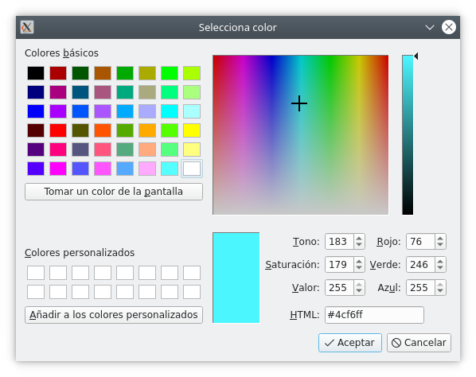
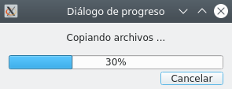

# 1. Diàlegs i altres finestres.
Fins ara hem utilitzat el component QMainWindow per treballar amb les nostres aplicacions. En aquest apartat estudiarem com mostrar o demanar informació a l'usuari a través de diversos tipus de finestres.

## 1.1. Diàlegs

### 1.1.1. QDialog

Tal com el seu nom indica, els diàlegs són finestres emergents temporals que ens permeten comunicar-nos amb l'usuari de l'aplicació i que apareixen a causa de la producció d'un esdeveniment. Són finestres modals, és a dir, bloquegen la interacció amb la resta de l'aplicació fins que se n'acabe l'execució, siga tancant-los o introduint la informació que es demana. 

Per aquest motiu, necessiten el seu propi bucle d'esdeveniments. Es pot evitar el bloqueig de l'execució amb l'ús de fils d'execució, però queda fora de l'abast d'aquest mòdul. S'hi hauria d'aplicar els coneixements adquirits al mòdul de Programació de Serveis i Processos als desenvolupaments en Qt.

A Qt els diàlegs s'implementen com a classes de QDialog o les seves derivades. 

!!!example "Exemple"
    ~~~py
        from PySide6.QtWidgets import QApplication, QDialog, QMainWindow, QPushButton

    class VentanaPrincipal(QMainWindow):
        def __init__(self):
            super().__init__()

            self.setWindowTitle("Aplicación con diálogos")

            boton = QPushButton("Haz clic para que el dialogo aparezca")
            boton.clicked.connect(self.mostrar_dialogo)
            self.setCentralWidget(boton)

        def mostrar_dialogo(self):
            print("Clic recibido, se mostrará el dialogo.")
            ventana_dialogo = QDialog(self)
            ventana_dialogo.setWindowTitle("Ventana de dialogo")
            ventana_dialogo.exec()

    app = QApplication([])

    ventana_principal = VentanaPrincipal()
    ventana_principal.show()

    app.exec()
    ~~~
 

### 1.1.2. Diàlegs personalitzats

Un cop sabem crear un diàleg, anem a personalitzar-lo. Podem fer servir els QPushButton estudiats anteriorment, però a Qt hi ha una sèrie de botons predefinits dissenyats segons les guies d'estil de les diferents plataformes. Es recomana consultar aquestes guies perquè les nostres aplicacions siguen el més naturals a l'usuari.

Els botons predefinits a Qt es troben al mòdul QDialogButtonBox com a propietats. A continuació mostrem la llista completa d'estos, que deuria ser suficient per a qualsevol aplicació:

- QDialogButtonBox.Ok
- QDialogButtonBox.Open
- QDialogButtonBox.Save
- QDialogButtonBox.Cancel
- QDialogButtonBox.Close
- QDialogButtonBox.Discard
- QDialogButtonBox.Apply
- QDialogButtonBox.Reset
- QDialogButtonBox.RestoreDefaults
- QDialogButtonBox.Help
- QDialogButtonBox.SaveAll
- QDialogButtonBox.Yes
- QDialogButtonBox.YesToAll
- QDialogButtonBox.No
- QDialogButtonBox.Abort
- QDialogButtonBox.Retry
- QDialogButtonBox.Ignore
- QDialogButtonBox.NoButton

Al següent exemple afegirem diversos botons a la nostra finestra. Per fer-ho:

1. Crearem una variable amb els nostres botons separats per l'operador lògic or “|”, ja que realment, els botons són variables binàries.
2. Passarem aquesta variable com a primer paràmetre a QDialogButtonBox, que contindrà tots els nostres botons.
3. Connectem els senyals dels botons a la ranura que desitgem. El més normal és utilitzar com a ranura les ja predefinides.
   
Consulteu [https://doc.qt.io/qt-6/qdialogbuttonbox.html](https://doc.qt.io/qt-6/qdialogbuttonbox.html) per a més informació sobre els senyals QDialogButtonBox.

Consulteu [https://doc.qt.io/qt-6/qdialog.html](https://doc.qt.io/qt-6/qdialog.html) per a més informació sobre les ranures de QDialog.

!!!example "Exemple"
    ~~~py
    from PySide6.QtWidgets import (
        QMainWindow, QApplication, QDialog, QDialogButtonBox, QVBoxLayout, QLabel,
        QPushButton
    )

    class DialogoPersonalizado(QDialog):
        def __init__(self, parent=None):
            super().__init__(parent)

            self.setWindowTitle("Dialogo personalizado")

            botones = QDialogButtonBox.Ok | QDialogButtonBox.Cancel

            self.caja_botones = QDialogButtonBox(botones)
            self.caja_botones.accepted.connect(self.accept)
            self.caja_botones.rejected.connect(self.reject)

            self.layout_dialogo = QVBoxLayout()
            self.layout_dialogo.addWidget(
                QLabel("Estás seguro de querer realizar esta acción?"))
            self.layout_dialogo.addWidget(self.caja_botones)
            self.setLayout(self.layout_dialogo)

    class VentanaPrincipal(QMainWindow):
        def __init__(self):
            super().__init__()

            self.setWindowTitle("Aplicación con diálogo personalizado")

            boton = QPushButton("Haz clic para que el dialogo aparezca")
            boton.clicked.connect(self.mostrar_dialogo)
            self.setCentralWidget(boton)

        def mostrar_dialogo(self):
            print("Clic recibido, se mostrará el dialogo.")
            ventana_dialogo = DialogoPersonalizado(self)
            ventana_dialogo.setWindowTitle("Ventana de dialogo personalizado")
            # 1 si s'executa accept
            # 0 si s'executa reject
            resultado = ventana_dialogo.exec()
            if resultado:
                print("Aceptada")
            else:
                print("Cancelada")

    app = QApplication([])

    ventana_principal = VentanaPrincipal()
    ventana_principal.show()

    app.exec()
    ~~~ 

!!!warning "Traducció de diàlegs"

    Si executem el codi, observem que els botons mostren el text en anglès. Podem utilitzar el següent mètode per traduir els controls predefinits:

    ~~~py
    def carregar_traductor(self, app):
        translator = QTranslator(app)
        translations = QLibraryInfo.location(QLibraryInfo.TranslationsPath)
        translator.load("qt_ca", translations)
        app.installTranslator(translator)

    ...

    app = QApplication([])

    ventana_principal = VentanaPrincipal()
    ventana_principal.carregar_traductor(app)
    ~~~

## 1.2. QMessageBox
A l'apartat anterior, hem personalitzat un QDialog, però hi ha quadres de diàleg ja predissenyats a Qt. Es troben disponibles al mòdul QMessageBox i hi ha quatre tipus segons el nivell de severitat de la informació (question, information, warning i critical). Realment, lúnica diferència entre ells és la icona que mostren. A la taula següent es mostren els nivells:

| Icona                    | Tipus de QMessageBox | Ús                                       |
| ------------------------ | -------------------- | ---------------------------------------- |
|  | Question             | Preguntes a l'usuari en accions normals. |
|  | Information             | nformació a l'usuari en accions normals. |
|  | Warning             | Informació per a errors no crítics. |
|  | Critical             | Informació per a errors crítics. |

Igual que en els QDialog, hi ha botons predefinits que podem utilitzar a les nostres QMessageBox. Aquesta és la llista d'ells:

- QMessageBox.Ok
- QMessageBox.Open
- QMessageBox.Save
- QMessageBox.Cancel
- QMessageBox.Close
- QMessageBox.Discard
- QMessageBox.Apply
- QMessageBox.Reset
- QMessageBox.RestoreDefaults
- QMessageBox.Help
- QMessageBox.SaveAll
- QMessageBox.Yes
- QMessageBox.YesToAll
- QMessageBox.No
- QMessageBox .NoToAll
- QMessageBox.Abort
- QMessageBox.Retry
- QMessageBox.Ignore
- QMessageBox.NoButton

!!!example "Missatge crític típic d'algunes aplicacions"
    ~~~py
    from PySide6.QtCore import QLibraryInfo, QTranslator
    from PySide6.QtWidgets import (
        QApplication, QMessageBox, QMainWindow, QPushButton
    )

    class VentanaPrincipal(QMainWindow):
        def __init__(self):
            super().__init__()

            self.setWindowTitle("Aplicación con mesaje crítico")

            boton = QPushButton("Haz clic para ver el mensaje crítico")
            boton.clicked.connect(self.mostrar_dialogo)
            self.setCentralWidget(boton)

        def mostrar_dialogo(self):
            boton_pulsado = QMessageBox.critical(
                self,
                "Ejemplo de cuadro de mensaje crítico",
                "Ha habído algun problema al realizar la acción",
                buttons=QMessageBox.Discard | QMessageBox.NoToAll |
                    QMessageBox.Ignore,
                defaultButton=QMessageBox.Discard
            )

            if boton_pulsado == QMessageBox.Discard:
                print("Descartado!")
            elif boton_pulsado == QMessageBox.NoToAll:
                print("No a todo!")
            else:
                print("Ignorado!")
        
    def cargar_traductor(app):
        translator = QTranslator(app)
        translations = QLibraryInfo.location(QLibraryInfo.TranslationsPath)
        translator.load("qt_ca", translations)
        app.installTranslator(translator)

    app = QApplication([])

    cargar_traductor(app)

    ventana_principal = VentanaPrincipal()
    ventana_principal.show()

    app.exec()
    ~~~
 
 
El resultat és el següent:

## 1.3. Altres diàlegs
Hi ha altres tipus de diàlegs que podeu trobar al mòdul QtWidgets. Aquests són més específics:

- **QColorDialog**: per especificar colors
- **QFileDialog**: per especificar fitxers o carpetes
- **QFontDialog**: per seleccionar les fonts
- **QInputDialog**: per demanar dades a l'usuari
- **QProgressDialog**: per informar del progrés d'una operació lenta

Vegem uns simples exemples que poden resultar útils (ometem la part general de l'aplicació per mostrar només la part que ens interessa):

!!!example "Exemple d'altres diàlegs"

    === "Obrir arxiu"
        ~~~py
        def mostrar_dialeg(self):
            finestra_dialeg = QFileDialog.getOpenFileName(
                self, caption="Obrir fitxer...", dir=".",
                filter="Documents de text (*.txt);;Documents PDF (*.pdf)",
                selectedFilter="Documents de text (*.txt)")
            fitxer = finestra_dialeg[0]
        ~~~

    === "Guardar arxiu"

        NOTA: Si el fitxer ja existeix ens demana confirmació de sobreescriptura
        ~~~py
        def mostrar_dialeg(self):
            finestra_dialeg = QFileDialog.getSaveFileName(
                self, caption="Desa fitxer ...", dir=".",
                filter="Documents de text (*.txt);;Documents PDF (*.pdf)",
                selectedFilter="Documents de text (*.txt)")
            fitxer = finestra_dialeg[0]
            print(arxiu)
        ~~~
        

    === "Obtenir un color"

        ~~~py
        def mostrar_dialeg(self):
            color = QColorDialog.getColor()
            if color.isValid():
                # Amb la següent línia assignem el color seleccionat
                # com a color de fons del botó a través de CSS
                self.boton.setStyleSheet(f"background-color: {color.name()}")
        ~~~
        

    === "Obtenir una font"

        ~~~py
        def mostrar_dialeg(self):
            seleccionada, font = QFontDialog.getFont(self)
            if seleccionada:
                # Assignem la font seleccionada al botó
                self.boton.setFont(font)
        ~~~
        
    
    === "Informació de l'usuari"
        Amb QInputDialog podem obtenir valors de l'usuari. Text amb getText, sencers amb getInt, ... 
        
        A l'exemple obtenim el mes de naixement d'una llista de mesos i l'imprimim per consola:

        ~~~py
        def mostrar_dialeg(self):
            mes, seleccionat = QInputDialog.getItem(
                self, "Mes de naixement",  "Messos",
                ["Gener", "Febrer", "Març", "Abril", "Maig",
                "Juny", "Juliol", "Agost", "Setembre",
                "Octubre", "Novembre", "Desembre"]
            )
            if seleccionat:
                print(mes)
        ~~~
        

    === "Barra de progrés"
        Amb QProgressDialog podem mostrar la informació de com avança un procés lent. Aquest tipus de processos s'haurien de llançar en un fil d'execució perquè la interfície no quede bloquejada en espera que el procés s'acabe. Simularem una còpia de fitxers llançada amb un fil d'execució. El codi següent engloba conceptes del mòdul de Programació de Serveis i Processos.

        

        ~~~py
        import time
        from PySide6.QtCore import QThread, Signal
        from PySide6.QtWidgets import (
            QMainWindow, QPushButton, QProgressDialog, QApplication
        )
        
        # Classe Fil que simula un procés lent
        class Hilo(QThread):
            # Senyal que transmet un nombre sencer al seu escoltador o ranura
            senyal = Signal(int)
        
            def __init__(self):
                super(Hilo, self).__init__()
                self.cancel·lat = False
        
            def __del__(self):
                self.wait()
        
            # Mètode que s'executa en llançar el fil
            # Mentre no es cancel·li, el fil emetrà un senyal amb un
            # sencer entre 0 i 10 cada 0,3 segons
            def run(self):
                for i in range(11):
                    if not self.cancel·lat:
                        self.senyal.emit(i)
                        time.sleep(0.5)
                    else:
                        break
        
        class FinestraPrincipal(QMainWindow):
            def __init__(self):
                super().__init__()
                self.setWindowTitle('Aplicació amb QProgressDialog')
                self.boton = QPushButton('Clic per iniciar la còpia de fitxers')
                self.boton.clicked.connect(self.mostrar_dialeg_progrés)
                self.setCentralWidget(self.boton)
        
            def mostrar_dialeg_progrés(self):
                # Deshabilitem el botó per evitar que es llanci un altre fil
                self.boton.setEnabled(False)
                # Creem un QProgessDialog entre 0 i 10 i un botó Cancel·la
                self.barra_progrés = QProgressDialog(
                    "Copiant fitxers ...", "Cancel·lar", 0, 10, self)
                self.barra_progreso.setWindowTitle("Diàleg de progrés")
                # Connectem el senyal cancel·lat del QProgressDialog a la ranura
                self.barra_progreso.canceled.connect(self.cancelar)
                
                # Creem un fil d'execució
                self.fil = Fil()
                # Connectem el senyal del fil a la ranura
                self.fil.senyal.connect(self.senyal_rebuda)
                # Llancem l'execució del fil
                self.fil.start()
                # Mostrem la barra de progrés
                self.barra_progreso.show()
        
            def senyal_rebuda(self, progrés):
                # Quan rebem el senyal del fil, incrementem
                # el progrés amb el valor rebut
                self.barra_progreso.setValue(int(progrés))
                # Quan arribi al 100% esperem 0.5si tanquem el diàleg
                if int(progrés) == 10:
                    time.sleep(0.5)
                    self.barra_progreso.close()
        
            # En donar-li al botó cancel·lar del diàleg, aturem l'enviament de senyals.
            # El diàleg es tancarà i el botó el tornem a habilitar
            def cancel·lar(self):
                self.fil.cancel·lat = True
                self.boton.setEnabled(True)
        
        if __name__ == "__main__":
            app = QApplication([])
            finestra_principal = FinestraPrincipal()
            finestra_principal.show()
            app.exec()
        ~~~

## 1.4. Altres finestres
Fins ara hem vist diferents diàlegs modals que executen al seu propi bucle d'esdeveniments i bloquegen la resta de l'aplicació. Però de vegades ens pot interessar obrir una altra finestra sense bloquejar la finestra principal.

!!!warning "Finestres"
    A Qt, qualsevol widget sense parent és una finestra. Això, a efectes pràctics, vol dir que per mostrar una finestra nova, només hem de crear un Widget i cridar al seu mètode show(). Fixa't que fins i tot podríem crear una aplicació amb diversos QMainWindows.

!!!example "Dues finestres en una mateixa aplicació"
    ~~~py
    from PySide6.QtWidgets import (
        QApplication, QMainWindow, QPushButton, QLabel, QVBoxLayout, QWidget
        )

    class OtraVentana(QLabel):
        def __init__(self):
            super().__init__()
            self.setText("La otra ventana")

    class VentanaPrincipal(QMainWindow):

        def __init__(self):
            super().__init__()
            self.otra_ventana = None  # Referència nula
            self.setWindowTitle("Aplicación con dos ventanas")
            self.boton = QPushButton("Mostrar/ocultar otra ventana")
            self.boton.clicked.connect(self.mostrar_otra_ventana)
            self.setCentralWidget(self.boton)

        def mostrar_otra_ventana(self):
            if self.otra_ventana is None:
                self.otra_ventana = OtraVentana()
                self.otra_ventana.move(self.pos())
                self.otra_ventana.show()
            else:
                if self.otra_ventana.isHidden():
                    self.otra_ventana.move(self.pos())
                    self.otra_ventana.show()
                else:
                    self.otra_ventana.hide()

    app = QApplication([])
    ventana_principal = VentanaPrincipal()
    ventana_principal.show()
    app.exec()
    ~~~