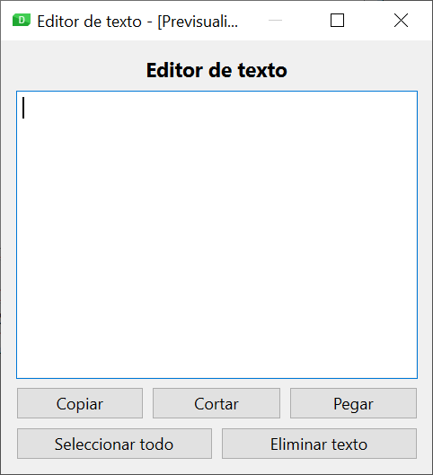
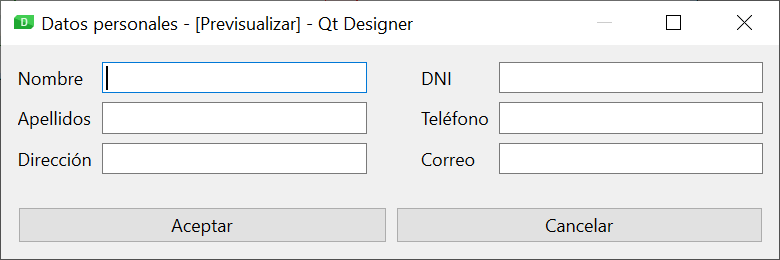

# A2 - Eines de disseny d'interfícies basades en llenguatges de marques

## Formulari 

Hem vist durant la teoria de l'apartat que Qt Designer ofereix diverses plantilles a l'hora de crear un nou formulari. En total són cinc plantilles diferents: una per a una finestra principal, tres relacionades amb diàlegs i una per crear un nou components (widget).
En aquesta activitat, cal crear un nou formulari amb cada una de les plantilles disponibles, i analitzar a l'Inspector d'objectes de Qt Designer els objectes que per defecte s'han introduït per a cada una de les plantilles.

## Editor de texto I

Utilitzant Qt Designer, dissenyant una aplicació per a l'edició de text, prenent com a base la captura següent:

{: style="display: block;margin-left: auto;margin-right: auto;width: 40%;"}

Tin en compte que els botons han de realitzar la funcionalitat esperada per a cada un d'ells, i que en redimensionar la finestra els diferents components han de canviar el seu tamany de forma lògica.
L'etiqueta que apareix a la part superior s'ha configurat amb un tamany de font de 11, i en negreta.

!!!note "Ajuda"
    Quan dissenyem layouts complexos en Qt Designer (que inclouen layouts niuats a altres layouts) sol ser més pràctic aplicar un enfocament de baix cap a dalt, creant primer els layouts interiors, i progressivament creant els layouts de nivells superiors fins arribar al layout principal.

# A3 - Ús de la interfície en una aplicació

## Formulari

En aquesta activitat hauràs de fer algunes modificacions a l'arxiu formulari.ui de la teoria utilitzant un editor de text en lloc de Qt Designer. Els canvis que has de fer són:

- Canvia el títol de la finestra per "Activitat 3”.
- Modificar el botó de tancar per què en lloc de tancar la finestra, la maximitze (hauràs de modificar tant el botó, com la connexió de la senyal a la ranura).
  
Una vegada realitzats els canvis, podeu executar l'arxiu que carrega el formulari i comprovar que els canvis funcionen correctament.

## Editor de text II

Partint de l'editor de text dissenyat a l'apartat anterior, hauràs de crear el programa principal que utilitze el fitxer de disseny UI generat, utilitzant les dues alternatives vistes als continguts teòrics (generació del codi Python associat, i càrrega directa del fitxer UI).
A més, al programa principal, caldrà establir el següent text d'ajuda a l'usuari al quadre de text: “Escriu el teu text aquí…”.

!!!note "Ajuda"
    Hauràs de crear dos programes principals, un per a cada alternativa d'ús del fitxer UI. Et pots basar en els exemples inclosos a la unitat.

    La propietat del control QTextEdit que permet establir el text d'ajuda s'anomena placeholderText.

# A4 - Funcionalitats avançades de l'eina de disseny

## Plantilla

En aquesta activitat hem de crear una plantilla per a la creació de nous formularis, amb les següents característiques:

- El layout principal serà un layout vertical.
- A la part superior de la finestra tindrem una etiqueta amb alt fixe, destinada al títol del formulari. El text estarà centrat horitzontalment, en negreta i amb una mida de font d'11.
- A la part inferior hi haurà una altra etiqueta, també amb alt fixe, destinada a mostrar la versió del formulari. El text estarà alineat a la dreta.

A la part central, i ocupant tot l'espai disponible, tindrem un layout de formulari.

## Formulari

**Dades personals**

Dissenya un nou formulari basant-te en la captura de pantalla següent, associant a les etiquetes els corresponents companys. A més, defineix el següent ordre de tabulació:

{: style="display: block;margin-left: auto;margin-right: auto;width: 70%;"}

1. Nom
2. DNI
3. Cognoms
4. Telèfon
5. Direcció
6. Correu
7. Botó Acceptar
8. Botó Cancel·lar

!!!note "Ajuda"
    Recorda que perquè la funcionalitat de controls companys funcioni correctament les etiquetes han de tenir assignat un caràcter d'accés ràpid a la seva propietat text, anteposant un ampersand (&) abans del caràcter triat. Tingues en compte a més que el mateix caràcter no es pot utilitzar en dues etiquetes diferents.