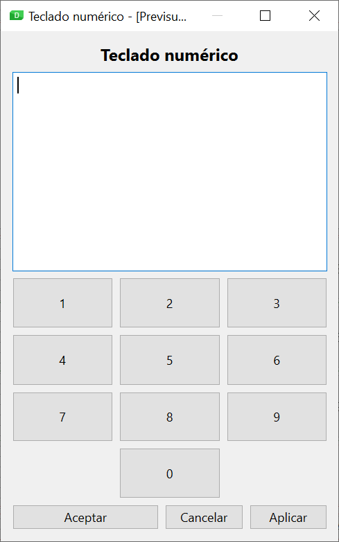
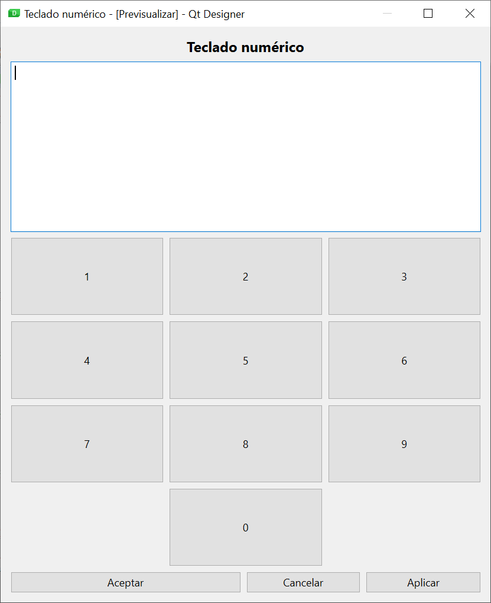

## Pràctica 1: Política de mida (Política de mida)

Com hem vist en els continguts teòrics, l'ús dels diferents tipus de layout i el seu nedament no sempre és suficient per aconseguir el comportament desitjat de la interfície quan la finestra es redimensiona. Per això Qt incorpora altres mecanismes, com els espaiadors o les polítiques de mida.

La política de mida d'un control està formada per dos grups de valors: la configuració (horitzontal i vertical) i la política que s'aplicarà al component quan es redimensione la finestra (i també es distingeix entre política horitzontal i vertical).

### Ajust horitzontal i vertical

El factor dʻajust (estirar) és un nombre que per defecte té el valor 0. S'utilitza per alterar la proporcionalitat del repartiment de l'espai que el layout fa entre els membres, que per defecte és equitativa (és a dir, reparteix l'espai a tots per igual). En cas que especifiqueu un valor a l'ajust, el layout repartirà l'espai proporcionalment segons aquests valors.

!!!example "EXEMPLE"
    Si en un formulari amb un layout vertical situem tres controls d'edició de text (QTextEdit) sabem que, en redimensionar la finestra, es repartirà l'alt disponible a parts iguals entre els tres controls. Però si canviem el factor dʻajust vertical als tres controls amb els valors 1, 2 i 3 respectivament, comprovarem que el repartiment és diferent. Lespai assignat al segon control serà el doble que el del primer, i el tercer control disposarà del triple despai respecte al primer.

### Política horitzontal i vertical

La política determina com es canviarà la mida del component quan es redimensioni la finestra, i estarà condicionada per la mida ideal del component (conegut comconsell de mida). Aquesta mida ideal la determina internament Qt per a cada component en funció del tipus de component i del seu contingut.

Els diferents valors que pot prendre la política sorgeixen per la combinació de quatre indicadors obanderes:

- **GrowFlag**: el component podrà créixer per sobre de la seva mida ideal si cal.
- **Expandir bandera**: el component ha de créixer tot el que sigui possible.
- **ShrinkFlag**: el component pot encongir per sota de la seva mida ideal si cal.
- **Ignora la bandera**: s'ignora la mida ideal, i el component tindrà tot l'espai possible.

Les diferents combinacions d'aquests *flags* donen lloc als possibles valors que podem donar a la política horitzontal i vertical:

- **Fixed**: No se aplica ningún flag, por lo que la única alternativa es el tamaño ideal.
- **Minimum**: GrowFlag
- **Maximum**: ShrinkFlag
- **Preferred**: GrowFlag | ShrinkFlag
- **Expanding**: GrowFlag | ShrinkFlag | ExpandFlag
- **MinimumExpanding**: GrowFlag | ExpandFlag
- **Ignored**: ShrinkFlag | GrowFlag | IgnoreFlag

!!!example "Exemple"
    Els botons (QPushButton) tenen per defecte una política vertical *Fixed* i horitzontal *Minimum*. Per això, la seva alçada sempre s'estableix segons la mida ideal, i no canvia en redimensionar la finestra. No obstant això, la seva amplada pot créixer per sobre del que indica la mida ideal, però no es pot reduir per sota d'aquest valor.

En aquest cas pràctic hauràs de dissenyar amb Qt Designer la interfície d'una aplicació, configurant adequadament la política de mida d'alguns components perquè es comportin correctament en redimensionar la finestra. Tingues en compte les següents indicacions:

- El títol de l'aplicació se centrarà en la finestra.
- El quadre de text tindrà un alt fix (que serà lalt recomanat).
- El botóAcceptartindrà el doble dample que els botonsCancel · lariAplicar.

Els fitxers DI_U03_CPE_1_E_01.png i DI_U03_CPE_1_E_02.png contenen captures de pantalla de l'aplicació amb diferents mides de finestra.

{: style="display: block;margin-left: auto;margin-right: auto;width: 40%;"}

{: style="display: block;margin-left: auto;margin-right: auto;width: 80%;"}

## Pràctica 2: El sistema de recursos de Qt

El sistema de recursos de Qt és un mecanisme independent de la plataforma per incorporar recursos a la nostra aplicació (com a icones o imatges), evitant les referències a fitxers amb la sintaxi específica de cada sistema operatiu.

La utilització del sistema de recursos implica dues accions:

Crear un fitxer de col·lecció de recursos: aquests fitxers basats en XML contenen una llista dels recursos necessaris per a l'aplicació. Tenen extensió.qrc.
Processar el fitxer de recursos: el compilador de recursos de Qt (inclòs a les eines estàndard de Qt) orcc, realitza un processament del fitxer de recursos, generant un fitxer de codi Python que pot ser importat per l'aplicació per disposar dels recursos. La sintaxi de l'ordre és molt senzilla.

~~~bash
rcc -g python fichero_recursos.qrc -o salida.py
~~~

Qt Designer ens ajuda en la creació dels fitxers de recursos i en la seva utilització en els components de la nostra interfície. Per això, tenim disponible el navegador de recursos, situat a la part inferior dreta de la finestra, al costat delEditor de senyals/slots. Des d'aquí, fent servir el botóEditar recursos (la icona de la qual és un llapis), s'obrirà l'editor de recursos.

Amb els botons situats a la part inferior esquerra podrem gestionar els fitxers de recursos (permetent-nos crear-ne un de nou, obrir-ne un existent o eliminar un fitxer). Amb els botons de la dreta gestionarem els recursos del fitxer seleccionat (podent crear un nou prefix, afegir un recurs al prefix seleccionat o eliminar prefixos o recursos).

Els prefixos es fan servir per organitzar els recursos dins del fitxer de recursos en diferents categories.

Per utilitzar el recurs des de Qt Designer, elEditor de propietats ens oferirà l'opció d'escollir un recurs a les propietats el tipus de les quals ho permeti (per exemple, la propietaticona d'unQToolButton).

En aquesta pràctica hauràs d'utilitzar el sistema de recursos Qt per afegir una icona a la finestra d'alguna de les aplicacions que hem dissenyat durant aquesta unitat. Els passos a seguir seran:

1. Necessites un fitxer d'icona per a la teva aplicació. Als enllaços de la unitat tens la referència aGaleria d'icones, una completa galeria d'icones, la majoria amb llicència Creative Commons.
2. Afegeix la icona als recursos del formulari utilitzant el navegador de recursos de Qt Designer.
3. Modifica la propietat *windowIcon* de la finestra del formulari, associant el recurs afegit.
4. Utilitza rcc per convertir el fitxer de recursos a codi Python.
5. Importa el fitxer Python generat perrcc al teu programa principal.
