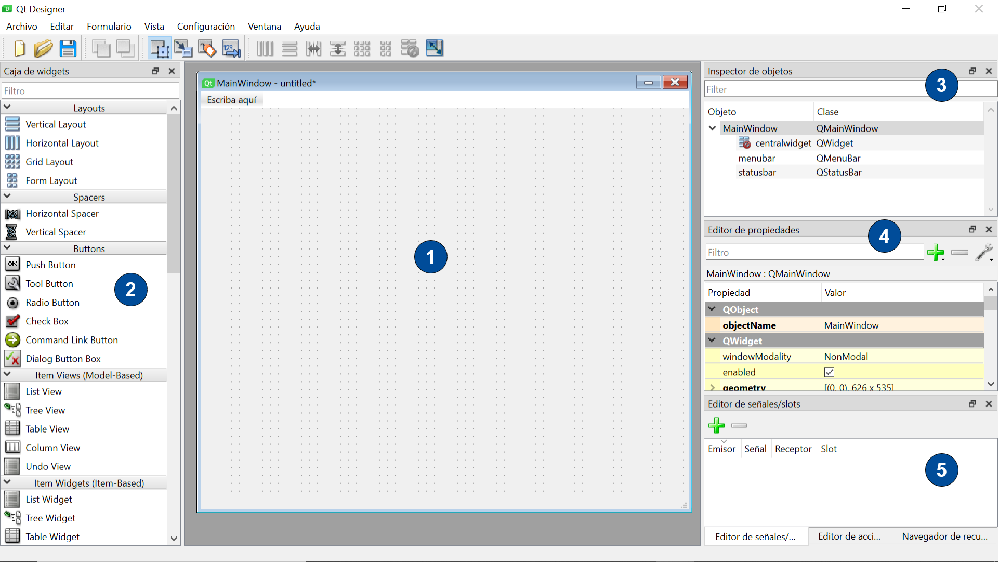
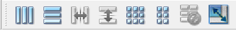
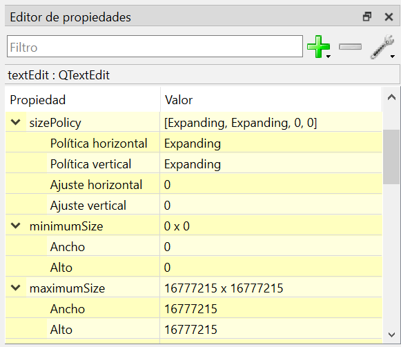
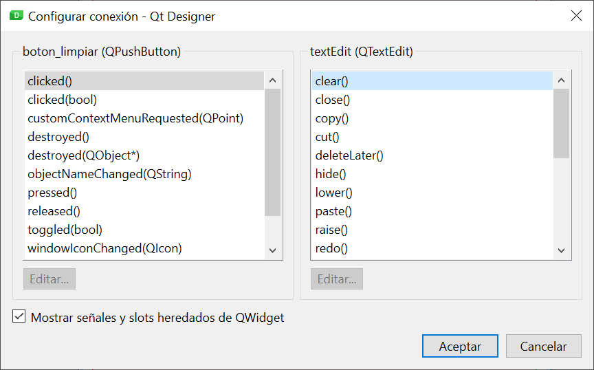

# 1. Eines de disseny d'interfícies basades en llenguatges de marques

A l'hora d'utilitzar un llenguatge de marques per a la generació de la interfície d'usuari d'una aplicació, normalment se'ns presenten dues opcions:

- Utilitzar directament el llenguatge de marques per definir els diferents elements que formaran la interfície i les seves propietats, ajudant-nos d'algun editor de text o codi (com ara Visual Studio Code).
- Fer ús d'una eina de disseny tipus WYSIWYG (what you see is what you get), que ens permetrà definir la interfície d'usuari en un entorn visual. L'eina generarà automàticament el codi corresponent en el llenguatge de marques.

Tot i que alguns llenguatges de marques per generar interfícies estan més orientats a ser utilitzats directament pels desenvolupadors, tots disposen d'una eina de disseny visual. La taula següent mostra les eines associades als llenguatges que vam veure a l'apartat anterior.

| Llenguatge  | Descripció                                                                           |
| ----------- | ------------------------------------------------------------------------------------ |
| Qt UI       | Qt Designer (independent o integrada a l'IDE Qt Creator).                            |
| FXML        | JavaFX SceneBuilder (independent o integrada als IDEs NetBeans, Eclipse o IntelliJ). |
| XAML        | Dissenyador XAML de l'IDE Visual Studio o Blend per a Visual Studio.                 |
| Gtk UI      | Glade (independent o integrat en algun IDE com Anjuta DevStudio).                    |
| Android XML | Editor de disseny (Layout Editor) de l'IDE Android Studio.                           |
| Storyboards | Interface Builder de l'IDE Xcode.                                                    |

En aquest apartat ens centrarem en les funcionalitats d'una d'aquestes eines, Qt Designer, inclosa al framework Qt.

!!!important "Important"
    Encara que a partir d´ara ens dedicarem a l´eina Qt Designer, la majoria de les eines de disseny visual d´interfícies d´usuari ofereixen funcionalitats molt similars a les que veurem en aquest apartat.

## 1.1. Primers passos amb Qt Designer

El procés de disseny d'un formulari amb Qt Designer sol compondre's de les etapes següents:

1. Crear un nou formulari.
2. Situar-hi els controls que necessitem, configurant-ne les propietats.
3. Organitzar els controls amb el layout desitjat.
4. Connectar senyals a ranures.
5. Previsualitzar-ne el resultat.

En obrir l'eina apareixerà el diàleg per crear un formulari nou.

{: style="display: block;margin-left: auto;margin-right: auto;width: 50%;"}

Des d'aquí podrem crear un nou formulari escollint una de les plantilles disponibles:

- Main Window, per crear una finestra principal.
- Dialog, per crear un nou diàleg, podent triar entre diferents configuracions de botons.
- Widget, per crear un nou component, que podrà ser utilitzat de manera independent, o integrat en una finestra o diàleg.

Una vegada triat el tipus de formulari, apareixerà la finestra principal de Qt Designer (a la imatge, per a un formulari de tipus finestra principal).

{: style="display: block;margin-left: auto;margin-right: auto;width: 100%;"}

Podem distingir les següents zones a la finestra principal:

1. **Zona de disseny**, on apareix la nostra finestra i podem arrossegar els components que formaran la interfície d'usuari.
2. **Caixa de widgets**, amb tots els components disponibles a Qt organitzats per categories. Des d´aquí podrem arrossegar directament un component a la finestra.
3. **Inspector d'objectes**, que mostra l'estructura jeràrquica dels components de la nostra interfície, indicant la classe de cadascun d'aquests components. També ens permet seleccionar un component concret de la interfície per modificar-ne les propietats.
4. **Editor de propietats**, que ens ajuda a modificar el valor de les diferents propietats del component seleccionat. Per defecte, les propietats apareixen agrupades per la classe a què pertanyen dins la cadena d'herència del component.
5. **Editor de senyals/ranures**, des d'on podrem associar els senyals emesos pels components amb les ranures predeterminades que ofereixen alguns components. L'Editor d'accions i el Navegador de recursos també són accessibles per mitjà de pestanyes en aquesta zona.

!!!important "Important"
    Podem personalitzar la disposició de les diferents zones comentades arrossegant-les a la part de la finestra on ens resulti més còmode tenir-les. També podem fer servir el menú Vista de l'aplicació per decidir quines eines tenir visibles.

## 1.2. Distribució dels components (layout)

Qt Designer ens permet definir de forma còmoda i ràpida la disposició dels nostres components, podent aplicar les diferents opcions de layout de Qt vistes a la unitat anterior. 

### 1.2.1. Layout principal

És important que definim un layout principal per al nostre formulari, que estableixi la manera com s'organitzen els components de la interfície en el nivell més alt.

!!!important "Important"
    Abans de poder configurar el layout principal del nostre formulari haurem d'haver inclòs almenys un control. Si no ho fem, les opcions de layout estaran deshabilitades.

Per assignar un layout a la finestra principal, seleccionarem la finestra (fent clic a una àrea sense ocupar del nostre formulari, o seleccionant l'objecte arrel a l'Inspector d'objectes), i aplicarem el layout desitjat utilitzant les opcions del menú Formulari o la barra d'eines associada. 

{: style="display: block;margin-left: auto;margin-right: auto;width: 30%;"}

Un dels grans avantatges d'una eina visual com Qt Designer és que podrem veure a la pròpia eina el resultat d'aplicar el layout, permetent fins i tot redimensionar la finestra per comprovar si el comportament de la interfície s'ajusta al que desitja. A més, ens resultarà molt senzill afegir nous controls al layout, ja que en arrossegar-los des de la Caixa de widgets apareixerà una línia de guia blava al formulari que ens ajudarà a posicionar el component dins del layout.

### 1.2.2. Layouts niuats (anidados)

A més de definir un layout per a la nostra finestra principal, és molt probable que el disseny de la nostra interfície necessiti niar al seu interior altres layouts per aconseguir el posicionament adequat dels components. 

Per crear un nou layout a Qt Designer simplement haurem d'arrossegar-lo des de la Caixa de widgets (a la secció Layouts) fins a la posició desitjada al formulari. Una vegada inserit, apareixerà com un requadre vermell a la finestra, i s'haurà afegit a l' Inspector d'objectes com a objecte independent. D'aquesta manera, podrem seleccionar-ho fàcilment per poder editar-ne les propietats. I ja podrem arrossegar altres components al seu interior.

També tenim l'opció de seleccionar diversos controls alhora (utilitzant la tecla Ctrl) i seleccionar per a ells un layout des del menú Formulari o utilitzant l'opció Distribució del menú contextual. Aquesta alternativa la podrem fer servir sempre que els controls no estiguin prèviament afegits en un layout.

### 1.2.3. Altres opcions per a la distribució de components

Tot i que els diferents layouts disponibles a Qt i la possibilitat de combinar-los ens aporten gran flexibilitat, normalment no n'hi ha prou per aconseguir dissenys d'interfície complexos. Qt inclou altres funcionalitats que complementen el sistema de layout, i que també tindrem disponibles a Qt Designer. 

Una daquestes possibilitats són els espaiadors, que permeten introduir un espai entre controls dins un layout. Per utilitzar-los, simplement els arrossegarem des de la Caixa de ginys (a la secció Spacers) podent triar entre un espaiador vertical o horitzontal.

L'altra característica clau de Qt a l'hora d'organitzar els components del formulari és l'ús de les propietats relacionades amb la mida del component i el seu comportament en redimensionar el formulari:

- **Política de mida (sizePolicy)**: permet configurar la manera com el component canviarà la mida en redimensionar el formulari. Es compon de:
    - **Política (horitzontal i vertical)**: hi ha diferents tipus de política, que es diferencien en la manera com el sistema de layout de Qt assigna l'amplada i l'alt al component en relació a la seva mida ideal (conegut com sizeHint).
    - **Ajustament (horitzontal i vertical)**: representa un factor d'ajustament proporcional, que permet que el repartiment d'espai entre els controls no sigui equitatiu. 
- **Mides mínim (minimunSize) i màxim (maximumSize)**: per definir un límit inferior i superior a l'alt i l'amplada del component. 

Totes aquestes propietats es poden modificar directament a Qt Designer utilitzant l'*Editor de propietats*.

{: style="display: block;margin-left: auto;margin-right: auto;width: 50%;"}

!!!important "Important"
    Recordeu que el nostre objectiu sempre ha de ser aconseguir que la interfície es comporti com necessitem, però amb la configuració de layout més senzilla que sigui possible.

## 1.3. Connexió de senyals a ranures

Qt Designer també permet associar un senyal d'un component a alguna de les ranures d'un altre component. Per fer-ho, cal canviar al mode Edició de senyals/slots.

!!!note "Modes d'edició"
    Qt Designer disposa de quatre modes d'edició (widgets, senyals/slots, companys i ordre de pestanyes). El mode per defecte és el mode Edició de widgets, que ens permet arrossegar components al formulari i configurar-los. Per canviar de manera podem utilitzar el menú Edita o les opcions associades de la barra d'eines.

Una vegada en el mode Edició de senyals/slots, simplement polsarem el control que origina el senyal i arrossegarem la fletxa vermella fins al que conté la ranura. Aleshores apareixerà la finestra de configuració de la connexió, on podrem associar el senyal origen amb l'slot destí.

{: style="display: block;margin-left: auto;margin-right: auto;width: 50%;"}

Una vegada creada la connexió, es podrà visualitzar i editar en qualsevol moment tornant al mode Edició senyals/slots, o mitjançant l' Editor de senyals/slots situat a la part inferior dreta de la finestra principal de Qt Designer. 

!!!important "Important"
    Si volem associar un senyal a una ranura definida per nosaltres, ho farem des del codi Python com vam veure a la unitat anterior. Per poder referenciar els controls des del codi, és Important que us assignem un identificador a Qt Designer (propietat objectName).

## 1.4. Previsualitzar el resultat

Durant el procés de creació del nostre formulari amb Qt Designer podem obtenir una vista prèvia del resultat, molt més propera a com es veurà realment el nostre disseny quan s'executi l'aplicació. Per fer-ho, tenim l'opció Vista prèvia del menú Formulari. També en aquest menú se'ns ofereix la possibilitat de previsualitzar el formulari amb estils diferents de l'establert per defecte.

