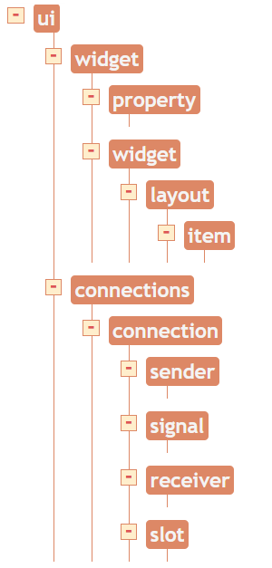
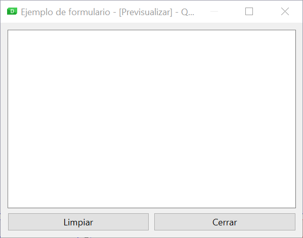
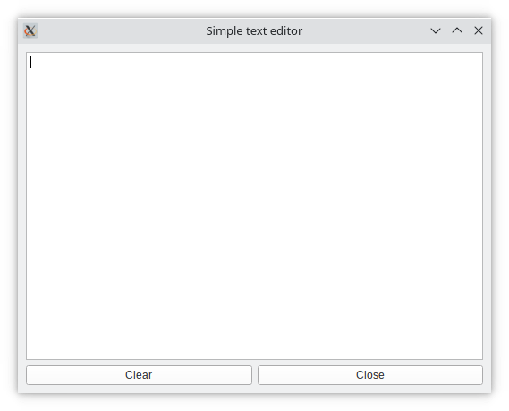

# Ús de la interfície en una aplicació

Com ja hem vist, gran part de les tecnologies d'interfície d'usuari actuals disposen d'un llenguatge de marques per definir el disseny de les finestres sense fer ús d'un llenguatge de programació. I també solen disposar d'una eina visual de disseny que facilita la tasca de definició de la interfície, i que genera automàticament un document en el llenguatge de marques corresponent. Tanmateix, Una vegada disposem del document caldrà integrar-lo d'alguna manera amb la resta de la nostra aplicació.  

## Format Qt UI

L'eina Qt Designer emmagatzema el disseny realitzat en un format conegut com a Qt UI, assignant als fitxers de disseny l'extensió *.ui. Aquest format està basat en XML i, encara que no està concebut per utilitzar-los pels desenvolupadors fora de l'eina de disseny, és possible manipular-lo directament en algun editor de text. També es podria generar o modificar des d'un programa, ja que la majoria de llenguatges de programació disposen de llibreries per a la manipulació d'XML.

!!!example "EXEMPLE"
    Una possible situació en què seria útil l'edició directa del fitxer generat per Qt Designer és la modificació d'una propietat que es repeteix en diferents controls. Per exemple, si tots els nostres botons tenen establert la mateixa amplada mínima i volem modificar-ho, en lloc de fer-ho un per un a Qt Designer, podríem utilitzar la funció de reemplaçament d'algun editor de text directament sobre el fitxer UI.

A continuació, es mostren alguns dels elements XML més importants que trobem en un fitxer de Qt Designer, i la seva estructura jeràrquica al document.

{: style="display: block;margin-left: auto;margin-right: auto;width: 20%;"}

| Element    | Descripció                                                                                                                                                                                 |
| ---------- | ------------------------------------------------------------------------------------------------------------------------------------------------------------------------------------------ |
| ui         | És l'element principal que engloba tot el document.                                                                                                                                        |
| widget     | S'utilitza per incloure un giny de Qt. A l'interior pot contenir elements property per definir les propietats, altres elements widget o un layout.                                         |
| layout     | Element associat als layouts de Qt. Al seu interior conté un o més elements item per a cadascun dels membres del dit layout.                                                               |
| connection | Conté les associacions de senyals amb ranures. Per a cada connexió hi haurà un element connection, format per quatre elements que defineixen la connexió (sender, signal, receiver, slot). |

!!!exemple "Formulari"
    Es pot analitzar amb més detall l'XML associat al següent formulari:
    {: style="display: block;margin-left: auto;margin-right: auto;width: 50%;"}

    ~~~xml
    <?xml version="1.0" encoding="UTF-8"?>
    <ui version="4.0">
        <class>MainWindow</class>
        <widget class="QMainWindow" name="MainWindow">
            <property name="geometry">
                <rect>
                    <x>0</x>
                    <y>0</y>
                    <width>529</width>
                    <height>390</height>
                </rect>
            </property>
            <property name="windowTitle">
                <string>Ejemplo de formulario</string>
            </property>
            <widget class="QWidget" name="centralwidget">
                <layout class="QVBoxLayout" name="verticalLayout_2">
                    <item>
                        <widget class="QTextEdit" name="textEdit" />
                    </item>
                    <item>
                        <layout class="QHBoxLayout" name="horizontalLayout">
                            <item>
                                <widget class="QPushButton" name="limpiar_boton">
                                    <property name="text">
                                        <string>Limpiar</string>
                                    </property>
                                </widget>
                            </item>
                            <item>
                                <widget class="QPushButton" name="cerrar_boton">
                                    <property name="text">
                                        <string>Cerrar</string>
                                    </property>
                                </widget>
                            </item>
                        </layout>
                    </item>
                </layout>
            </widget>
        </widget>
        <tabstops>
            <tabstop>textEdit</tabstop>
            <tabstop>limpiar_boton</tabstop>
            <tabstop>cerrar_boton</tabstop>
        </tabstops>
        <resources />
        <connections>
            <connection>
                <sender>limpiar_boton</sender>
                <signal>clicked()</signal>
                <receiver>textEdit</receiver>
                <slot>clear()</slot>
                <hints>
                    <hint type="sourcelabel">
                        <x>119</x>
                        <y>364</y>
                    </hint>
                    <hint type="destinationlabel">
                        <x>139</x>
                        <y>266</y>
                    </hint>
                </hints>
            </connection>
            <connection>
                <sender>cerrar_boton</sender>
                <signal>clicked()</signal>
                <receiver>MainWindow</receiver>
                <slot>close()</slot>
                <hints>
                    <hint type="sourcelabel">
                        <x>411</x>
                        <y>370</y>
                    </hint>
                    <hint type="destinationlabel">
                        <x>522</x>
                        <y>368</y>
                    </hint>
                </hints>
            </connection>
        </connections>
        <slots>
            <slot>mostrar_mensaje()</slot>
        </slots>
    </ui>
    ~~~

Als enllaços de la unitat s'inclou la referència a la pàgina de la documentació de Qt on es defineix l'esquema XML complet dels documents Qt UI.

## Incloure la interfície en una aplicació

A l'hora d'utilitzar el nostre fitxer de disseny de la interfície des d'una aplicació, se'ns presenten dues opcions diferents:

- Utilitzar una eina de generació de codi que, a partir del fitxer de descripció de la interfície, generi el codi corresponent al llenguatge de programació adequat. Aquest codi s'haurà d'integrar durant la compilació amb la resta de l'aplicació, ia més haurà de ser regenerat cada cop que realitzem canvis en el disseny.
- Carregar directament des del codi de la nostra aplicació el fitxer de descripció de la interfície, generant-se en temps d'execució el codi corresponent. Aquesta alternativa permet modificar el disseny al fitxer UI sense necessitat de recompilar l'aplicació, encara que per altra banda ralentitzarà l'execució en haver de generar el codi. 

### Generar codi Python a partir del fitxer UI

Per generar el codi Python corresponent a un fitxer de disseny de Qt Designer s'utilitza l'eina User Interface Compiler (uic), inclosa a la instal·lació de Qt. L'ordre següent generarà el fitxer de codi Python finestra.py a partir del fitxer de disseny d'interfície finestra.ui.

~~~ps
uic -g python finestra.ui -o finestra.py
~~~

Per als que utilitzeu linux:

~~~bash
pyside6-uic finestrs.ui -o finestra.py
~~~

Podeu veure a continuació el codi generat a partir de [formulari.ui](../arxius/formulari.ui).

~~~python3
# -*- coding: utf-8 -*-

################################################################################
## Form generated from reading UI file 'formulari.ui'
##
## Created by: Qt User Interface Compiler version 6.4.0
##
## WARNING! All changes made in this file will be lost when recompiling UI file!
################################################################################

from PySide6.QtCore import (QCoreApplication, QDate, QDateTime, QLocale,
    QMetaObject, QObject, QPoint, QRect,
    QSize, QTime, QUrl, Qt)
from PySide6.QtGui import (QBrush, QColor, QConicalGradient, QCursor,
    QFont, QFontDatabase, QGradient, QIcon,
    QImage, QKeySequence, QLinearGradient, QPainter,
    QPalette, QPixmap, QRadialGradient, QTransform)
from PySide6.QtWidgets import (QApplication, QHBoxLayout, QMainWindow, QPushButton,
    QSizePolicy, QTextEdit, QVBoxLayout, QWidget)

class Ui_MainWindow(object):
    def setupUi(self, MainWindow):
        if not MainWindow.objectName():
            MainWindow.setObjectName(u"MainWindow")
        MainWindow.resize(529, 390)
        self.centralwidget = QWidget(MainWindow)
        self.centralwidget.setObjectName(u"centralwidget")
        self.verticalLayout_2 = QVBoxLayout(self.centralwidget)
        self.verticalLayout_2.setObjectName(u"verticalLayout_2")
        self.textEdit = QTextEdit(self.centralwidget)
        self.textEdit.setObjectName(u"textEdit")

        self.verticalLayout_2.addWidget(self.textEdit)

        self.horizontalLayout = QHBoxLayout()
        self.horizontalLayout.setObjectName(u"horizontalLayout")
        self.limpiar_boton = QPushButton(self.centralwidget)
        self.limpiar_boton.setObjectName(u"limpiar_boton")

        self.horizontalLayout.addWidget(self.limpiar_boton)

        self.cerrar_boton = QPushButton(self.centralwidget)
        self.cerrar_boton.setObjectName(u"cerrar_boton")

        self.horizontalLayout.addWidget(self.cerrar_boton)

        self.verticalLayout_2.addLayout(self.horizontalLayout)

        MainWindow.setCentralWidget(self.centralwidget)

        self.retranslateUi(MainWindow)
        self.limpiar_boton.clicked.connect(self.textEdit.clear)
        self.cerrar_boton.clicked.connect(MainWindow.close)

        QMetaObject.connectSlotsByName(MainWindow)
    # setupUi

    def retranslateUi(self, MainWindow):
        MainWindow.setWindowTitle(QCoreApplication.translate("MainWindow", u"Ejemplo de formulario", None))
        self.limpiar_boton.setText(QCoreApplication.translate("MainWindow", u"Limpiar", None))
        self.cerrar_boton.setText(QCoreApplication.translate("MainWindow", u"Cerrar", None))
    # retranslateUi

~~~

!!!warning "Compte"
    Al comentari inicial que s'inclou al codi generat se'ns avisa que qualsevol canvi manual que fem al codi Python d'aquest fitxer es perdrà si es torna a generar des del fitxer UI.

Quan tenim el codi Python, cal integrar-lo en la nostra aplicació. Si observem el codi generat, veurem que conté la definició d'una classe nova, el nom de la qual es forma afegint el prefix Ui_ al nom del nostre objecte principal en el disseny. En el nostre exemple, la classe es diu Ui_MainWindow. Aquesta classe conté la definició d'un mètode anomenat **setupUi** que és l'encarregat de crear i configurar tots els objectes associats al nostre disseny.

Per poder utilitzar aquesta classe al nostre programa principal, el primer que hem de fer és realitzar la importació corresponent.

A continuació, haurem de crear una classe nova que hereta tant de la classe generada, com de la classe de l'objecte principal del nostre disseny (en l'exemple, QMainWindow). Al constructor d'aquesta nova classe (a la qual hem anomenat MainWindow) es cridarà al mètode setupUi perquè es generen tots els objectes de la interfície.

~~~python3
import sys
from PySide6 import QtWidgets

from formulari import Ui_MainWindow

class MainWindow(QtWidgets.QMainWindow, Ui_MainWindow):
    def __init__(self):
        super().__init__()
        self.setupUi(self)

app = QtWidgets.QApplication(sys.argv)

window = MainWindow()
window.show()
app.exec()
~~~

Una vegada creada aquesta classe, al nostre programa principal simplement haurem de crear una nova instància, i mostrar la finestra com ho fem habitualment (amb el mètode Show).

{: style="display: block;margin-left: auto;margin-right: auto;width: 50%;"}

### Carregar el fitxer UI des de Python 

Com hem comentat anteriorment, tenim una altra alternativa per utilitzar el disseny realitzat a Qt Designer, que consisteix a carregar directament el fitxer UI des de l'aplicació Python. Per fer-ho, utilitzarem la classe QUiLoader inclosa al mòdul QtUiTools. 

Aquesta classe ofereix el mètode load, que rebrà com a paràmetre el fitxer UI i generarà la finestra. 

~~~python3
import sys, os
from PySide6 import QtWidgets
from PySide6.QtUiTools import QUiLoader

loader = QUiLoader()
app = QtWidgets.QApplication(sys.argv)
ui_path = os.path.join(os.path.dirname(__file__), "formulari.ui")
window = loader.load(ui_path, None)
window.show()
app.exec()
~~~

## Manipulació dels objectes generats  

Una vegada hem generat la nostra finestra (amb qualsevol dels dos mètodes descrits) podem accedir a qualsevol dels objectes generats per, per exemple, modificar-ne alguna de les propietats o associar una ranura a un dels seus senyals. Per a això, simplement utilitzarem el nom que hàgem donat a Qt Designer (mitjançant la propietat layoutName als layouts, i objectName a la resta de components) i la mateixa sintaxi que vam aprendre a la unitat anterior.

!!!example "EXEMPLE"
    Si volem modificar el text dels botons i el títol de la finestra, simplement hem d'accedir a estos ells amb el seu nou i canviar les seues propietats per codi:
    Podem agrupar tots els canvis en un mètode com es veu al següent exemple:

    ~~~python3
    import sys, os
    from PySide6 import QtWidgets
    from PySide6.QtUiTools import QUiLoader

    loader = QUiLoader()

    def mainwindow_setup(w):
        w.setWindowTitle("Simple text editor")
        w.cerrar_boton.setText("Close")
        w.limpiar_boton.setText("Clear")

    app = QtWidgets.QApplication(sys.argv)
    ui_path = os.path.join(os.path.dirname(__file__), "formulari.ui")
    window = loader.load(ui_path, None)
    mainwindow_setup(window)
    window.show()
    app.exec_() 
    ~~~
    Ara la interfície quedaria així:

    {: style="display: block;margin-left: auto;margin-right: auto;width: 50%;"}