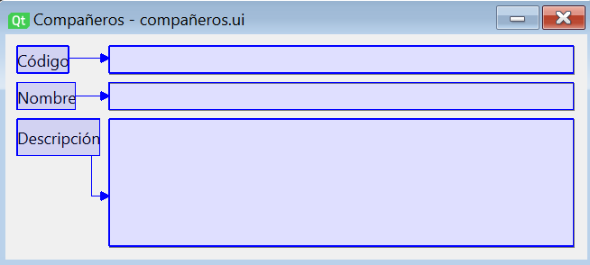
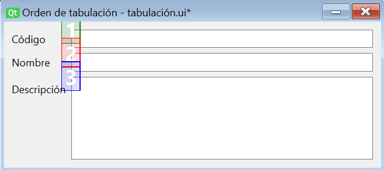

# 1. Funcionalitats avançades de l'eina de disseny

La finalitat principal de les eines de disseny associades als llenguatges de marques és permetre a l'usuari definir els components de la interfície i la manera com s'organitzen aquests. Així i tot, solen incloure un altre tipus de funcionalitats que ajuden el desenvolupador a especificar tots els aspectes relacionats amb el disseny.

A Qt Designer hem vist com a més de poder arrossegar i configurar els components podem, per exemple, definir l'associació de senyals a ranures. En aquest apartat veurem altres funcionalitats que incorpora aquesta eina per completar el disseny d'un formulari.

## 1.1. Definició de companys (buddy widgets)

Quan dissenyem formularis d'entrada de dades, és habitual utilitzar en el disseny una etiqueta (QLabel) per identificar cada camp del formulari, i un control d'entrada de dades (com QLineEdit, QTextEdit o QComboBox) per que l'usuari pugui proporcionar el valor. De fet, Qt ofereix el layout de formulari (QFormLayout) per ajudar-nos a organitzar etiquetes i controls d'entrada.

Qt ens ofereix la possibilitat d'associar a cada etiqueta el control d'entrada de dades corresponent com un control company. D'aquesta manera, quan l'usuari utilitze l'accés ràpid associat a l'etiqueta (definit amb un caràcter '&' abans de la lletra corresponent a la propietat text), el focus passarà al company. Per utilitzar la drecera, l'usuari haurà de combinar la tecla Alt amb la lletra definida.

Podem associar companys a les etiquetes a Qt Designer canviant al mode Editar companys al menú Editar, o utilitzant la barra d'eines. El funcionament és molt similar al que vam veure per a l'associació de senyals a ranures, ja que simplement haurem de prémer l'etiqueta i arrossegar la fletxa vermella fins al company. A més, com hem comentat, l'etiqueta haurà de tenir assignat un caràcter d'accés a la propietat text.

{: style="display: block;margin-left: auto;margin-right: auto;width: 50%;"}

## 1.2. Ordre de tabulació

Molts usuaris d'aplicacions basades en formularis estan habituats a desplaçar-se pels diferents camps del formulari fent servir la tecla de tabulació del teclat. Qt Designer ofereix la possibilitat de personalitzar visualment l'ordre en què es desplaçarà el focus d'un camp a un altre amb el tabulador utilitzant el mode Edita ordre de pestanyes.

!!!important "IMPORTANT"
    El nom donat a l'edició de l'ordre de tabulacions a les traduccions de Qt Designer pot induir a error. En anglès, es diu Tab Order Editing Mode. La paraula Tab fa referència en aquest context al tabulador, però ha estat traduïda com a pestanya.

Una vegada en el mode d'edició de l'ordre de tabulació, se'ns mostrarà un número associat a cada control que podeu rebre el focus (com els controls d'entrada de dades o els botons). Aquest número indica l'ordre de tabulació actual. Si volem modificar-ho, simplement hem d'anar prement sobre aquests números a l'ordre desitjat. Segons anem prement els números canviarà el color de la manera següent:

- Vermell: l'últim número premut.
- Verd: números ja establerts.
- Blau: números per establir.

{: style="display: block;margin-left: auto;margin-right: auto;width: 50%;"}

Aquest mode d'edició també compta amb un menú contextual amb les opcions següents:

- Començar des d'aquí: per començar la configuració en un punt intermedi de la seqüència de tabulació (que és molt útil en formularis amb molts camps).
- Reinicia: per restablir l'ordre de tabulació.
- Ordre de llista de pestanyes: obrirà un diàleg per configurar l'ordre de tabulació amb una interfície de llista. Els canvis realitzats es reflectiran en els números mostrats sobre els controls en acceptar el diàleg.

!!!important "IMPORTANT"
    Tant la possibilitat de configurar l'ordre de tabulació com l'associació de companys són funcionalitats que ajuden a millorar la productivitat dels usuaris finals de la nostra aplicació, i són especialment rellevants en aplicacions destinades a l'àmbit empresarial. A més, aquestes opcions estan alineades amb l'heurística d'usabilitat número 7 de Nielsen, Flexibilitat i eficiència d'ús.

## 1.3. Plantilles

Qt Designer ofereix la possibilitat de crear les nostres pròpies plantilles de formulari, que ens permetran crear un nou formulari a partir d'una estructura bàsica definida per nosaltres. 

El seu ús és molt senzill. Simplement haurem de dissenyar la nostra plantilla com si fos un formulari corrent. Una vegada dissenyada, s'ha de desar utilitzant l'opció Desa com a plantilla del menú Fitxer. Al diàleg que apareix li donarem un nom a la plantilla i decidirem on emmagatzemar-la.

Una vegada guardada la plantilla, quan crearem un nou formulari apareixerà com a opció, a més de les plantilles per defecte que ja coneixem.