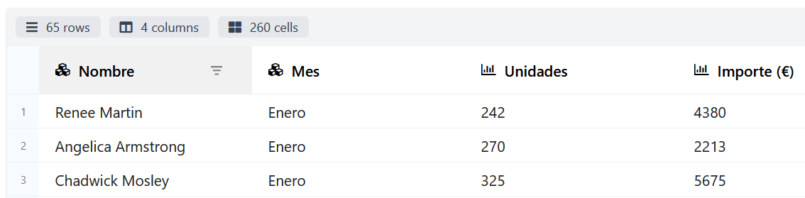
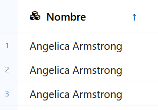
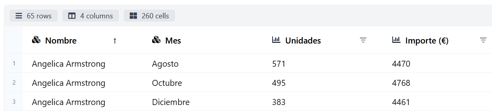
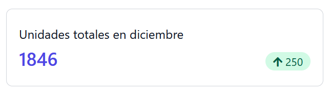

## Disseny d'informes

En aquest apartat aprendrem a elaborar informes a la nostra aplicació amb `DataPane`, una llibreria Python que permet crear informes amb diferents elements (com taules i gràfics) que es generen en format HTML. Aquesta llibreria es distribueix baix la llicència de programari lliure Apache 2.0.

`DataPane` permet emmagatzemar els informes generats com un fitxer HTML local, o també pujar-los a la *plataformadatapane.com*,on s'afegeixen algunes funcionalitats addicionals. Per poder pujar els informes, cal tenir un compte que podem crear de manera gratuïta a la web.

Podem instal·lar la llibreria`DataPane` amb l'ordre següent:

```py
conda install datapane
```

Als enllaços de la unitat trobaràs la referència a la pàgina de la documentació de `DataPane` on es tracta la instal·lació de la llibreria.


### Preparació de les dades

Com hem comentat a l'apartat anterior, els orígens de dades per elaborar un informe poden ser molt diversos. Per simplificar aquest aspecte al màxim, els informes creats amb `DataPane` tenen un únic origen de dades possible: un DataFrame de la llibreria `pandas` de Python.

`pandas` és una de les llibreries més utilitzades a Python en *DataScience* per a la manipulació de dades. La seva principal estructura de dades és el DataFrame, una estructura en dues dimensions similar a una taula duna base de dades relacional.


La llibreria `pandas` permet crear un DataFrame a partir de diferents orígens de dades, com ara fitxers o bases de dades. Per tant, les dades dels nostres informes podran provenir de diferents fonts encara que `DataPane` únicament admeta `DataFrames`.

El codi d'exemple següent mostra com crear unDataFrame a partir d'un fitxer CSV, que ens servirà com a origen per als primers informes.

```py
import os

import pandas as pd
import datapane as dp

base_path = os.path.dirname(__file__)
csv_path = os.path.join(base_path, "data.csv")"
df = pd.read_csv(csv_path)
```

Pots descarregar el [fitxer CSV](../exemples/data.csv) utilitzat fent clic. Conté les dades mensuals de vendes d'una empresa, incloent a cada fila el nom del comercial, el mes, el nombre d'unitats venudes i l'import total de les vendes en aquest mes.

### Informes amb taules

L'element bàsic de qualsevol informe és la taula de dades. A `DataPane` disposem de dos components diferents per inserir una taula en un informe:

- **Table**: es tracta d'una taula estàtica on l'usuari només podrà visualitzar la informació.
- **DataTable**: aquest tipus de taula ofereix la possibilitat a l'usuari d'ordenar les files pel camp desitjat, i fins i tot filtrar les dades posant condicions a cadascun dels camps.
  
#### Creació d'un informe amb taules

Continuant amb l'exemple anterior, el codi següent crearia un informe amb un componentTable i unDataTable a partir del DataFrame que teníem preparat.

```python
table = dp.Table(df)
data_table = dp.DataTable(df)
report = dp.Report(table, data_table)
report_path = os.path.join(base_path, "informe2.html")
report.save(path=report_path, open=True)
```

A les dues primeres línies es creen les dues taules de diferents tipus. A la tercera es crea un nou informe que inclou les dues taules. I a la darrera línia es desa l'informe en un fitxer local, indicant a més que volem obrir l'informe en un navegador després de generar-lo (amb el paràmetre open=True, que és opcional).

Podeu descarregar [l'informe generat](../exemples/informe2.html), i el [codi complet de l'exemple](../exemples/informe2.py).

#### Ordenació i filtratge de dades
Com podem comprovar a l'informe generat, els components *Table* i *DataTable* mostren la informació de manera diferent.*Table* es representa com una taula HTML amb totes les dades visibles (útil si l'informe es vol imprimir o exportar a PDF), mentre que *DataTable* utilitza una barra de desplaçament vertical per moure's per les diferents files. A més, *DataTable*  inclou a la part superior informació sobre les dades (el nombre de files, columnes i cel·les que conté), i a la capçalera de les columnes els controls d'ordenació i filtratge per a l'usuari.

<figure markdown>
  
  <figcaption>DataTable</figcaption>
</figure>


Per activar l'ordenació es fa servir la icona situada a l'esquerra de l'etiqueta de la columna (que a més representa el tipus de dada del camp). Quan ordenem per una de les columnes apareix un indicador visual en forma de fletxa a la capçalera, que estarà orientada en funció del tipus d'ordenació (ascendent o descendent).

<figure markdown>
  
  <figcaption>Ordenació</figcaption>
</figure>


L'opció de filtratge (que s'activa amb la icona que apareix a la dreta de l'etiqueta de la columna) permet establir una condició sobre les dades que apareixen a la taula. Es poden definir filtres a més d'una columna, de manera que es mostraran les dades que compleixin tots els criteris de filtratge. Cal tenir en compte que els operadors de filtratge disponibles depenen del tipus de dades de cada camp.

Quan una columna té aplicat un filtre apareix un indicador visual a la capçalera. Per eliminar el filtre, l'haurem d'editar i establir la condició *None*.

<figure markdown>
  
  <figcaption>Filtratge</figcaption>
</figure>

A l'exemple mostrat a la imatge, s'ha establert un filtre a les unitats i un altre a l'import.

!!! warning "Important"
    Els controls d'ordenació i filtratge permeten a l'usuari configurar les dades que es mostren a l'informe. Si volem aplicar algun tipus d'ordenació o filtre a les dades abans que es genere l'informe, haurem d'utilitzar les opcions ofertes per la llibreria `pandas`. Busqueu a la seua documentació si voleu aplicar-ne.

### Informes amb indicadors

Moltes vegades, els informes han d'incloure indicadors que representen un valor únic rellevant per a la persona que veurà l'informe (per exemple, el nombre de vendes totals a tota l'empresa a l'últim mes). Aquests indicadors (també anomenats grans números o *big numbers*, en anglès) solen provenir de valors calculats a partir de les nostres dades, utilitzant alguna funció d'agregació (com el recompte, la suma o la mitjana).

#### Càlcul de valors agregats

Abans de crear l'informe que contindrà els indicadors, hem de calcular els valors que es mostraran al codi de la nostra aplicació. La llibreria `pandas` incorpora multitud de funcions per processar les dades que ens facilitaran la tasca de calcular els indicadors a partir de les dades existents al `DataFrame`.

Calcularem com a exemple el nombre total d'unitats venudes per tots els comercials els mesos de novembre i desembre. El codi necessari seria el següent:

```python
datos_diciembre = df[df['Mes']=='Diciembre']
unidades_diciembre = datos_diciembre['Unidades'].sum()


datos_noviembre = df[df['Mes']=='Noviembre']
unidades_noviembre = datos_noviembre['Unidades'].sum()
```

La primera línia crea un nou DataFrame (dades_desembre) amb les files que compleixen la condició especificada (que el mes siga  desembre). A la segona línia se selecciona la columna Unitats i s'aplica la funció de sum() per acumular tots els valors d'aquesta columna. El codi per al mes de novembre és equivalent.

!!! note "Funcions d'agregació"
    `pandas` posa a la nostra disposició multitud de funcions d'agregació, entre les quals podem destacar les següents:

    - sum(): Calculeu la suma de tots els valors. És la que s'utilitza a l'exemple anterior.
    - count(): Realitza un recompte dels valors presents a la columna.
    - mean(): Calcula la mitjana aritmètica dels valors.
    - min(): Permet obtenir el mínim de tots els valors de la columna.
    - max(): S'utilitza per obtenir el valor màxim a la columna.


#### Creació d'un informe amb indicadors

Quan tenim calculats els indicadors desitjats, els inclourem a l'informe amb el component `BigNumber` de `DataPane`. Quan creem aquest component podem establir els arguments següents:

- heading: capçalera que acompanyarà l'indicador.
- value: valor de l'indicador.
- prev_value: valor anterior, perquè es pugui comparar amb l'actual (opcional).
- change: variació del valor de l'indicador respecte de l'anterior valor (opcional).
- is_upward_change: indica si el canvi és positiu o negatiu (obligatori si s'estableixcanvi).

Seguint amb l'exemple anterior, crearem un informe amb les unitats totals venudes al mes de desembre, incloent-hi la variació respecte al mes anterior. El codi seria el següent:

```python
unidades = dp.BigNumber(heading='Unidades totales en diciembre',
             value=unidades_diciembre,
             change=unidades_diciembre - unidades_noviembre,
             is_upward_change=unidades_diciembre > unidades_noviembre)
report = dp.Report(unidades)
report_path = os.path.join(base_path, "informe3.html")
report.save(path=report_path, open=True)
```

L'informe generat es mostrarà de la manera següent:

<figure markdown>
  
  <figcaption>DataTable</figcaption>
</figure>

Podeu descarregar [l'informe generat](../exemples/informe3.html), i el [codi complet de l'exemple](../exemples/informe3.py).

#### Altres components dels informes

A més de les taules de dades i els indicadors, `DataPane` permet incorporar altres elements als informes per enriquir el resultat final. Alguns d'aquests components són:

- **Gràfics**: un dels components més importants a l'hora de crear informes. Seran tractats en detall a l'apartat següent de la unitat.
- **Text**: de vegades també pot ser interessant incloure text a l'informe (per exemple, per incloure un títol o una explicació de les dades mostrades). Per fer-ho s'utilitza el component `Text`, el constructor del qual rep com a paràmetre el text a inserir en format `Markdown`.

!!! note "Markdown"
    `Markdown` és un llenguatge de marques lleuger, que permet crear documents en text pla amb marques de format fàcils de llegir i escriure. La seva popularitat ha crescut molt degut en gran mesura a la senzillesa i flexibilitat del format. L'utilitzarem en la unitat de documentació.

- **HTML**: mitjançant aquest component `HTML` podem introduir un bloc de codi HTML al nostre informe. El codi introduït pot contindre estils definits amb CSS, però no codi Javascript.
- **Multimèdia**: amb el component `Media` podem incloure a l'informe imatges, vídeos o fitxers d'àudio. Al constructor del component haurem d'utilitzar el paràmetre `file` per indicar la ruta del recurs a incloure.
- **Fitxers adjunts**: si volem adjuntar un fitxer a l'informe (com un document PDF o un full de càlcul) perquè l'usuari el puga descarregar, utilitzarem el component `Attachment`, indicant la ruta del fitxer de la mateixa manera que al component anterior.

El codi següent mostra com utilitzar aquests components a l'informe de vendes del mes de desembre creat anteriorment.

```python
titulo = dp.HTML('''
<p style="font-size:30px;text-align:center;color:#ffffff;background-color:#4d4d4d;">
    Informe de ventas
</p>''')
data_path = os.path.join(base_path, "data.csv")
fichero = dp.Attachment(file=data_path)
texto = dp.Text('**Puedes descargar el fichero con los datos del informe.**')
image_path = os.path.join(base_path, "img", "report.png")
imagen = dp.Media(file=image_path)

report = dp.Report(imagen, titulo, unidades, texto, fichero)
report_path = os.path.join(base_path, "informe4.html")
report.save(path=report_path, open=True)
```

Pots descarregar la [imatge utilitzada](../exemples/img/report.png), el [resultat de l'informe](../exemples/informe4.html) i el [codi Python complet de l'exemple](../exemples/informe4.py).
