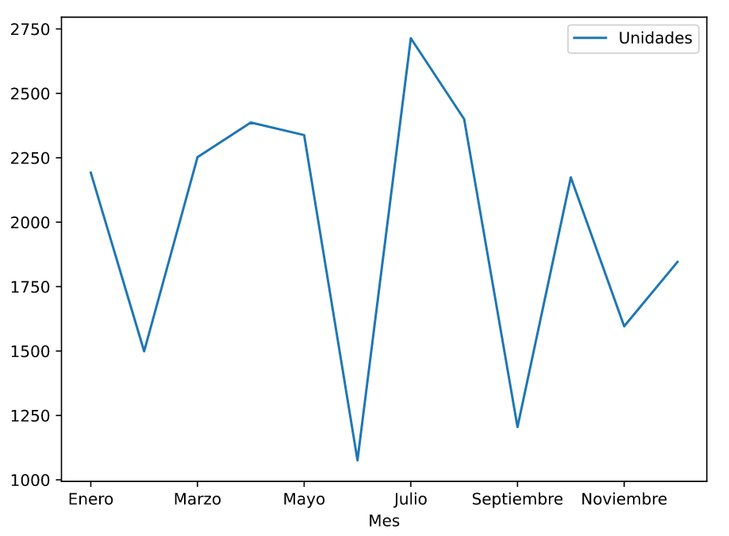
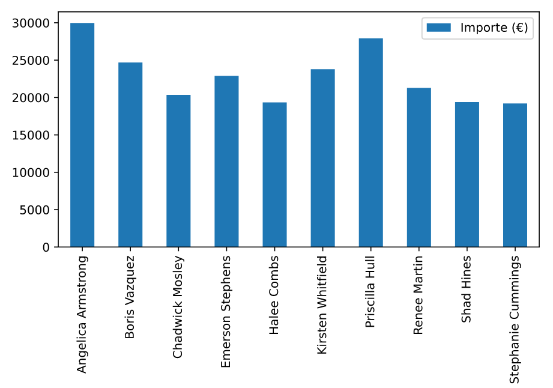

## Elaboració de gràfics

Els gràfics són una eina habitual per presentar informació en un informe, ja que permeten mostrar de manera visual relacions en les dades que difícilment es podrien observar representant-les en forma de taula.

`DataPane` permet incloure gràfics als informes per mitjà del component `Plot`. Aquest component rep el gràfic a mostrar, que s'haurà de crear amb una llibreria especialitzada de gràfics.`DataPane` és compatible amb les principals llibreries Python per a gràfics, com *Matplotlib*, *Altair*, *Plotly* o *Bokeh*.

Nosaltres utilitzarem la llibreria `matplotlib`, que encara que no està inclosa a la biblioteca estàndard de Python, se'l considera com l'estàndard de facto per a la generació de gràfics a Python. A més, es pot utilitzar directament des d'un DataFrame de `pandas`.

!!! warning "Tipus de gràfics matplotlib"
    Tot i que en els apartats següents ens centrarem en els tipus de gràfics més utilitzats, la llibreria matplotlib permet generar gràfics de multitud de tipus diferents. Busca a la documentació si necessites incloure gràfics d'altre tipus.


### Gràfics de línies

Un dels tipus més habituals de gràfics són els de línies, que permeten representar gràficament la relació entre dues variables utilitzant eixos cartesians (abscises i ordenades, o simplement x i y). Aquest tipus de gràfic és molt utilitzat per mostrar els canvis produïts en una variable segons una altra. La segona variable sol ser el temps, convertint el gràfic en una representació d'una sèrie temporal.

Construirem un gràfic de línies utilitzant les mateixes dades d'origen que a l'apartat anterior, que contenen la informació mensual de vendes dels diferents comercials d'una empresa. A partir d'aquestes dades, podem obtenir el gràfic de línies següent, que mostra l'evolució al llarg de l'any del nombre total d'unitats venudes per tots els comercials.

<figure markdown>
  
  <figcaption>Gràfic de línies</figcaption>
</figure>

El codi necessari per generar un informe amb aquest gràfic s'inclou a continuació:

```python
ventas_mes = df.groupby(['Mes'], sort=False).sum()
grafico_matplotlib = ventas_mes.plot(y='Unidades')
grafico_datapane = dp.Plot(grafico_matplotlib)
```

A la primera línia, creem un nou DataFrame amb les dades de vendes agrupades per mes (utilitzant el mètode `groupby()`) aplicant la funció d'agregació de suma. D'aquesta manera tindrem el total d'unitats i l'import per cada mes.

A la segona línia del codi s'utilitza el mètode `Plot` del DataFrame per generar un nou gràfic amb la llibreria `Matplotlib`. Com a paràmetre del mètode indiquem quina columna del DataFrame s'ha de representar a l'eix y (en aquest cas les unitats venudes).

A la darrera línia, a partir del gràfic anterior, creem un nou objecte Plot de `DataPane`, que podrem inserir en un informe com la resta de components que hem vist a l'apartat anterior.


### Gràfics de barres

Els gràfics de barres, igual que els de línies, també permeten representar la relació entre dues variables. Però en aquest cas, una de les variables (que normalment se situa a l'eix horitzontal) sol tenir valors qualitatius o discrets (dades categòriques). Per a cadascun, el valor de l'altra variable es representarà amb l'alçada d'una barra o columna.

Per a les nostres dades de vendes, un possible gràfic de barres seria el que mostraria, per a cada venedor, l'import total de vendes en tots els mesos.

<figure markdown>
  
  <figcaption>Gràfic de barres</figcaption>
</figure>


El codi necessari per generar un informe amb aquest gràfic és molt similar al del gràfic de línies:

```python
ventas_vendedor = df.groupby(['Nombre']).sum()
grafico_matplotlib = ventas_vendedor.plot.bar(y='Importe (€)')
grafico_datapane = dp.Plot(grafico_matplotlib)
```

Com es pot apreciar, en aquest cas, les dades s'agrupen pel nom del venedor. Per generar un gràfic de barres es fa servir el mètode `plot.bar` del DataFrame. En aquest cas representarem l'import. Finalment, de la mateixa manera que a l'exemple anterior, es crea el component Plot de `DataPane` a partir del gràfic de Matplotlib.

### Gràfics de sectors

Els gràfics de sectors (també coneguts com a gràfics de pastís) representen en un cercle la distribució d'una variable, normalment discreta. És un dels gràfics més habituals, ja que permeten comparar ràpidament la importància dels diferents valors de la variable.

Seguint amb les nostres dades de vendes, podríem plantejar un gràfic de sectors que representi les unitats totals venudes per cada venedor.

El codi associat a aquest gràfic és molt similar al dels exemples anteriors:

```python
grafico_matplotlib = ventas_vendedor.plot.pie(y='Unidades',legend=False, ylabel="")
grafico_datapane = dp.Plot(grafico_matplotlib)
```

Com es pot observar, es fa servir el mateix DataFrame que a l'exemple anterior (vendes_venedor). Per generar el gràfic utilitzem el mètode `plot.pie` del DataFrame, a qui indiquem que representarem les unitats. A més, traiem la llegenda del gràfic (que en aquest cas no aporta informació) i l'etiqueta de la variable representada. Finalment, de la mateixa manera que en els casos anteriors, se'n crea el component Plot de `DataPane` a partir del gràfic deMatplotlib.

!!! example "Exemple"
    Pots decarregar el [codi per generar l'informe que inclou els tres gràfics](../exemples/grafics.py) vistos en aquest apartat i [l'informe generat](../exemples/grafics.html).