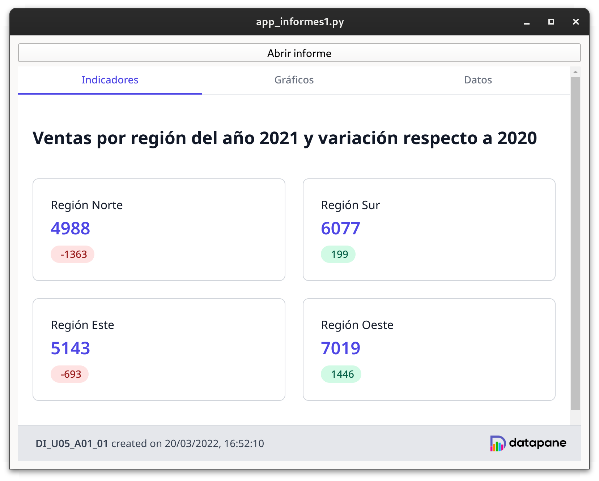

## Desenvolupament d'aplicacions amb informes

Quan tenim els nostres informes dissenyats, hem d'integrar-los amb les nostres aplicacions. Com hem vist, la llibreria `DataPane` genera els informes en format HTML, cosa que facilitarà la tasca dintegració, a més de permetre el desplegament dels informes en un servidor remot.

### Integració d'informes a una aplicació Qt

Per integrar un informe fet amb la llibreria `DataPane` en una aplicació Qt tenim dues alternatives:

1. Obrir l'informe al navegador predeterminat del sistema
2. Utilitzar el component `QWebEngineView` per incrustar l'informe a la finestra de l'aplicació

### Obrir l'informe al navegador predeterminat

Podem fer que un informe s'obri al navegador predeterminat del sistema com a resposta a una acció de l'usuari (per exemple, la pulsació d'un botó o una opció d'un menú). Per fer-ho, s'utilitza la classe QDesktopServices inclosa al mòdul QtGui. Aquesta classe disposa del mètode estàtic `openUrl`, que obrirà al navegador predeterminat la URL rebuda com a paràmetre (utilitzant el tipus `QUrl`).

El codi següent permet obrir un dels informes desenvolupats a l'apartat anterior al navegador predeterminat.

```python
ruta_base = os.path.dirname(__file__)
ruta_absoluta = os.path.join(ruta_base, "informe1.html")
QDesktopServices.openUrl(QUrl.fromLocalFile(ruta_absoluta))
```

A la primera línia es construeix la ruta absoluta del fitxer a partir de la seva ruta relativa. A continuació, s'utilitza el mètode `openUrl` de `QDesktopServices` per obrir l'informe, passant-li com a paràmetre un objecte `QUrl` construït a partir de la ruta absoluta.

#### Utilitzar el componentQWebEngineView

Si en lloc d'obrir l'informe al navegador predeterminat volem incrustar-lo a la finestra de la nostra aplicació, haurem d'utilitzar el component de QtQWebEngineView. Aquest component s'utilitza per mostrar qualsevol contingut web, tant local com remot, i es basa en el motor de navegació *Chromium*.

El codi que s'inclou a continuació mostra com utilitzar aquest component, partint de la ruta absoluta obtinguda al codi anterior.

```python
view = QWebEngineView()
view.load(QUrl.fromLocalFile(ruta_absoluta))
self.layout_vertical.addWidget(view)
```

El primer que fem és crear el component. A continuació, s'invoca el mètode `load()`, que iniciarà la càrrega del document especificat en forma d'objecte QUrl (de la mateixa manera que a l'exemple anterior). És important destacar que la càrrega es realitzarà de forma asíncrona, oferint el component senyals i ranures per controlar el procés de càrrega. Als enllaços de la unitat hi ha la referència a la documentació d'aquest component.

!!! example "Exemple"
    Als recursos de la unitat hi ha el [fitxer de codi Python](../exemples/app_informes1.py), una aplicació Qt que combina les dues maneres d'integrar un informe. A la part superior de la finestra s'inclou un botó que en ser premut obri l'informe al navegador predeterminat. La resta de la finestra l'ocupa un QWebEngineView que mostra el mateix informe directament a l'aplicació.

<figure markdown>
  
  <figcaption>Aplicació amb informes integrats</figcaption>
</figure>

#### Desplegament d'informes a un servidor

Com ja hem comentat, el fet que els informes dissenyats amb`DataPane` siguin fitxers HTML permet el seu desplegament en un servidor web. Aquesta opció facilita que un mateix informe puga ser consultat de diferents maneres (des de diferents aplicacions o des d'una intranet, per exemple).

!!! warning "Informes a la web"
    L'opció de desplegar els informes en un servidor web té sentit quan els informes no s'han de generar en el moment de la consulta, sinó que es poden generar de forma programada amb antelació (per exemple, informes mensuals que s'elaboren una vegada al mes).

Els dos mecanismes comentats anteriorment per integrar un informe a una aplicació Qt són perfectament vàlids per a informes desplegats en un servidor. Simplement haurem de canviar la URL subministrada, que en aquest cas referenciarà al servidor on estan allotjats els informes.	

!!! note "Núvol"
    Els proveïdors de serveis al núvol ofereixen la possibilitat de desplegar de forma senzilla contingut web estàtic, com és el cas dels informes generats amb `DataPane`. AAzure trobem el servei `Static Web Apps`, mentre que a AWS podem fer-ho amb el servei `Amplify`. També ho podem publicar a github.

Finalment, comentar que els desenvolupadors de la llibreria`DataPane` ofereixen un servei d'emmagatzematge d'informes a internet (datapane.com), que permet pujar els informes directament des del codi Python que els genera. Per això s'utilitza el mètode `upload()` del component Report. Consulteu la documentació si voleu servir aquest mètode.


