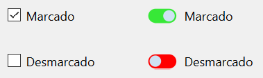

## 1. Alternatives en la creació de nous components

Totes les tecnologies destinades a la creació d'interfícies d'usuari inclouen un conjunt de components per utilitzar als formularis dissenyats, format pels controls més habituals a les aplicacions GUI. Tot i això, en algunes ocasions la funcionalitat de la nostra aplicació pot requerir l'ús d'un component que la nostra tecnologia d'interfície no inclou.

Per incorporar nous components a les nostres aplicacions tenim dues alternatives:

- Utilitzar components desenvolupats per tercers (empreses o desenvolupadors independents). És important conèixer la llicència que s'aplica al component, sobretot si es tracta d'una llicència comercial o lliure.
  
- Desenvolupar el component que necessitem per utilitzar-lo a la nostra aplicació. La majoria de les tecnologies d'interfície d'usuari incorporen mecanismes que permeten als desenvolupadors crear components nous, com veurem al llarg d'aquesta unitat. 

!!!warning 'IMPORTANT'
    En el cas particular del framework Qt, la varietat de components inclosos és molt àmplia, i és una de les raons per les quals l'oferta de controls desenvolupats per tercers no és tan abundant com en altres tecnologies. Als enllaços de la unitat s'inclouen alguns llocs web on aconseguir controls de tercers per Qt.

### 1.1 Personalitzar l'aparença del component

De vegades, la funcionalitat del nou component que necessitem coincideix completament amb la d'un control existent, i simplement un canvi en la seva aparença visual pot ser suficient. Moltes de les tecnologies d'interfície existents permeten modificar completament l'aparença visual d'un component, de manera que, encara que no canvia la lògica, l'usuari el percebrà com un control diferent.

!!!example "EXEMPLE"
    Avui dia és habitual trobar a les interfícies que utilitzem (sobretot a les destinades a dispositius mòbils) un control de tipus interruptor o switch, que ens permet alternar entre dos estats. La funcionalitat d'aquest control és realment la mateixa que una casella de verificació, per la qual cosa podríem canviar la seva aparença perquè es comporti visualment com un interruptor.

### 1.2 Derivar d'un component existent

Moltes vegades, la funcionalitat del nou component que volem crear no coincideix exactament amb la de cap component existent, però és molt similar. En aquests casos, la solució sol consistir a crear un component derivat del que ja n'hi ha, realitzant les modificacions pertinents (que normalment consistiran a afegir propietats, senyals i ranures).

No sempre necessitarem derivar directament d'un component existent, sinó que de vegades serà més convenient basar-se en alguna classe superior a la cadena d'herència del component, que aporti la funcionalitat base que necessitem per al nostre nou control.

!!!example "EXEMPLE"
    Qt disposa d'algunes classes abstractes que serveixen de base per crear alguns components. Per exemple, de la classe QAbstractButton deriven els diferents tipus de botons (QCheckBox, QPushButton, QRadioButton i QToolButton). Si ens plantegem dissenyar un botó personalitzat, podríem optar per partir directament de la classe abstracta, o d'alguna de les classes derivades. 

### 1.3 Crear un component completament nou

Si la funcionalitat del nostre nou component no està relacionada amb la de cap altre component existent, haurem de crear-lo des de zero. En la majoria dels casos, això implica heretar una classe base antecessora de tots els components (en el cas de Qt, seria la classe QWidget). 

En el cas de crear un component totalment nou, haurem d'alguna manera definir-ne la geometria i l'aparença visual. A Qt disposem per a això de la classe QPainter, amb una gran quantitat de mètodes per poder dibuixar el nostre control.  

### 1.4 Afegir diversos components existents

És habitual trobar una última opció per crear nous components, consistent a afegir diversos components existents (o fins i tot combinar components inclosos al framework amb altres creats per nosaltres o per tercers). 

!!!example "EXEMPLE"

Un possible exemple de component agregat seria un quadre de text amb indicador del nombre de caràcters escrits. En aquest cas, hauríem d'afegir un quadre de text on l'usuari escriuria i una etiqueta per indicar el nombre de caràcters.

