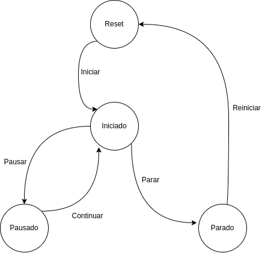

## 2. Creació de nous components per codi.

Els components són utilitzats, entre altres coses, per amagar la complexitat del programari en parts més manejables. Cada component amaga la seva complexitat darrere d'una interfície formada per les seves propietats i mètodes a què es té accés. Poden introduir-se i eliminar-se, fins i tot ser intercanviats com a part dun tot. 

Això redueix la complexitat del desenvolupament programari i millora el seu manteniment, permetent que el mateix codi pugui ser reutilitzat a diferents llocs. El resultat és un bloc de codi encapsulat en una classe independent que passa a formar part del banc de peces disponibles per formar part de desenvolupaments més complexos.

### 2.1 Components definits per l'usuari

Per començar a desenvolupar un component propi, el més fàcil és buscar un component des del qual partir, de manera que se n'hereten les propietats i mètodes i així poder utilitzar-los en el component que volem crear. Per exemple, si voleu un diàleg customitzat, podem heretar de QDialog, si volem un component botó amb alguna funcionalitat customitzada, podem heretar de QButton. En cas que el nostre component no guardi relació estreta amb altres components, el més adequat serà heretar de QWidget directament, que és la classe base des de la qual hereta la resta de Widgtes.

A més, podem utilitzar classes privades als nostres components que ens ajudin a produir un codi més organitzat i mantenible.

### 2.2 Exemple: component cronòmetre

Il·lustrarem tot això amb un exemple que anirem construint pas a pas.

En alguna de les nostres aplicacions ens pot fer falta un component visual que serveixi per mesurar el temps transcorregut, per exemple podria servir per mesurar el temps que portem per fer una tasca de classe, per mesurar el transcurs d'una activitat esportiva, etc. Crearem un component que posteriorment podem afegir a diferents aplicacions amb interfície gràfica d'usuari, sense necessitat de tornar-lo a crear a cadascuna, sinó que reutilitzarem el codi generat per a la seva creació.

#### 2.2.1 Elecció de l'objecte base
Si pensem en quin component utilitzar com a base, veiem que no hi ha cap component al qual puguem afegir funcionalitat de forma ràpida i que ens serveixi per a la nostra finalitat, així que partim de la classe base QWidget i en farem servir d'altres ginys per construir el nostre component.

#### 2.2.1 Classe cronòmetre (sense interfície)

Comencem definint una classe que ens servirà per controlar de manera interna el temps transcorregut i el temps transcorregut entre pauses, ja que construirem un cronòmetre amb la possibilitat de pausa. D'aquesta classe obtindrem, de tant en tant, el temps transcorregut des que vam posar en marxa el cronòmetre i la diferència entre el transcorregut i el pausat en cas d'haver utilitzat alguna pausa. 

La classe utilitzada a Qt per controlar el temps transcorregut és QElapsedTimer. La idea és fer servir el comptador de temps transcorregut (__temps_transcorregut) en posar en marxa el comptador. Si mentre estigueu en marxa, volem pausar el compte, fem ús d'un altre comptador (__temps_pausat) per mesurar el temps que el comptador ha estat pausat, així, mostrarem la diferència entre tots dos per mostrar el temps correcte del cronòmetre. Per controlar tot això definirem la seva interfície a la secció següent.

~~~py
from PySide6.QtCore import QTime, QElapsedTimer
 
class Cronometre():
    def __init__(self):
        self.__temps_transcorregut = QElapsedTimer()
        self.__temps_pausa = QElapsedTimer()
        self.__acumulador = 0
 
    def reiniciar(self):
        self.__temps_transcorregut.restart()
        self.__acumulador = 0
 
    def getTime(self):
        return QTime(0, 0).addMSecs(self.__temps_transcorregut.elapsed() - self.__acumulador)
 
    def pausar(self):
        self.__temps_pausa.restart()
 
    def continuar(self):
        self.__acumulador = self.__acumulador + self.__tiempo_pausa.elapsed()
~~~

Fixa't que hem definit totes les propietats de l'anterior classe com a privades, ja que van precedides de doble guió baix. De manera que des de fora de la classe no s'hi pot accedir, només podem interactuar amb el control del temps a través dels seus mètodes reiniciar, pausar i continuar. Amb obtenirTemps, obtindríem el temps de marxa del cronòmetre, independentment de si ha estat pausat o no.

#### 2.2.2 Definició de la interfície del component

Un cop tenim definida la classe que controla el nostre temps, és moment de definir la interfície del nostre component que en farà ús.
Per mostrar el temps transcorregut podem fer ús d‟una etiqueta (QLabel) amb el format hh:mm:ss, on hh són les hores transcorregudes, mm els minuts i ss els segons. Es podria reescriure el codi perquè el cronòmetre tingués la possibilitat d'explicar els mil·lisegons, però per a l'exemple que estem desenvolupant el deixarem en segons.

Definirem també un parell de botons (QPushButton), un per iniciar/parar i reiniciar el compte i un altre per pausar/continuar.
A més, el nostre cronòmetre tindrà la possibilitat d'avisar mitjançant l'emissió d'un senyal definit per codi que s'ha arribat al temps marcat a l'avís. Aquest senyal serà emès quan el temps d'avís i el temps del cronòmetre coincideixin, sempre que el checkbox estigui activat. Per introduir el temps fem ús d'un QTimeEdit. La interfície quedaria de la manera següent:

El codi complet del component és el següent. 

~~~py
from PySide6.QtWidgets import (
    QLabel, QWidget, QPushButton, QVBoxLayout, QCheckBox,
    QTimeEdit, QHBoxLayout
)
from PySide6.QtCore import (
    QTime, QTimer, Slot, QElapsedTimer, QSize, Qt, Signal
)
from PySide6.QtGui import QIcon

import recursos_cronometre

class Cronometro():
    def __init__(self):
        self.__tiempo_transcurrido = QElapsedTimer()
        self.__tiempo_pausa = QElapsedTimer()
        self.__acumulador = 0

    def iniciar(self):
        self.__tiempo_transcurrido.restart()
        self.__acumulador = 0

    def obtenerTiempo(self):
        return QTime(0, 0).addMSecs(
            self.__tiempo_transcurrido.elapsed() - self.__acumulador)

    def pausar(self):
        self.__tiempo_pausa.restart()

    def continuar(self):
        self.__acumulador = self.__acumulador + self.__tiempo_pausa.elapsed()

class CronometroUI(QWidget):
    mensaje = Signal(str)

    CRONOMETRO_RESET = 0
    CRONOMETRO_INICIADO = 1
    CRONOMETRO_PAUSADO = 2
    CRONOMETRO_PARADO = 3

    LISTA_ICONOS = {
        'play': ':/icons/play.png',
        'pause': ':/icons/pause.png',
        'stop': ':/icons/stop.png',
        'resume': ':/icons/resume.png',
        'restart': ':/icons/restart.png'
    }

    def __init__(self, parent=None):
        super().__init__(parent)
        layout = QVBoxLayout()
        self.__estado = self.CRONOMETRO_RESET

        self.setLayout(layout)
        self.__cronometro = Cronometro()
        self.__tiempo = QTimer(self)
        self.__tiempo_aviso = QTime(0, 0, 0, 0)

        self.etiqueta = QLabel(QTime(0, 0).toString("hh:mm:ss"), self)
        self.etiqueta.setMinimumHeight(50)
        self.etiqueta.setAlignment(Qt.AlignCenter)
        self.etiqueta.setStyleSheet(
            "background-color: white;"
            "border: 2px solid black;"
            "font-size: 25px"
        )

        self.boton_inicio = QPushButton(
            QIcon(self.LISTA_ICONOS['play']), "", self)
        self.boton_inicio.setIconSize(QSize(50, 50))
        # self.boton_inicio.setCheckable(True)
        self.boton_pausa = QPushButton(
            QIcon(self.LISTA_ICONOS['pause']), "", self)
        self.boton_pausa.setIconSize(QSize(50, 50))
        # self.boton_inicio.setCheckable(True)
        self.boton_pausa.setDisabled(True)

        self.aviso = QCheckBox("Avisar cuando llegue a ...", self)
        self.editor_tiempo_aviso = QTimeEdit(QTime(0, 0), self)
        self.editor_tiempo_aviso.setDisplayFormat("hh:mm:ss")

        layout_horizontal = QHBoxLayout()
        layout_horizontal.addWidget(self.aviso)
        layout_horizontal.addWidget(self.editor_tiempo_aviso)

        layout.addLayout(layout_horizontal)
        layout.addWidget(self.etiqueta)
        layout.addWidget(self.boton_inicio)
        layout.addWidget(self.boton_pausa)

        self.__tiempo.timeout.connect(self.actualizar_tiempo)
        self.boton_inicio.clicked.connect(self.iniciar_parar)
        self.boton_pausa.clicked.connect(self.pausar_continuar)
        self.editor_tiempo_aviso.timeChanged.connect(
            self.actualizar_tiempo_aviso)

    @Slot()
    def actualizar_tiempo(self):
        crono_actual = self.__cronometro.obtenerTiempo()
        self.etiqueta.setText(
            crono_actual.toString("hh:mm:ss"))
        self.etiqueta.repaint()  # Actualiza el valor antes de lanzar aviso
        if self.aviso.isChecked():
            if -200 < self.__tiempo_aviso.msecsTo(crono_actual) < 200:
                self.mensaje.emit("Tiempo límite alcanzado")

    @Slot()
    def iniciar_parar(self):
        if self.__estado == self.CRONOMETRO_RESET:  # Iniciar
            self.__cronometro.iniciar()
            self.__tiempo.start(1000)
            self.__estado = self.CRONOMETRO_INICIADO
            self.boton_pausa.setDisabled(False)
            self.boton_inicio.setIcon(QIcon(self.LISTA_ICONOS['stop']))
        elif self.__estado == self.CRONOMETRO_PARADO:  # Reiniciar
            self.__estado = self.CRONOMETRO_RESET
            self.etiqueta.setText(
                QTime(0, 0).toString("hh:mm:ss"))
            self.boton_inicio.setIcon(QIcon(self.LISTA_ICONOS['play']))
        else:  # Parar
            self.__tiempo.stop()
            self.__estado = self.CRONOMETRO_PARADO
            self.boton_inicio.setIcon(QIcon(self.LISTA_ICONOS['restart']))
            self.boton_pausa.setDisabled(True)

    @Slot()
    def pausar_continuar(self):
        if self.__estado == self.CRONOMETRO_INICIADO:  # Pausar
            self.__cronometro.pausar()
            self.__tiempo.stop()

            self.__estado = self.CRONOMETRO_PAUSADO
            self.boton_pausa.setIcon(QIcon(self.LISTA_ICONOS['resume']))
            self.boton_inicio.setDisabled(True)
        else:  # Continuar
            self.__cronometro.continuar()
            self.__tiempo.start()

            self.__estado = self.CRONOMETRO_INICIADO
            self.boton_pausa.setIcon(QIcon(self.LISTA_ICONOS['pause']))
            self.boton_inicio.setDisabled(False)

    @Slot()
    def actualizar_tiempo_aviso(self):
        self.__tiempo_aviso = self.editor_tiempo_aviso.time()

if __name__ == "__main__":
    from PySide6.QtWidgets import QApplication
    app = QApplication([])

    crono = CronometroUI()
    crono.show()

    app.exec()
~~~

!!!important "Ús de recursos"
    Si et fixes, a la línia 42, s'ha definit un diccionari amb les rutes a les icones. Per a definir les rutes s'ha utilitzat els dos punt ":" per a fer referència als recursos. No es tracta d'una ruta al disc dur, sinó que s'indica la ruta al recurs. Aquesta s'indica a un arxiu de recursos ".qrc"

    **Mira la relació entre ':/icons/play.png' i el següent arxiu .qrc**
    ~~~xml
    <!DOCTYPE RCC>
    <RCC version="1.0">
        <qresource prefix="icons">
            <file alias="play.png">images/play.png</file>
            <file alias="pause.png">images/pause.png</file>
            <file alias="resume.png">images/resume.png</file>
            <file alias="stop.png">images/stop.png</file>
            <file alias="restart.png">images/restart.png</file>
        </qresource>
    </RCC>
    ~~~

    Per a indicar la ruta al recurs hem utilitzat el prefix i l'alias, mentre que el contingut de l'etiqueta xml indica la ruta on es troba la imatge al disc dur.

    Per a produir un arxiu .py de recursos, utilitzarem **pyside6-rcc**. Així, generarem l'arxiu *recursos_cronometre.py* amb la següent ordre:

    ~~~bash
    pyside6-rcc recursos_cronometre.qrc -o recursos_cronometre.py
    ~~~

#### 2.2.3 Senyals definits per l'usuari

Com hem comentat anteriorment, farem servir l'emissió d'un senyal per avisar que el temps s'ha complert. Per això, només cal definir un senyal en el nostre component i emetre'l per codi quan es donen les condicions que desitgem, ja sigui un esdeveniment de l'usuari o unes condicions que es compleixin.

A la definició del senyal, es rep com a paràmetre el tipus d'informació que l'acompanyarà quan s'emeti. En el punt en què emetem el senyal, donarem valor a aquesta informació, definint-ne ja el valor. En aquest cas emetrem al costat del senyal, un missatge indicant que s'ha complert el temps, així que en la seva definició li passarem com a argument un str.
Aquest senyal definit mitjançant codi, s'utilitzarà igual que qualsevol altre senyal, és a dir, el connectarem a un slot per executar la funcionalitat desitjada quan s'emeti. Mostrem aquí els fragments que afecten la definició i emissió del senyal:

!!!warning "Senyal mensaje"
    De moment sols emetem el senyal, però s'executarà res en emetre aquesta, ja que no li hem assignat un *slot*. Si incorporem este component a una aplicació, en podríem fer ús.

~~~py
from PySide6.QtCore import Signal
...
 
self.mensaje = Signal(str)
 
...
 
self.mensaje.emit(​​"Temps límit assolit")
~~~

#### 2.2.4 Lògica interna del component
Només cal definir la lògica interna del component. La idea bàsica és, definim un QTimer, que és la classe Qt utilitzada per implementar temporitzadors. S'usa connectant una ranura al seu senyal timeout, que serà emesa a intervals regulars cada x mil·lisegons. El nombre de mil·lisegons es rep com a argument a la seva funció start(). 
Veiem aquí la part que fa referència al temporitzador en el nostre component:

~~~py
from PySide6.QtCore import QTimer
...
 
self.__temps = QTimer(self)
self.__tiempo.timeout.connect(self.actualitzar_temps)
...
 
self.__tiempo.start (1000)
...
 
self.__tiempo.stop()
...
~~~

Al nostre component definim un QTimer privat, que no podrà ser modificat des de fora del nostre component. Cada segon actualitzarà el temps mostrat al display del component, ja que hem llançat el QTimer amb el paràmetre 1000. 
En actualitzar el cronòmetre també comprovarà si heu d'emetre el senyal d'avís. En cas que la diferència entre el temps del cronòmetre i de l'avís sigui menor de 200 mil·lisegons, es llançarà l'avís. S'ha de deixar un petit marge perquè es poden produir retards en els processos que s'estan executant a l'ordinador, i de no deixar aquest marge, la comparació entre el temps actual i el del timeout pot ser massa gran i no llançar l'avís, sobretot en ordinadors lents o amb molts processos en execució.

~~~py
self.__temps = QTimer(self)
 
self.__tiempo.timeout.connect(self.actualitzar_temps)
 
@Slot()
def actualitzar_temps(self):
    crono_actual = self.__cronometro.obtenerTemps()
    self.etiqueta.setText(
        crono_actual.toString("hh:mm:ss"))
    self.etiqueta.repaint() 
# Perquè actualitzeu el valor abans de llançar l'avís
    if self.aviso.isChecked():
        if -200 < self.__temps_aviso.msecsTo(crono_actual) < 200:
            self.mensaje.emit(​​"Temps límit assolit")
~~~

Finalment, necessitem representar l'estat intern del cronòmetre per implementar les funcionalitats de parar/iniciar i reiniciar per una banda i les de pausar/continuar per una altra. Per això definim quatre estats:

~~~
    CRONOMETRO_RESET = 0 # Estat inicial
    CRONOMETRO_INICIADO = 1
    CRONOMETRO_PAUSADO = 2
    CRONOMETRO_PARADO = 3
~~~

De l'estat inicial passarà a iniciat prement en iniciar (play). Des d'aquest es podrà parar (stop) o pausar (pause), passant als estats aturat i pausat respectivament. En estat pausat podrà iniciar-se novament amb el continuar (continue) i passarà a iniciat. Des de l'estat aturat, si feu clic a reiniciar (restart) tornareu a l'estat inicial. En el diagrama d'estats següent queda reflectit l'anterior comportament.

Amb això tenim complet el codi del nostre component, disponible a l'arxiu DI_U04_A02_01.py (recorda que fa ús del fitxer de recursos DI_U04_A02_03.py). Però un component per si mateix no és útil, ja que no podem executar-lo, ja que només conté la definició i la implementació d'una classe, però cap instància de la mateixa. Per això, veurem en el següent apartat, com integrar-lo en una aplicació.
