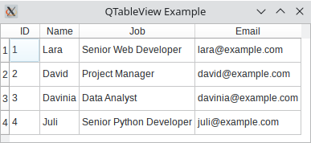

# Visualització i edició de dades amb PySide

Un requisit comú a les aplicacions GUI que utilitzen bases de dades és la capacitat de carregar, mostrar i editar dades de la base de dades mitjançant diferents *Widgets*.Els que se solen utilitzar són les taules, les llistes, els arbres i les llistes desplegables.

PySide ofereix dos tipus diferents de Widgets per gestionar dades:

- Els Widgets estàndard inclouen contenidors interns per emmagatzemar dades.
- Els widgets de visualització no mantenen contenidors de dades interns, sinó que utilitzen models per accedir a les dades.

El segon enfocament aprofita la programació Model-View de PySide. Amb aquest enfocament, tenim Widgets que representen vistes com ara taules, llistes i arbres i classes *model* que es comuniquen amb les vostres dades.

## Arquitectura Model-View de PySide

El patró de disseny Model-View-Controller (MVC) és un patró destinat a dividir el codi d'una aplicació en tres capes generals, cadascuna amb una funció diferent.

El model s'ocupa de la lògica de l'aplicació, la vista proporciona representacions en pantalla i el controlador connecta el model i la vista per fer que l'aplicació funcione correctament, mantenint la persistència de les dades.

Qt proporciona una variació personalitzada de MVC. L'anomenen arquitectura Model-View i també està disponible per a PySide. El patró també separa la lògica en tres components:

- **Els models** es comuniquen amb les dades i accedeixen a elles. També defineixen una interfície que utilitzen les vistes i els delegats per accedir a les dades. Tots els models es basen en QAbstractItemModel. Alguns models que s'utilitzen habitualment inclouen QStandardItemModel, QFileSystemModel, i models relacionats amb SQL.

- **Les vistes** són les responsables de mostrar les dades a l'usuari. També tenen una funcionalitat similar al controlador en el patró MVC. Totes les vistes es basen en QAbstractItemView. Algunes vistes d'ús habitual són QListView, QTableView i QTreeView.

- **Els Delegats** presenten els elements a les vistes i proporcionen widgets per poder modificar-los. També es comuniquen amb el model si s'ha modificat un element. La classe base és QAbstractItemDelegate.

La separació de classes en aquests tres components implica que els canvis en els models es reflectiran automàticament en les vistes, i els canvis en les vistes o a través dels delegats actualitzaran el model automàticament.

A més, podem mostrar les mateixes dades en diferents vistes amb un únic model.

## Ús de components estàndard

PySide ofereix diversos components estàndard per mostrar i editar dades a les vostres aplicacions. Aquests proporcionen vistes com ara taules, arbres i llistes. També proporcionen un contenidor intern per emmagatzemar dades i delegats convenients per editar-les. Totes aquestes característiques s'agrupen en una sola classe.

Hi ha tres d'aquestes classes estàndards:

- **QListWidget** -> llista d'elements
- **QTreeWidget** -> arbre jeràrquic d'elements
- **QTableWidget** -> taula d'elements
- 
QTableWidget és el més útil quan es tracta de mostrar i editar dades. Crea una matriu 2D d'objectes  QTableWidgetItem. Cada element té un valor individual en forma d'string i aquests valors es mostren en cel·les que s'organitzen en una taula de files i columnes.

Les operacions més importants que podem realitzar sobre ells són:

- Edició del contingut dels seus elements mitjançant objectes delegats
- Afegir nous elements utilitzant .setItem()
- Configurar el nombre de files i columnes mitjançant .setRowCount() i.setColumnCount()
- Afegir etiquetes de capçalera verticals i horitzontals amb setHorizontalHeaderLabels() i .setVerticalHeaderLabels

~~~py
import sys
import os

from PySide6.QtSql import QSqlDatabase, QSqlQuery
from PySide6.QtWidgets import (
    QApplication,
    QMainWindow,
    QMessageBox,
    QTableWidget,
    QTableWidgetItem,
)

class Contacts(QMainWindow):
    def __init__(self, parent=None):
        super().__init__(parent)
        self.setWindowTitle("QTableView Example")
        self.resize(450, 250)
        # Set up the view and load the data
        self.view = QTableWidget()
        self.view.setColumnCount(4)
        self.view.setHorizontalHeaderLabels(["ID", "Name", "Job", "Email"])
        query = QSqlQuery("SELECT id, name, job, email FROM contacts")
        while query.next():
            rows = self.view.rowCount()
            self.view.setRowCount(rows + 1)
            self.view.setItem(rows, 0, QTableWidgetItem(str(query.value(0))))
            self.view.setItem(rows, 1, QTableWidgetItem(query.value(1)))
            self.view.setItem(rows, 2, QTableWidgetItem(query.value(2)))
            self.view.setItem(rows, 3, QTableWidgetItem(query.value(3)))
        self.view.resizeColumnsToContents()
        self.setCentralWidget(self.view)
        query.finish()
        QSqlDatabase.removeDatabase(QSqlDatabase.database().connectionName())

def createConnection():
    con = QSqlDatabase.addDatabase("QSQLITE")
    con.setDatabaseName(os.path.join(os.path.dirname(__file__),
                 "contacts.sqlite"))
    if not con.open():
        QMessageBox.critical(
            None,
            "QTableView Example - Error!",
            "Database Error: %s" % con.lastError().databaseText(),
        )
    return con

app = QApplication(sys.argv)
connection = createConnection()
if not connection.isOpen():
    sys.exit(1)
win = Contacts()
win.show()
QSqlDatabase.removeDatabase(QSqlDatabase.database().connectionName())
sys.exit(app.exec())
~~~

Mostrar i editar taules de bases de dades amb Widgets estàndard és una tasca difícil, ja que tindrem dues còpies de les mateixes dades que haurem de sincronitzar per mantindre la coherència entre les dades i les visualitzacions:

- A la nostra base de dades
- Al widget, als contenidors interns, normalment propietats d'aquest

Si seguim aquet patró, som responsables de sincronitzar les dues còpies de les nostres dades manualment, cosa que pot ser una operació molesta i propensa a errors. Afortunadament, podem utilitzar l'arquitectura Model-View de PySide per evitar la majoria d'aquests problemes.

## Ús de components amb patró Model-View

Les classes que seguixen el patró Model-View de PySide eliminen els problemes de duplicació i sincronització de dades que es poden produir quan s'utilitzen classes estàndard per crear aplicacions de bases de dades. L'arquitectura Model-View ens permet utilitzar diverses vistes per mostrar les mateixes dades perquè podem passar un model a moltes vistes.

- Les classes model proporcionen una interfície de programació d'aplicacions (API) que podem utilitzar per manipular dades. 
- Les classes de visualització proporcionen objectes delegats convenients que podem utilitzar per editar dades a la vista directament. 

!!!important "Definim el model"
    Per connectar una vista amb un mòdul determinat, heu de fer una crida .setModel() de l'objecte de vista.

PySide ofereix un conjunt de classes de vista que admeten l'arquitectura Model-View:

- **QListView** -> llista d'elements que prenen valors directament d'una classe model
- **QTreeView** -> arbre jeràrquic d'elements que prenen valors directament d'una classe model
- **QTableView** -> taula d'elements que prenen valors directament d'una classe model

Podem utilitzar aquestes classes de vista juntament amb classes de model per crear les nostres aplicacions de base de dades. Això farà que siguen més robustes, més ràpides de codificar i menys propenses a errors.

Aquestes són algunes de les classes models que proporciona PySide per treballar amb bases de dades SQL:

- **QSqlQueryModel** -> model de dades de només lectura per a consultes SQL
- **QSqlTableModel** -> model de dades editable per llegir i escriure registres en una única taula
- **QSqlRelationalTableModel** -> model de dades editable per llegir i escriure registres en una taula relacional

Una vegada connectat un d'aquests models a una taula o consulta de base de dades, podem utilitzar-los per omplir les nostres visualitzacions. Les vistes proporcionen objectes delegats que ens permeten modificar les dades directament a la vista. El model connectat a la vista actualitzarà les dades de la vostra base de dades per reflectir qualsevol canvi a la vista. Tingueu en compte que no cal que actualitzem les dades de la base de dades manualment. El model ho farà per nosaltres.

Aquí hi ha un exemple que mostra els conceptes bàsics de com utilitzar un QTableView i un QSqlTableModel junts per crear una aplicació de base de dades mitjançant l'arquitectura Model-View de PySide:

~~~py
import sys
import os

from PySide6.QtCore import Qt
from PySide6.QtSql import QSqlDatabase, QSqlTableModel
from PySide6.QtWidgets import (
    QApplication,
    QMainWindow,
    QMessageBox,
    QTableView,
)

class Contacts(QMainWindow):
    def __init__(self, parent=None):
        super().__init__(parent)
        self.setWindowTitle("QTableView Example")
        self.resize(415, 200)
        # Set up the model
        self.model = QSqlTableModel(self)
        self.model.setTable("contacts")
        self.model.setEditStrategy(QSqlTableModel.OnFieldChange)
        self.model.setHeaderData(0, Qt.Horizontal, "ID")
        self.model.setHeaderData(1, Qt.Horizontal, "Name")
        self.model.setHeaderData(2, Qt.Horizontal, "Job")
        self.model.setHeaderData(3, Qt.Horizontal, "Email")
        self.model.select()
        # Set up the view
        self.view = QTableView()
        self.view.setModel(self.model)
        self.view.resizeColumnsToContents()
        self.setCentralWidget(self.view)

def createConnection():
    con = QSqlDatabase.addDatabase("QSQLITE")
    con.setDatabaseName(os.path.join(os.path.dirname(__file__),
                 "contacts.sqlite"))
    if not con.open():
        QMessageBox.critical(
            None,
            "QTableView Example - Error!",
            "Database Error: %s" % con.lastError().databaseText(),
        )
        return False
    return True

app = QApplication(sys.argv)
if not createConnection():
    sys.exit(1)
win = Contacts()
win.show()
sys.exit(app.exec_())
~~~

Per editar les dades d'una cel·la de la taula, podeu fer doble clic a la cel·la. A la cel·la es mostrarà un component de delegat convenient, que us permetrà editar el contingut. A continuació, podeu prémer *Enter* per guardar els canvis.

!!!important "Ús de Model-View"
    La capacitat de gestionar i guardar automàticament els canvis a les dades és un dels avantatges més importants de l'ús de les classes Model-View de PySide. L'arquitectura Model-View millorarà la nostra productivitat i reduirà els errors que poden aparèixer quan hem d'escriure el codi de manipulació de dades per nosaltres mateixos.

### Ús de components amb models predefinits

És molt senzill utilitzar un model predefinit per a mostrar i editar informació. Els models predefinits que podem utilitzar a Qt són:

- QSqlTableModel (el que hem utilitzat a l'exemple)
- QStringListModel
- QStandardItemModel
- QFileSystemModel
- QSqlQueryModel
- QSqlRelationalTableModel
- QSortFilterProxyModel

Veiem un exemple amb QSqlTableModel, que és dels més utilitzats en aplicacions:

~~~py
import sys
import os

from PySide6.QtCore import Qt
from PySide6.QtSql import QSqlDatabase, QSqlTableModel
from PySide6.QtWidgets import (
    QApplication,
    QMainWindow,
    QMessageBox,
    QTableView,
)

class Contacts(QMainWindow):
    def __init__(self, parent=None):
        super().__init__(parent)
        self.setWindowTitle("QTableView Example")
        self.resize(415, 200)
        # Set up the model
        self.model = QSqlTableModel(self)
        self.model.setTable("contacts")
        self.model.setEditStrategy(QSqlTableModel.OnFieldChange)
        self.model.setHeaderData(0, Qt.Horizontal, "ID")
        self.model.setHeaderData(1, Qt.Horizontal, "Nom")
        self.model.setHeaderData(2, Qt.Horizontal, "Treball")
        self.model.setHeaderData(3, Qt.Horizontal, "Correu")
        self.model.select()
        # Set up the view
        self.view = QTableView()
        self.view.setModel(self.model)
        self.view.resizeColumnsToContents()
        self.setCentralWidget(self.view)

def createConnection():
    con = QSqlDatabase.addDatabase("QSQLITE")
    con.setDatabaseName(os.path.join(os.path.dirname(__file__),
                 "contacts.sqlite"))
    if not con.open():
        QMessageBox.critical(
            None,
            "QTableView Example - Error!",
            "Database Error: %s" % con.lastError().databaseText(),
        )
        return False
    return True

app = QApplication(sys.argv)
if not createConnection():
    sys.exit(1)
win = Contacts()
win.show()
sys.exit(app.exec_())
~~~

!!!warning "Models predefinits"
    Sempre que siga possible, utilitzarem models predefinits, ja que ens estalviaran molta feina i ens evitaran errors de programació. Sols si amb la funcionalitat d'aquests no és suficient, implementarem models abstractes.

!!!warning "Models abstractes"
    L'ús de models abstractes queda fora de l'abasts d'este curs, però podeu trobar exemples al següent [enllaç](https://doc.qt.io/qtforpython/overviews/modelview.html)

## Ús de delegats

Quan la informació que volem editar no és un text, podem fer ús de delegats per modificar-la. Per exemple, un SpinBox per a editar un enter, un ComboBox per a limitar les opcions d'un text, un DateEdit per a editar un data...

Al següent exemple mostrem com utilitzar un SpinBox com a delegat en totes les cel·les:

~~~py
import sys

from PySide6.QtWidgets import (QApplication, QStyledItemDelegate, QSpinBox,
                               QTableView)
from PySide6.QtGui import QStandardItemModel, Qt
from PySide6.QtCore import QModelIndex

class SpinBoxDelegate(QStyledItemDelegate):
    """A delegate that allows the user to change integer values from the model
       using a spin box widget. """

    def __init__(self, parent=None):
        super().__init__(parent)

    def createEditor(self, parent, option, index):
        editor = QSpinBox(parent)
        editor.setFrame(False)
        editor.setMinimum(0)
        editor.setMaximum(100)
        return editor

    def setEditorData(self, editor, index):
        value = index.model().data(index, Qt.EditRole)
        editor.setValue(value)

    def setModelData(self, editor, model, index):
        editor.interpretText()
        value = editor.value()
        model.setData(index, value, Qt.EditRole)

    def updateEditorGeometry(self, editor, option, index):
        editor.setGeometry(option.rect)

if __name__ == '__main__':
    app = QApplication(sys.argv)

    model = QStandardItemModel(4, 2)
    tableView = QTableView()
    tableView.setModel(model)

    delegate = SpinBoxDelegate()
    tableView.setItemDelegate(delegate)
    tableView.horizontalHeader().setStretchLastSection(True)

    for row in range(4):
        for column in range(2):
            index = model.index(row, column, QModelIndex())
            value = (row + 1) * (column + 1)
            model.setData(index, value)

    tableView.setWindowTitle("Spin Box Delegate")
    tableView.show()
    sys.exit(app.exec())
~~~

!!!note "Delegats per a una sola columna"
    Per assignar delegat a una sola columna podem utilitzar el mètode setDelegateForColumn().