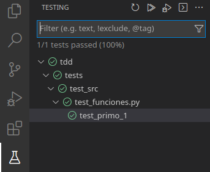

# Activitat resolta 2 - TDD
Ja hem insistit en la importància que tenen les proves de programari en el desenvolupament de les aplicacions per assegurar un alt grau de qualitat als nostres projectes. En aquesta unitat ens centrarem en una tècnica de programació centrada en aquesta fase de proves que a més s'ajusta a la filosofia de desenvolupament àgil. És l'anomenat desenvolupament guiat per proves odesenvolupament impulsat per proves(TDD).

## Objectiu
Ara que ja sabem escriure proves unitàries amb pytest i automatitzar-ne l'execució, tot sense sortir del nostre entorn de desenvolupament, aplicarem la tècnica de TDD per realitzar la implementació d'una funció per esbrinar si un nombre és primer.

## Solució
Seguirem una sèrie de regles per seguir el cicle de desenvolupament definit per TDD.

El primer que farem serà crear una estructura pel nostre projecte amb el codi i els tests separats:

```bash
.
├── src
│ ├── funcions.py
│ └── __init__.py
└── proves
    ├── __init__.py
    └── test_src
        ├── __init__.py
        └── test_funcions.py
```

### **Regla 1**: Primer el test, després la codificació.
Així que la primera cosa que haurem d'escriure és el test i verificar que falla.

El número 1 no està considerat com a primer, així que si cridem a la funció amb el número 1 hauria de retornar False. Per tant podem escriure la prova següent:

!!! example "test_src/test_funcions.py"
    ```python
    def test_primo_1():
        assert es_primo(1) == False
    ```

En executar el test al VSCode ens fallarà, igual que si ho fem per consola. L'error serà el següent:

```python
def test_primo_1():
> assert ca_primo(1) == False
E NameError: el nom 'es_primo' no està definit
```

### **Regla 2**: Afegeix el mínim codi per superar el test
Així que definirem la funció amb la mínima implementació per superar el test. Els fitxers quedaran com segueix:

!!! example "src/funcions.py"
    ```python
    def es_primo(num):
    if num == 1:
        return False
    ```

    <figure markdown>
      { width="300" }
      <figcaption>Supera el test</figcaption>
    </figure>

### **Regla 3**: No hauríeu de tindre més d'un test no superat a la vegada
Aquesta regla no és una regla que s'hagi de seguir estrictament, però ajuda el programador a centrar-se en un sol problema. Ara que la nostra implementació supera el test per al número 1, escriurem un test per a un nombre primer. Farem servir el 2 per a la nostra prova.

!!! example "test_src/test_funcions.py"
    ```python
    def test_es_primo_numero_primo():
        assert es_primo(2) == True
    ```

    Si executem els tests, observarem que aquest nou test falla, així que refactoritzarem el codi de la funció es_primo perquè supere tots els tests amb el mínim codi possible:

!!! example "src/funcions.py"
    ```python
    def es_primo(num):
        if num == 1:
            return False
        else:
            return True
    ```

### **Regla 4**: Escriu codi que passe el test, després refactoritza el codi.
El codi anterior passa ambdues proves, però podem veure fàcilment que la implementació no és correcta. Quan afegiu un test per a números negatius o el zero, el test fallarà.

!!! example "test_src/test_funcions.py"
    ```python
    def test_es_primo_negativo():
        assert es_primo(-10) == False
    ```

La refactorització quedaria com:
!!! example "src/funcions.py"
    ```python
    def es_primo(num):
        if num < 2:
            return False
        else:
            return True
    ```

### **Regla 5**: Un test hauria de fallar la primera vegada que ho escrius, en cas contrari pregunta't per què ho afegeixes.
Si no hi ha cap test que fallen, no hauríeu d'afegir nova funcionalitat. Això us obliga a escriure primer els test de nou abans que el codi.

Si escrivim un test per a qualsevol nombre compost (no primer més gran que 2) de nou fallarà, ja que no tornarà que sí que és primer.

!!! example "test_src/test_funcions.py"
    ```python
    def test_es_primo_numero_primo_mayor_2():
        assert es_primo(29) == True
    ```

La refactorització quedaria com:

!!! example "src/funcions.py"
    ```python
    def es_primo(num):
        if num < 2:
            return False
        for n in range(2, num):
            if num % n == 0:
                return False
        return True
    ```

### **Regla 6**: mai refactoritzar sense tests.
Un cop tenim ben implementats els tests, podem refactoritzar el codi assegurant que la refactorització no introdueix errors que anteriorment no teníem.

Si observem la funció, la podem fer més eficient canviant el rang, ja que el divisor més gran d'un nombre no pot ser més gran que la part sencera de la meitat. Així que podem refactoritzar i deixar la implementació com segueix, fent la funció molt més eficient:

!!! example "src/funcions.py"
    ```python
    import math


    def es_primo(num):
        if num < 2:
            return False
        for n in range(2, math.floor(math.sqrt(num) + 1)):
            if num % n == 0:
                return False
        return True
    ```

Si executem els tests, veurem que els supera tots, assegurant que la nostra implementació és correcta.

!!! tip "Instruccions addicionals sobre el seu ús en un context pràctic real."
    En un desenvolupament real, cada programador provaria el codi en local abans d'enviar les seves modificacions al repositori del projecte. Encara que s'enviaren per error canvis que no superaren els tests, el repositori no els posaria en producció, ja que fallarien les proves. Si els tests locals se superen, es pot estar molt segur que no s'introduiran errors que anteriorment no estigueren en el codi, reduint així la possibilitat de defectes.
