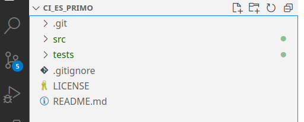
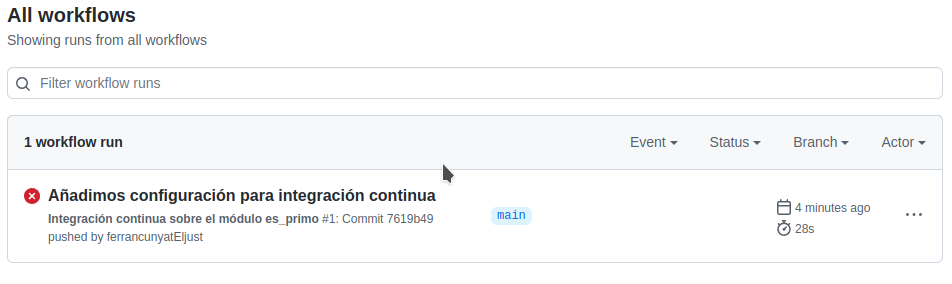
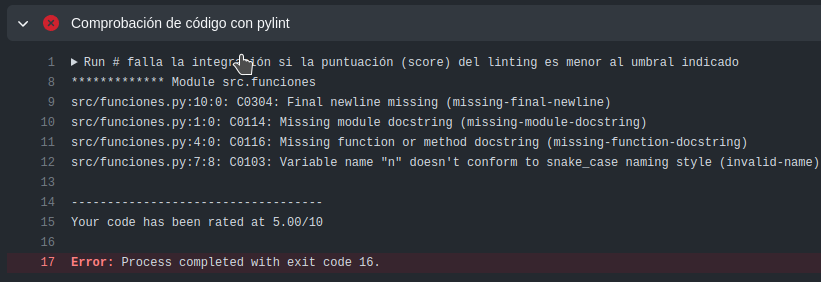

# Integració continua amb Github Pages
Hem après en apartats anteriors que les noves metodologies s'orienten a obtenir un producte amb més qualitat amb un temps de lliurament el menor possible. Per aconseguir aquest objectiu, les empreses han implantat la cultura DevOps (development + operations). Entre les seves operacions hi ha la integració i el lliurament/desplegament continus, que són dues de les peces clau que els permetran aconseguir l'objectiu presentat anteriorment.

## Objectiu
En aquesta pràctica muntarem un sistema d'integració contínua amb Github Actions. En concret pujarem el nostre codi desenvolupat en l'activitat anterior, el que consistia a desenvolupar la funció `es_primo`, per poder fer integració contínua sobre el codi.

### Primer pas - creació del repositori
El primer pas serà crear un repositori a github amb el nom, per exemple, ci_es_primo. Afegirem un README, un .gitignore del llenguatge de programació python i el publicarem sota llicència GNU/GPL 3.0.

<figure markdown>
  
  <figcaption>Creació del repositori</figcaption>
</figure>

Una vegada creat el clonem al nostre ordinador i afegim el codi (carpeta `src`) i les proves (carpeta `tests`) del nostre projecte.

<figure markdown>
  { width="500" }
  <figcaption>Estructura del repositori</figcaption>
</figure>

!!! warning "pytest!"
    Comproveu que en executar els tests amb vscode tot funciona correctament.

!!! warning "Compte!"
    Afegiu .vscode/ a .gitignore per a no incorporar la configuració local al repositori remot.

### Segon pas - afegim un linter
Ara anem a afegir un linter, que és una ferramenta que analitza el codi i busca errors, tant de sintaxi com d'estil. Podem utilitzar l'extensió vscode `pylint` de Microsoft o intal·lar i comprovar que la llibreria s'ha instal·lat al nostre entorn amb:

```python
pip install pylint
pylint --version
```

Si instal·lem pylint a vscode ens apareixeran els problemes detectats a la pestanya problems. 

<figure markdown>
  { width="600" }
  <figcaption>Pylint a vscode</figcaption>
</figure>

Si hem instal·lat la ferramenta, podem executar la següent ordre (des de l'arrel del repositori) per comprovar els problemes:

```bash
$ pylint src
************* Module src.funcions
src/funcions.py:15:0: C0304: Final newline missing (missing-final-newline)
src/funcions.py:1:0: C0114: Missing module docstring (missing-module-docstring)
src/funcions.py:4:0: C0116: Missing function or method docstring (missing-function-docstring)
src/funcions.py:5:4: R1705: Unnecessary "else" after "return", remove the "else" and de-indent the code inside it (no-else-return)

-------------------------------------------------------------------
Your code has been rated at 6.36/10 (previous run: 6.36/10, +0.00)
```

!!! note "Pylint CLI front a extensió pylint de MS"
    Com vegeu els resultats no són exactament els mateixos degut a les diferents versions de pylint utilitzades.

### Tercer pas - afegim una acció de github
Les accions de Github ens permeten realitzar una sèrie d'accions cada vegada que es produeix un esdeveniment de Github. L'esdeveniment més utilitzat és PUSH, és a dir, afegir canvis al nostre repositori. Els fitxers actualitzats normalment seran mòduls de codi font que es van descarregar prèviament de Github, sobre els quals ha treballat i ha fet canvis un programador. Usant una eina de control de versions com Git, prepararem els canvis per integrar-los al repositori original. Com hem vist a la teoria, abans d'integrar el codi font modificat a la còpia mestra, ens hem d'assegurar que està lliure d'errors, passant les proves que havíem definit. Aquesta és la part CI d'un flux CI/CD.

Per afegir una acció anem a Accions al nostre repositori. Ens suggeriran una sèrie de configuracions segons el contingut del repositori. En aquest cas, github detecta que és un repositori amb codi python, així que ens suggereix alguns fluxos de treball. Seleccionarem de *`Python application`* donant-li a *`Configure`*. En cas de no aparéixer, el podem buscar a la plataforma.

<figure markdown>
  { width="300" }
  <figcaption>Python application action</figcaption>
</figure>

En prémer se'ns presentarà en edició un fitxer de configuració yaml `python-app.yml`.

Simplement observant el fitxer de configuració es pot intuir com funciona:

```yml
# This workflow will install Python dependencies, run tests and lint with a single version of Python
# For more information see: https://help.github.com/actions/language-and-framework-guides/using-python-with-github-actions


name: Python application


on:
  push:
    branches: [ main ]
  pull_request:
    branches: [ main ]


permissions:
  contents: read


jobs:
  build:


    runs-on: ubuntu-latest


    steps:
    - uses: actions/checkout@v3
    - name: Set up Python 3.10
      uses: actions/setup-python@v3
      with:
        python-version: "3.10"
    - name: Install dependencies
      run: |
        python -m pip install --upgrade pip
        pip install flake8 pytest
        if [ -f requirements.txt ]; then pip install -r requirements.txt; fi
    - name: Lint with flake8
      run: |
        # stop the build if there are Python syntax errors or undefined names
        flake8 . --count --select=E9,F63,F7,F82 --show-source --statistics
        # exit-zero treats all errors as warnings. The GitHub editor is 127 chars wide
        flake8 . --count --exit-zero --max-complexity=10 --max-line-length=127 --statistics
    - name: Test with pytest
      run: |
        pytest
```

Bàsicament estem configurant que quan es produesca un `push` o un `pull_request` sobre la rama principal `main` es llance l'acció. Quan es llance es posarà en marxa el `build` que serà executat amb un sol `job` o treball (podríem configurar-ne diversos). El `job` es porta a terme (`run`) sobre un contenidor docker que executa la última imatge d'ubuntu (`ubuntu-latest`) i realitza una sèrie de passos (`steps`). Els passos són:

- portar el codi (checkout)
- configurar python3 sobre el contenidor
- instal·lar les dependències. Aquest pas s'executa sobre la terminal bash del contenidor, igual que ho faríem al nostre ordinador.
- executar el linter, també sobre la terminal.
- executar les proves, novament utilitzant la terminal del contenidor.

Si tots els passos anteriors es completen correctament, la integració haurà estat satisfactòria. En cas contrari, la construcció fallarà i ens enviarà un correu electrònic a l'adreça amb què ens registrem a github indicant que el flux de treball ha fallat.

Canviarem algunes configuracions:

- Anem a modificar el nom del fitxer a ci.yml
- Canviarem tots els `name` per a que ens ajude a veure en quin pas ha fallat
- Utilitzarem el linter pylint en comptes de flake8
- La línia d'instal·lar les dependències definides al fitxer de requisits no cal, però la deixarem per si en un futur inserim dependències a una de les factoritzacions.
- El linter el canviarem perquè la puntuació a aconseguir siga de 10 (això és la màxima puntuació, estem exigint que siguen molt escrupolosos amb la producció de codi).
- Finalment, executarem les proves amb pytest.

El fitxer quedaria com segueix:

```yml
# This workflow will install Python dependencies, run tests and lint with a single version of Python
# For more information see: https://docs.github.com/en/actions/automating-builds-and-tests/building-and-testing-python

name: Integració contínua sobre el projecte funcions

on:
  push:
    branches: [ "main" ]
  pull_request:
    branches: [ "main" ]

permissions:
  contents: read

jobs:
  build:

    runs-on: ubuntu-latest

    steps:
    - uses: actions/checkout@v3
    - name: Configurar Python 3.10
      uses: actions/setup-python@v3
      with:
        python-version: "3.10"
    - name: Instal·lar dependències
      run: |
        python -m pip install --upgrade pip
        pip install pylint pytest
        if [ -f requirements.txt ]; then pip install -r requirements.txt; fi
    - name: Lint amb pylint
      run: |
        # stop the build if there are Python syntax errors or undefined names
        pylint --fail-under=10 src      
    - name: Proves amb pytest
      run: |
        pytest
```

En donar-li a `satart commit`, es realitzarà un `push` sobre el repositori, per la qual cosa l'acció s'executarà. Si vas al menú `Actions` observaràs que la integració no ha sigut satisfactòria. Això és degut al fet que no havíem corregit els problemes de `linting`.

<figure markdown>
  
  <figcaption>Integració fallida</figcaption>
</figure>

Si fem clic sobre l'enllaç de l'error i després sobre build, ens mostrarà el pas que ha fallat al costat de l'eixida per consola del contenidor.

<figure markdown>
  
  <figcaption>Eixida per consola del contenidor</figcaption>
</figure>

### Quart pas - modifiquem el codi per corregir els erros
Ens portem el codi a local i corregim els errors que ens indica el pylint, quedant l'arxiu com segueix:

```python
"""Módulo que contiene la función es_primo"""
import math


def es_primo(numero):
    """
   Función para determinar si un número es primo:


   Entrada:
   - entero: número entero a determinar si es primo


   Salida:
   - True/False: en caso de ser primo o no
   """

    if numero < 2:
        return False

    for n in range(2, math.floor(math.sqrt(numero) + 1)):
        if numero % n == 0:
            return False

    return True

if __name__=='__main__':
    for i in range(2,100):
        print(f'{i} -> {es_primo(i)}')

```

!!! tip "Comprovació en local"
    Abans d'enviar els canvis, comproveu que el linter et dona una puntuació de 10 i que no heu introduït errors en la refactorització utilitzant pytest. Si tot és correcte ja podeu enviar el codi per a la seua integració. En cas de no ser-ho, corregeix els errors abans de la integració.

Finalement comprova que la integració ha sigut satisfactòria a `github actions`.

<figure markdown>
  
  <figcaption>Integració satisfactòria</figcaption>
</figure>

Pots veure les eixides per consola de cada un dels passos:

<figure markdown>
  
  <figcaption>Eixida per consola dels passos</figcaption>
</figure>

Al següent enllaç tens el [repositori públic amb integració](https://github.com/fpieseljust/ci_es_primo/) continua que hem utilitzat a esta activitat.