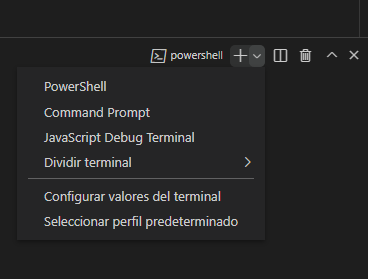
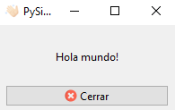

# Hello world! - Executable per a windows
No serveix de res desenvolupar una bona aplicació si després no pot ser executada per persones de fora de l'equip de desenvolupament. Per aconseguir aquest fi, necessitem empaquetar tota l'aplicació en un tot, de manera que puga ser distribuïda entre els usuaris finals que en faran ús. 

## Objectiu
En aquesta activitat empaquetarem l'aplicació `Hello world!` de PySide6 per a windows a partir del codi font.

## Requisits
- Màquina Windows amb python3 instal·lat. 
- [Codi font i recursos de l'aplicació](../../code/hello_world_exe/hello_world.zip).
- Es recomana utilitzar el vscode per fer el cas, encara que no és imprescindible.

## Solució

```python
importar sys, os
des de PySide6.QtWidgets importar QAplicació,QMainWindow,QWidget,QVBoxLayout,QLabel,QPushButton
des de PySide6.QtCore importar Qt
des de PySide6.QtGui importar QIcon


directori_principal =vostè.Camí.dirname(__dossier__)


classe Finestra principal(QMainWindow):


    def __calent__(jo mateix):
        súper(Finestra principal,jo mateix).__calent__()


        jo mateix.setWindowTitle("PySide6 executable")


        maquetació =QVBoxLayout()


        etiqueta =QLabel("Hola món!")
        etiqueta.setAlignment(Qt.AlignCenter)
        maquetació.addWidget(etiqueta)


        botó =QPushButton("Tancar")
        botó.setIcon(QIcon(vostè.Camí.uneix-te(directori_principal,"icones","tancar.png")))
        botó.premut.connectar(jo mateix.Tanca)
        maquetació.addWidget(botó)


        giny =QWidget()
        giny.setLayout(maquetació)
        jo mateix.setCentralWidget(giny)


aplicació =QAplicació(sys.argv)
aplicació.setWindowIcon(QIcon(vostè.Camí.uneix-te(directori_principal,"icones","mano.ico")))
finestra =Finestra principal()
finestra.espectacle()


aplicació.executiu()
```

Executem el codi per veure que funciona en una consola “Command Prompt”. Per treure el cmd en vscode, utilitzem Ctrl + ñ i llancem un cmd com es mostra a la imatge següent.

<figure markdown>
  { width="400" }
  <figcaption>CMD integrat a vscode</figcaption>
</figure>

Creem un entorn virtual l'activem (si estem usant vscode, ho detectarà i ho activarà automàticament) i instal·lem les dependències:

```cmd
python3 -m venv venv
venv\scripts\activate.bat
pip3 install PySide6 PyInstaller
```

Llancem l'aplicació amb:

```cmd
python hello_world.py
```

<figure markdown>
  { width="600" }
  <figcaption>App Hello world!</figcaption>
</figure>

Utilitzem pyinstaller per crear un executable .exe:

```cmd
pyinstaller --onefile -n "Hello World!" -w hello_world.py
```
Les opcions es detallen a continuació:

- **--onefile**: indica que voleu un únic fitxer .exe, com a aplicació portable (si proves sense aquesta opció observaràs que el .exe s'acompanya de llibreries dinàmiques i altres fitxers necessaris per a l'execució). Executar amb un únic fitxer és més lent, ja que en executar cal descomprimir el codi en una carpeta temporal, en canvi és més fàcil de distribuir en constar d'un únic fitxer, encara que es podria distribuir en un fitxer comprimit.
- **-n**: indica el nom de l'executable. En aquest cas el resultat és “Hola món!.exe”.
- **-w**: indica que és una aplicació amb interfície d'usuari (windowed) i no de consola.

Ens crearà un parell de carpetes (build i dist). El fitxer executable el podem trobar a dist\Hola Món!.exe, però en executar-lo observaràs que les imatges no les mostra. Això és degut a que no hem indicat a pyinstaller que necessita altres fitxers (els recursos `resources`). Per solucionar-ho, editarem l'arxiu `Hola Mundo!.spec` i a l'apartat d'anàlisi, a la línia `datas = []`, la deixarem com segueix:

dates=[('resources', 'resources')],

Estem indicant que copieu la carpeta `resources` dels fitxers font a una carpeta que acompanyarà l'executable i s'anomenarà `resources` també. En tornar a executar l'aplicació, veureu que ara el resultat és l'esperat.

Observem, però, que la icona que mostra a la barra de tasques no és la que hem indicat per codi sinó la d'una aplicació `python`. Això passa perquè Windows mira l'executable i el classifica al `application group` al qual pertany. Per defecte, tots els scripts de Python s'agrupen al mateix grup `Python`, per la qual cosa es mostra la icona de Python. Per evitar que això passe, hem de proporcionar a Windows un identificador d'aplicació diferent. Afegeix el següent fragment de codi a la teua aplicació i observaràs que s'ha solucionat:


```python
import sys, os
from PySide6.QtWidgets import QApplication, QMainWindow, QWidget, QVBoxLayout, QLabel, QPushButton
from PySide6.QtCore import Qt
from PySide6.QtGui import QIcon

main_path = os.path.dirname(__file__)

try:
    from ctypes import windll  # Codi sols vàlid en windows
    app_id = 'desenvolupament_interficies.unitat_7.hello_world.1'
    windll.shell32.SetCurrentProcessExplicitAppUserModelID(app_id)
except ImportError:
    pass


class MainWindow(QMainWindow):
    pass
```

Crida de nou pyinstaller amb les opcions indicades i veuràs que el nou executable a `dist` sí que mostra la icona correcta a la barra de tasques.

```cmd
pyinstaller --onefile -n "Hello World!" -w Hola Mundo!.spec
```