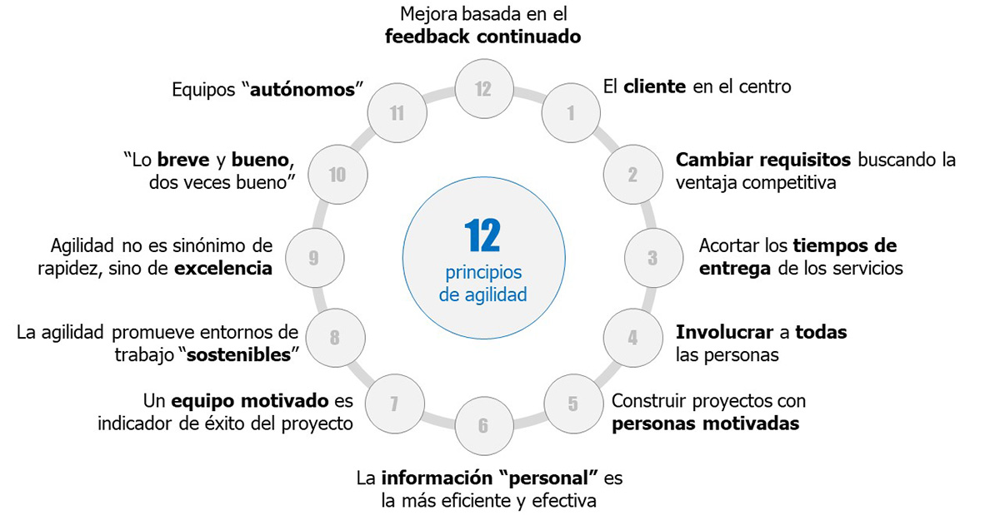
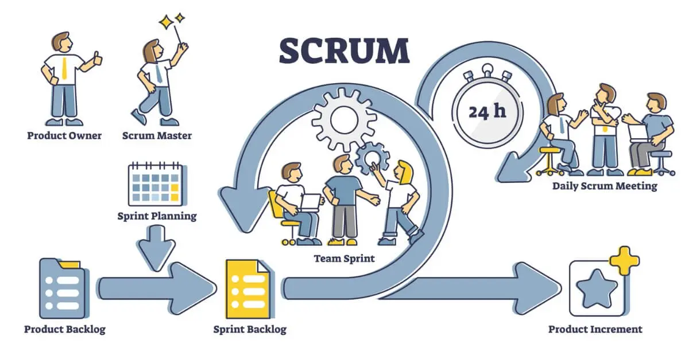
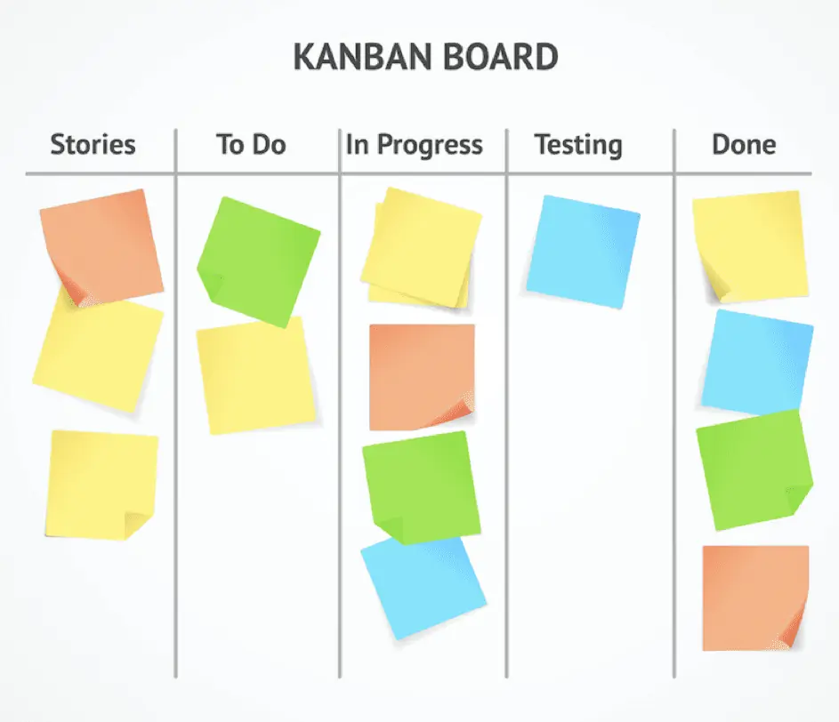

# Metodologies en el desenvolupament de programari.

Les metodologies àgils van néixer pels volts de l'any 2000 per donar resposta als problemes que ocasionaven les metodologies tradicionals de desenvolupament d'aplicacions. El principal problema era la baixa qualitat de la solució i el costós que resultava el manteniment, ja que el lliurament del producte es produïa en etapes molt avançades del desenvolupament.

## Metodologies tradicionals

Com el seu nom indica, són les metodologies utilitzades durant molt de temps. El seu propòsit principal és establir unes directrius rígides perquè el desenvolupament del projecte sigui previsible. A causa d'això, són processos seqüencials on les estimacions tindran molta importància.

Una de les metodologies més utilitzades en aquest tipus és el desenvolupament en cascada. Consta normalment de cinc fases:
1. **Anàlisi de requisits:** requisits que ha de complir. Han de ser molt ben definits, ja que no s'esperen que canviïn al llarg del procés de desenvolupament. És per això que d'aquesta part se n'encarreguen els desenvolupadors més experimentats.
2. **Disseny de la solució:** com serà la nostra solució per complir els requisits marcats.
3. **Implementació:** codificació del disseny utilitzant un llenguatge o unes tecnologies concretes.
4. **Proves:** comprovació que es compleix els requisits estipulats.
5. **Manteniment:** modificació dels problemes que sorgeixin.

<figure markdown>
  
  <figcaption>Metodologies tradicionals</figcaption>
</figure>

## Metodologies àgils
Les metodologies àgils són les que es caracteritzen per adaptar-se als canvis que es puguin produir durant el desenvolupament de la solució. Són molt més flexibles que les metodologies tradicionals i es basen en 12 principis recollits alEl Manifest Agile, agrupats en 4 valors fonamentals:

1. Individus i interaccions sobre processos i eines.
    Es prioritzen els membres dels equips i les decisions que puguin prendre front a processos preestablerts i eines de control sobre el compliment d'aquests processos. L'èxit depèn molt més de l'equip que dels processos i les eines utilitzats.

2. Programari que s'executa amb una àmplia documentació.
    Es prioritza tenir programari funcionant, desplegat, sense errors i podent ser utilitzats, abans que la documentació, que només serà útil si aporta valor a la consecució de la finalitat esmentada.

3. Col·laboració amb el client sobre negociació contractual.
    Es prioritza el contacte continu amb el client, perquè provi el programari que s'està desenvolupant i produeixi uncomentaris, que pot introduir nous canvis en el projecte, abans que uns requisits estàtics que cal complir.

4. Resposta davant del canvi sobre seguir un pla.
    Millora més el programari ladaptació a un canvi inesperat que la capacitat de seguir un pla establert que estarà no alineat amb les noves necessitats aparegudes.

<figure markdown>
  
  <figcaption>Els 12 principis de les metodologies àgils</figcaption>
</figure>

Dins la filosofia de metodologies àgils, les tres més utilitzades són:
### Scrum:
És una metodologia que permet realitzar projectes més orientats a les necessitats de l’empresa i dels clients, de manera més eficient i en un menor termini de temps. Scrum es basa en una iteració contínua, on es realitzen petites activitats per a construir un producte o projecte de forma incremental. Els components d’un equip realitzen activitats de forma iterativa i incremental per desenvolupar el projecte.

- **Planificació de la iteració**: Es defineixen les tasques a realitzar en l’iteració actual.
- **Llista de tasques (sprint backlog):** Es crea una llista de tasques que s’han de completar durant l’iteració.
- **Estimació de recursos i temps**: Es fa una estimació dels recursos necessaris i del temps que es necessitarà per completar cada tasca.
- **Assignació de tasques**: Es reparteixen les tasques entre els membres de l’equip.
- **Reunions diàries (Scrum daily meetings)**: L’equip es reuneix diàriament per discutir el progrés i planificar el treball del dia.

<figure markdown>
  
  <figcaption>Metodologia scrum</figcaption>
</figure>

### XP (Extreme Programming o programació extrema)
Aquesta metodologia se centra en la millora de la qualitat del software i la capacitat de resposta a les necessitats canviants del client. Algunes de les seves pràctiques més conegudes són la programació en parelles, el desenvolupament orientat a proves i el refactoring.

<figure markdown>
  
  <figcaption>Programació extrema</figcaption>
</figure>

### Kanban
Aquesta metodologia es basa en la gestió visual del treball. El treball es divideix en tasques que es representen visualment en un tauler Kanban, permetent a l’equip veure l’estat de totes les tasques en qualsevol moment.
<figure markdown>
  
  <figcaption>Kanban</figcaption>
</figure>
