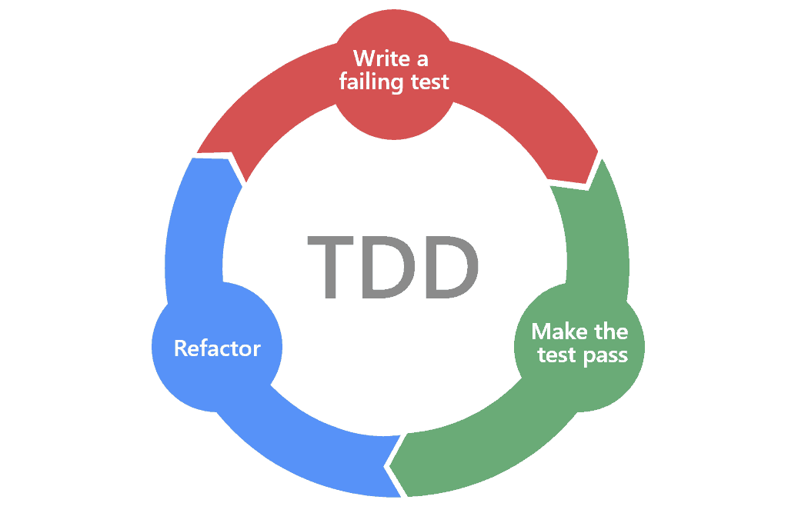
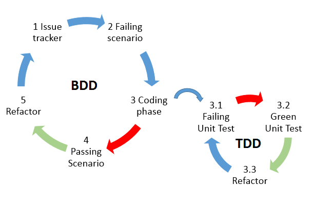

# Desenvolupament guiat per proves

## ¿Què és el desenvolupament guiat per proves?
El terme Test Driven Development (TDD) o desenvolupament guiat per proves és un enfocament de desenvolupament de programari en què es desenvolupen proves per especificar i validar la implementació de la nostra funcionalitat. El procés seguit pels desenvolupadors és el següent:

1. Es creen primer els casos de prova per a cada funcionalitat i es verifica que la prova falla. - Roig
2. Posteriorment s'escriu el codi mínim que ens permet passar la prova, sense tenir en compte la funcionalitat. - Verd
3. Es reescriu el codi (refactorització) per implementar la funcionalitat desitjada, tenint en compte que siga el més llegible i eficient possible, i comprovant que la prova continua donant un resultat satisfactori. - Refactor
   
Aquest procés s'anomena comunament Red-Green-Refactor.

<figure markdown>
  
  <figcaption>Testing Software Development</figcaption>
</figure>

Això fa que el codi siga tan simple com siga possible i la quantitat d'errors que pugui contenir sigui mínima. A més, aquesta forma de treballar aporta diverses millores, com ara evitar la duplicació de codi, millorar el manteniment dels programes, augmentar la qualitat del codi i reduir la documentació a desenvolupar.

## Perquè TDD?

La major crítica a aquest tipus d'enfocament és el temps que es dedica a escriure les proves, que finalment no formaran part de la solució final. Tot i això, aquest sobreesforç inicial, aporta una sèrie d'avantatges sobre el nostre desenvolupament:

- Desenvolupar les proves implica que s'hagin de conèixer les entrades i les sortides perquè la funció s'executi correctament: TDD ens obliga a pensar en la interfície de l'aplicació abans de començar a codificar. Això també ajuda a la integració de les diferents parts.
- Més confiança en el codi: en tenir proves automatitzades per a totes les funcions, els desenvolupadors se senten més segurs si han de modificar la funcionalitat ja existent o si han de desenvolupar noves funcions. Provar tot el sistema per veure si els nous canvis van trencar el que existia abans es torna una tasca trivial.
- TDD no elimina tots els errors, però la probabilitat de trobar-los és menor: en intentar corregir un error, podeu escriure una prova per assegurar-vos que se solucioni quan acabi la codificació.
- Les proves es poden utilitzar com a documentació addicional. A mesura que escrivim les entrades i sortides d'una funció, un desenvolupador pot veure la prova i veure com cal utilitzar la seva interfície.

## Cobertura de codi
La cobertura de codi és una mètrica que mesura la quantitat de codi font que cobreix el nostre pla de prova. Una cobertura del 100% vol dir que tot el codi que ha escrit ha estat provat per almenys una proves. S'utilitzen diferents mètriques per obtenir la cobertura, algunes de les més utilitzades són:

- Nombre de línies de codi provades
- Nombre de funcions de codi provades
- Número branques o camins provats (un camí és la ruta per on pot passar l'execució del nostre codi, per exemple una sentència if seria una bifurcació que crea dos camins diferents)

Una cobertura de codi alta no significa que l'aplicació estigui lliure d'errors ja que és probable que el codi no hagi estat provat per a tots els escenaris possibles.

## Proves unitàries i dintegració
En desenvolupar projectes grans, el nombre de funcions i components a desenvolupar augmenta considerablement. Si bé les proves unitàries ens verifiquen que cadascun d'aquests components es comporta com cal individualment, les proves d'integració ho fan quan els components es posen a treballar junts.

TDD requereix que comencem escrivint una prova que falli, no ens obliga que el tipus de prova hagi de ser de tipus unitari. La nostra primera prova pot ser una prova dintegració si així ho considerem millor.

Si comencem per escriure una prova dintegració, aquesta fallarà fins que cada component estigui desenvolupat de forma individual, obligant al desenvolupador a escriure les proves unitàries corresponents per a aquests components. Quan es refactorizi el codi per superar la prova dintegració, si està dissenyada correctament, estarem complint amb un requisit dusuari per al nostre sistema.

## TDD i metodologies àgils
El desenvolupament guiat per proves s'ajusta de forma òptima a les metodologies àgils, on el principal objectiu és oferir actualitzacions incrementals a una solució que va creixent de la manera més ràpida possible i on la solució intermèdia té un alt grau de qualitat. La certesa que el codi compleix les proves unitàries i d'integració suposa que els problemes a l'entorn de producció seran molt menors.

TDD també s'ajusta perfectament a altres eines utilitzades en les metodologies àgils, com el *pair programing* programació per parelles. Per exemple, un dels desenvolupadors es podria dedicar a escriure les proves i l'altre a la refactorització per superar aquestes proves. Aquests rols es poden intercanviar de manera queambdues parts estan centrades en la part que estan fent i alhora revisen la feina de l'altra persona implicada, aportant beneficis per a tots dos i per al projecte.

El desenvolupament guiat pel comportament, o BDD, és un refinament de TDD que té com a objectiu optimitzar el desenvolupament a través de la reducció de les dificultats de comunicació, creant una millor comprensió del client i permetent una comunicació continuada entre l'equip de desenvolupament i l'usuari final. És una manera de combinar els requisits amb el codi i us permet comprendre el comportament del sistema des de la perspectiva comercial/de l'usuari final.

<figure markdown>
  
  <figcaption>Behavior Driven Development</figcaption>
</figure>

La majoria d'empreses que tenen implementades les metodologies àgils fan ús de les tècniques de desenvolupament guiat per proves.
