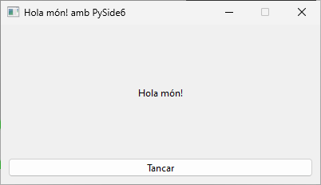

# Creació d'executables amb pyinstaller

## Hola món!

En esta pràctica aprendrem a construir executables per als diferents sistemes operatius fent ús de pyinstaller.

Per a instal·lar pyinstaller executem la següent ordre:

```shell
pip install pyinstaller
```

Partirem del següent codi font:

```python
import sys
from PySide6.QtWidgets import (QApplication, QMainWindow, 
    QWidget, QVBoxLayout, QLabel, QPushButton)
from PySide6.QtCore import Qt


class MainWindow(QMainWindow):
    def __init__(self):
        super(MainWindow, self).__init__()
        self.setFixedSize(400, 200)
        self.setWindowTitle("Hola món! amb PySide6")

        layout = QVBoxLayout()
        label = QLabel("Hola món!")
        label.setAlignment(Qt.AlignCenter)
        layout.addWidget(label)

        button = QPushButton("Tancar")
        button.pressed.connect(self.close)
        layout.addWidget(button)

        widget = QWidget()
        widget.setLayout(layout)
        self.setCentralWidget(widget)


if __name__ == '__main__':    
    app = QApplication(sys.argv)
    window = MainWindow()
    window.show()
    app.exec()
```

És l'Hola món! amb un botó per tancar.

{: style="display: block;margin-left: auto;margin-right: auto;width: 50%;"}

Ara executem a un terminal:

```shell
pyinstaller.exe -n "Hola món!" -w --onefile .\holamon_pyside6.py
```

On les opcions utilitzades són:

- -n per a donar-li nom a l'executable
- -w per a indicar que és un programa amb GUI i no de consola, de forma que no apareixerà la shell durant la seua execució
- --onefile que empaquete tots els arxius en un únic arxiu executable