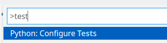
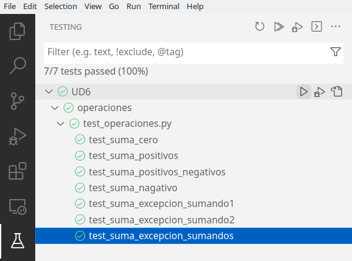

# Activitat resolta 1 - Proves unitàries amb `pytest` 
Al procés de producció de programari s'introdueixen involuntàriament alguns errors que han de ser corregits abans de posar la solució en producció. És per això que hi ha el programari testing o les proves d'aplicacions. Aquest procés es desenvolupa en paral·lel a totes les etapes del desenvolupament i ens serveix com a verificació i validació que el programari compleix amb la seva comesa i ho fa de manera adequada.

## Objectiu
Hem vist a la teoria que un dels tipus de proves sobre aplicacions imprescindibles són les proves unitàries. Una de les eines més utilitzades per dur a terme aquestes proves unitàries a python és `pytest`. Utilitzarem pytest per realitzar unes proves unitàries sobre la funció de suma de dos números.

## Solució:
El primer que hem de fer és instal·lar pytest al nostre sistema:

```bash
pip install pytest
```

Per comprovar que realment està instal·lat, pots executar des de consola:

```bash
pytest --version
```

El funcionament de pytest és similar a qualsevol llibreria de proves. Utilitzem `assert` perquè la llibreria comprove si es compleix una determinada condició.
En cas de complir-se, s'ha comprovat que passa el test; en cas contrari, alguna cosa ha fallat:

```python
assert Val1 == Val2     #¿Val1 igual Val2?
assert Val1 != Val2     #¿Val1 diferent Val2?
assert Val1 < Val2      #¿Val1 és més petit que Val2?
assert Val1 <= Val2     #Val1 menor o igual que Val2?
assert Val1 > Val2      #¿Val1 més gran que Val2?
assert Val1 >= Val2     #Val1 més gran o igual que Val2?
```

Definim una funció suma dins d'un operacions.py.

```python
def suma_enteros(sumando1, sumando2):
    if not isinstance(sumando1, int) or not isinstance(sumando2, int):
        raise TypeError('Proporciona solo enteros')
    else:
        resultado = sumando1 + sumando2
    return resultado
```

Ara definim un fitxer de test sobre la suma. És impossible cobrir tots els casos ja que hi ha infinits números, però podem fer agrupacions de proves, per exemple:

- sumar el zero amb ell mateix, ja que és l'element neutre de l'operació suma
- sumar dos positius
- resumeix els negatius
- sumar un positiu i un negatiu

Ara definirem un fitxer de test per a les diferents agrupacions i per comprovar que es llança l'excepció si no passem sencers a la funció.

```python
import pytest


import operaciones


def test_suma_cero():
  assert operaciones.suma_enteros(0,0) == 0


def test_suma_positivos():
  assert operaciones.suma_enteros(5,5) == 10


def test_suma_positivos_negativos():
  assert operaciones.suma_enteros(-5,5) == 0


def test_suma_nagativo():
  assert operaciones.suma_enteros(-5,-5) == -10


def test_suma_excepcion_sumando1():
   with pytest.raises(TypeError):
       operaciones.suma_enteros(5.0,5) == 0


def test_suma_excepcion_sumando2():
   with pytest.raises(TypeError):
       operaciones.suma_enteros(5.0,'a') == 0


def test_suma_excepcion_sumandos():
   with pytest.raises(TypeError):
       operaciones.suma_enteros(True,'a') == 0
```

### Integració del testing a vscode

Es pot utilitzar el VSCode per llançar els tests de forma integrada, resultant molt més còmode llançar-los. Per fer-ho prem la combinació de tecles Ctrl + Shift + P (o a través del menú View -> Command Palette), i busca “Tests”. Seleccioneu l'opció “Python: Configure Tests”.

<figure markdown>
  { width="500" }
  <figcaption>Python configure test</figcaption>
</figure>

Ens demanarà triar quina eina volem fer servir. Seleccionem pytest (recorda que ha d'estar instal·lada amb pip).

<figure markdown>
  { width="500" }
  <figcaption>Seleccionar framework</figcaption>
</figure>

Finalment seleccionem la carpeta on tenim definits els tests test_*.py. Ens apareixerà al panell esquerre del VSCode una proveta de laboratori des d'on podem llançar i depurar els tests.

<figure markdown>
  { width="500" }
  <figcaption>Image caption</figcaption>
</figure>