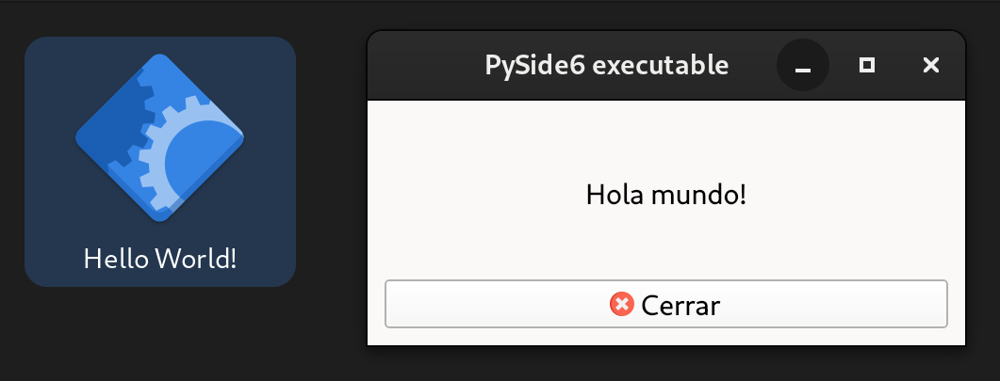

# Distribució d'aplicacions per a distribucions linux/macOS

En [l'activitat resolta 4](../../activitats/4-executable-windows/), vam veure com construir un .exe per a Windows. Farem el mateix però en aquesta ocasió construirem un .deb per als derivats de Debian, un .rpm per als derivats de Red Hat i un .pkg per als macOS.

## Requisits

- Màquina amb una distribució de linux derivada de debian (Ubuntu, LinuxMint...) amb Python3 instal·lat.
- [Codi font i recursos de l'aplicació](../../code/hello_world/hello_world.zip).
- Es recomana utilitzar el vscode per fer el cas, encara que no és imprescindible.

## Resolució

Partirem del següent codi, que executarem a la màquina amb la distribució de Linux derivada de debian.

```python
import sys, os

from PySide6.QtWidgets import QApplication, QMainWindow, QWidget, QVBoxLayout, QLabel, QPushButton
from PySide6.QtCore import Qt
from PySide6.QtGui import QIcon


main_path = os.path.dirname(__file__)

class MainWindow(QMainWindow):

    def __init__(self):
        super(MainWindow, self).__init__()

        self.setWindowTitle("PySide6 executable")

        layout = QVBoxLayout()

        label = QLabel("Hola mundo!")
        label.setAlignment(Qt.AlignCenter)
        layout.addWidget(label)

        button = QPushButton("Cerrar")
        button.setIcon(QIcon(os.path.join(main_path, "resources", "close.png")))
        button.pressed.connect(self.close)
        layout.addWidget(button)

        widget = QWidget()
        widget.setLayout(layout)
        self.setCentralWidget(widget)

def main():
    app = QApplication(sys.argv)
    app.setWindowIcon(QIcon(os.path.join(main_path, "resources", "hand.png")))

    window = MainWindow()
    window.show()

    app.exec()

if __name__ == "__main__":
    main()
```

Instal·lem un entorn virtual (venv) i les llibreries PySide6 i pyinstaller:

```bash
$ python3 -m venv venv
$ source venv/bin/activate
(venv) $ pip install PySide6 pyinstaller
```

Construim l'executable amb pyinstaller:

```bash
$ pyinstaller --onefile -n "hello-world" --add-data="resources:resources" -w hello_world.py
```

A `dist/hello-world` tindrem l'executable, que podem executar directament fent-hi doble clic.

<figure markdown>
  { width="400" }
  <figcaption>Executable a Linux</figcaption>
</figure>

Necessitem instal·lar [fpm](https://github.com/jordansissel/fpm), que és una aplicacions de ruby ​​(anomenades gemmes) per construir el rpm, deb o pkg segons el nostre sistema operatiu:

```bash
$ sudo apt-get install ruby
$ gem install fpm --user-install
```
!!! warning "Compte!"
    Comprovem que fpm està instal·lat i al nostre *path*, en cas de no ser així l'afegim editant el fitxer ~.bashrc.

    ```bash
    $ fpm --version
    ```

Crearem un accés directe abans de construir l'aplicació, de manera que puguem accedir ràpidament. El fitxer serà hola-mundo.desktop amb el contingut següent:

```bash
[Desktop Entry]

Type=Application

Name=hello-world

Comment=Hello World! with PySide6.

Path=/opt/hello-world

Exec=/opt/hello-world/hello-world

Icon=hello-world

```

Ara, amb l'ajuda del següent script farem la construcció de l'instal·lador i procedirem a instal·lar-lo:

```bash
#!/bin/sh
# Build executable
source ../venv/bin/activate
[ -e build ] && rm -r build
[ -e dist ] && rm -r dist
[ -e hello-world.spec ] && rm hello-world.spec
[ -e hello-world.rpm ] && rm hello-world.rpm
pyinstaller --onefile -n "hello-world" --add-data="resources:resources" -w hello_world.py

# Create folders.
[ -e pkg ] && rm -r pkg
mkdir -p pkg/opt/hello-world
mkdir -p pkg/usr/share/applications
mkdir -p pkg/usr/share/icons/hicolor/scalable/apps

# Copy executable file
cp -r "dist/hello-world" "pkg/opt/hello-world"
# Copy icon file
cp -f resources/hello-world.svg pkg/usr/share/icons/hicolor/scalable/apps/hello-world.svg
# Copy desktop entry file
cp -f hello-world.desktop pkg/usr/share/applications

# Change permissions
find "pkg/opt/hello-world/hello-world" -type f -exec chmod 755 -- {} +
find pkg/usr/share -type f -exec chmod 644 -- {} +

# Create package
# fpm --verbose -C pkg -s dir -t rpm -n "hello-world" -v 0.0.1 -p hello-world.rpm
fpm -C pkg -s dir -t rpm -n "hello-world" -v 0.0.1 -p hello-world.rpm

# Install package
sudo dnf remove hello-world-0.0.1-1.x86_64
sudo dnf install hello-world.rpm

```

!!! warning "Compte!"
    Haurem d'adaptar l'script anterior segons el nostre sistema operatiu:
    - **Línia 29**: l'opció `-t` indica quin tipus de paquet volem construir. Consulta [la documentació](https://fpm.readthedocs.io/en/v1.15.1/packaging-types.html) per proporcionar l'opció correcta segons el teu sistema operatiu.
    - **Línies 32 i 33**: Hauràs de canviar la desinstal·lació i la instal·lació segons el sistema operatiu.