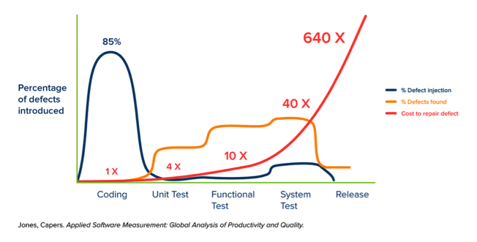
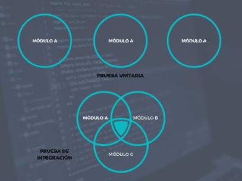
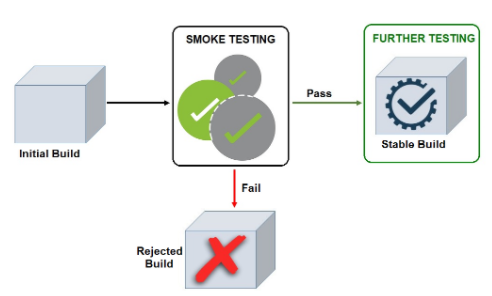
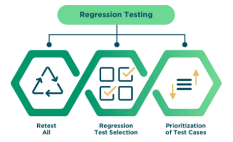

# Tipus de proves d'aplicacions

## Què són les proves de programari?

Qualsevol tipus daplicació necessita ser provada per assegurar uns mínims de qualitat. Aquesta és una etapa fonamental en el procés de desenvolupament, tant en alguns casos que pot arribar a suposar entre el 15 i el 25% de l'esforç total invertit en el desenvolupament de solucions.
És un procés que ens permet verificar i validar la funcionalitat d'un programa o aplicació de programari amb l'objectiu de garantir, no només que està lliure de defectes, sinó que a més compleix una sèrie de requisits establerts prèviament a les especificacions del producte. Implica l'execució, ja sigui manual o automatitzada, d'una sèrie de proves que avaluïn una o diverses propietats del programari.
Aquesta etapa de desenvolupament s'ha de fer en paral·lel a la codificació per evitar problemes posteriors que són molt més costosos de reparar. És en aquesta primera etapa de codificació quan s'introdueixen la majoria de fallades, però moltes vegades no es detecten fins a etapes més avançades, suposant un problema de costos, ja que com més avançat estigui l'estat del projecte, més esforç econòmic, de temps i de recursos sol costar.

<figure markdown>
  
  <figcaption>Errors introduïts, errors trobats i cost de reparació</figcaption>
</figure>

## Objectius de les proves de programari

Entre els objectius principals de l'etapa de testing, podem destacar alguns dels següents:

- Detectar i corregir errors en etapes primerenques del desenvolupament.
- Assegurar la funcionalitat correcta del producte.
- Proporcionar qualitat a la solució adoptada.
- Proveir confiança en laplicació desenvolupada.
- Assegureu-vos que les modificacions no introdueixin errors nous.
- Complir els requisits del negoci.
- Complir els requisits i la satisfacció de lusuari.

## Tipus de proves

Les proves de programari es classifiquen generalment en dues categories principals: proves funcionals i proves no funcionals.

- **Proves funcionals**: Les proves funcionals es duen a terme per comprovar la funcionalitat i la usabilitat principalment. Garanteixen o validen que les característiques i funcionalitats del programari es comporten segons les especificacions, que solen estar en un document anomenat Software Requirement Specification (SRS). Tot i que hi ha molts tipus de proves funcionals per determinar diferents característiques del programari, ens centrarem en les més útils i utilitzades, entre les quals destaquem: les proves de fum, proves unitàries, proves d'integració, proves de regressió i proves d'acceptació.

- **Proves no funcionals o proves de rendiment**: Les proves no funcionals difereixen de les funcionals en què les funcions a considerar es proven en execució del sistema, podent avaluar característiques com ara el rendiment, la fiabilitat, la usabilitat, l'escalabilitat, etc. Normalment es duen a terme mitjançant eines i solucions dautomatització.

## Proves funcionals

Tot i que hi ha més tipus de proves, veurem a continuació els cinc tipus de proves que es poden considerar indispensables en un projecte de programari.

### Proves unitàries

Són proves realitzades pels propis codificadors i executades sobre els elements lògics mínims del sistema, normalment sobre funcions o classes. Això ens porta a refactoritzar el codi, és a dir, reescriure sense canviar-ne la funcionalitat, en etapes primerenques del desenvolupament. Redueixen dràsticament els problemes i temps dedicats a la integració i permeten provar o depurar el codi sense necessitat de disposar del sistema complet, acotant molt els fragments a reescriure.

### Proves d'integració de components

Aquestes proves permeten identificar com funciona el sistema en unir els components de les proves unitàries. Que els components funcionin de manera separada no garanteix que ho facin en unir-se entre ells. Tenen com a objectiu trobar defectes en les comunicacions entre les unitats integrades i validar que el programari es comporti de manera esperada entre els diferents components.
 
S'implementen després de les proves unitàries, provant que la integració de cada part amb les parts confrontants funciona correctament, validant així el comportament dels mòduls en conjunt.
 
Un exemple d'aquest tipus de proves seria que un usuari en fer login sigui dirigit a la pantalla inicial. D'una banda s'hauria provat el login i de l'altra la pantalla d'inici, es comproven ara en conjunt, és a dir, que en fer login es dirigeix ​​a la pantalla corresponent i funciona amb l'usuari loguejat.
 
Les bones pràctiques de desenvolupament de qualitat de programari indiquen que aquestes proves, a diferència de les unitàries que són realitzades pels desenvolupadors, han de ser executades per equips externs al desenvolupament, per evitar el biaix que es pogués produir.

<figure markdown>
  
  <figcaption>Proves d'integració</figcaption>
</figure>

### Proves de fum

Es realitzen a les fases inicials delprovant, i permeten determinar si les parts principals de l'aplicació estan a punt per a més proves. Aquestes parts poden ser aspectes crítics com ara l'inici de sessió o el registre d'usuaris.
 
El resultat de lesprova de fum o proves de fum permet decidir si el programari està llest per afrontar un cicle de proves més exhaustives i costoses, o si cal fer algunes millores abans de passar a la següent fase de testeig. Per dur a terme aquest tipus de proves, cal executar un subconjunt dels casos de prova definits, els quals recorren les funcionalitats crítiques i bàsiques del sistema.
 
Solen representar al voltant d'un 5% del total de proves que cal aplicar, i en cas de no passar-les, la nostra aplicació ha de tornar a l'equip de desenvolupament per corregir els errors o fins i tot començar una nova aplicació des de zero.

<figure markdown>
  
  <figcaption>Proves de fum</figcaption>
</figure>

### Proves de regressió

Són les més utilitzades durant la fase de desenvolupament del producte, ja que permeten verificar que els canvis, ja sigui per la incorporació de noves funcionalitats o la reparació d'errors, no fan malbé parts que anteriorment funcionaven.
Normalment són proves automatitzades que es reutilitzen un cop introduïts els canvis. Això no obstant, se sol fer un mix si s'han introduït grans modificacions o si el programari es troba en una versió inestable. Les tècniques aplicades a aquest tipus de tests poden ser, retestejar-ho tot, seleccionar uns casos en concret o prioritzar casos concrets.

<figure markdown>
  
  <figcaption>Proves de regressió</figcaption>
</figure>

### Proves d'acceptació
 
Pertanyen a la fase final de testing i permeten a l'usuari final validar que el programari compleix les especificacions executant-lo en un entorn real. Són executades de forma manual sense seguir un procediment concret, sinó que l'usuari, juntament amb un analista de proves, va explorant l'aplicació i provant-ne la funcionalitat pas a pas.

<figure markdown>
  
  <figcaption>Proves acceptació</figcaption>
</figure>

## Proves no funcionals

Les proves no funcionals no solen dur-les a terme els equips de desenvolupament, sinó els equips d'implantació d'aplicacions, que seran els encarregats de, a partir del codi generat per l'equip de desenvolupament, implantar l'aplicació per ser utilitzada per l'usuari final . Les principals s'enumeren a continuació, encara que les que realment interessen al programador s'han vist a l'apartat anterior:

- **Proves de rendiment (Prova de permanència):** Avalua el rendiment i la velocitat de resposta de l'aplicació sota una càrrega de treball normal.
- **Prova de càrrega (Load testing):** Prova el comportament d'unaaplicació sota un gran volum de treball, superior a la càrrega normal.
- **Proves d'estrès (Stress Testing):** Determinen si el programari continuarà funcionant sota una càrrega extrema.
- **Proves de volum (Volume Testing):** Prova el rendiment del programari carregant quan processa grans volums de dades.
- **Proves de seguretat (Security Testing):** Verifiquen si el sistema està protegit contra atacs sobtats o deliberats de fonts internes i externes. Cada cop van adquirint més importància, a causa de la necessitat de protegir la informació per part de les empreses i de l'auge dels ciberatacs.
- **Proves de compatibilitat (Compatibility Testing):** Comproveu si l'aplicació és compatible amb diferents entorns i sistemes.
- **Proves d'instal·lació (Install Testing):** Verifica el comportament correcte del programari després de la instal·lació.
- **Proves de recuperació (Recovery Testing):** Determina si un sistema es pot recuperar després d'una fallada o per contra no ho fa.
- **Proves de confiança (Reliability Testing):** Garanteix que el programari funciona de manera consistent realitzant una tasca sense fallar dins un període específic.
- **Proves d'usabilitat (Usability Testing):** Testegen la facilitat d'ús del programari. Aquest tipus de proves és molt important tenir-les en compte a lhora de desenvolupar la interfície gràfica dusuari.
- **Proves de conformitat (Compliance Testing):** Determina si un programa o sistema de programari compleix un conjunt definit d'estàndards interns o externs abans del llançament a producció.