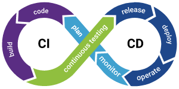
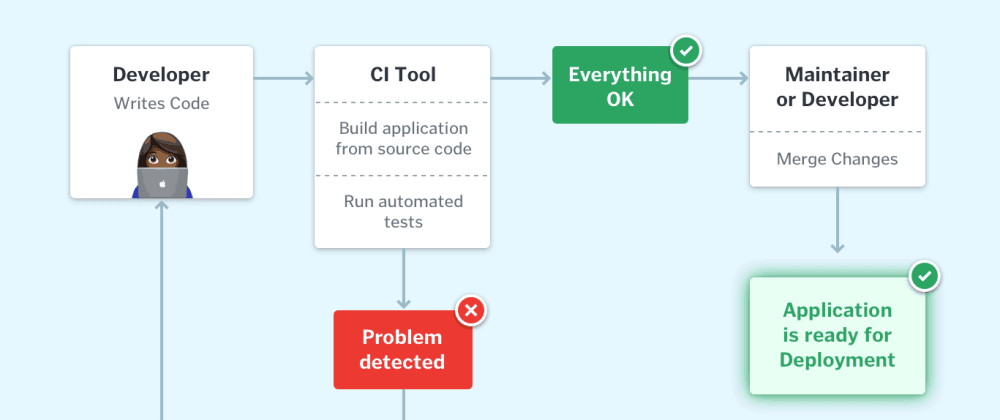
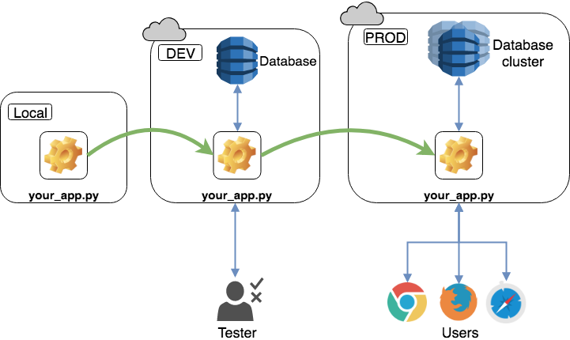
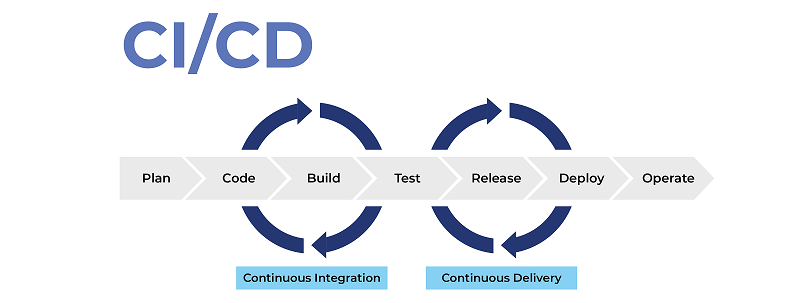
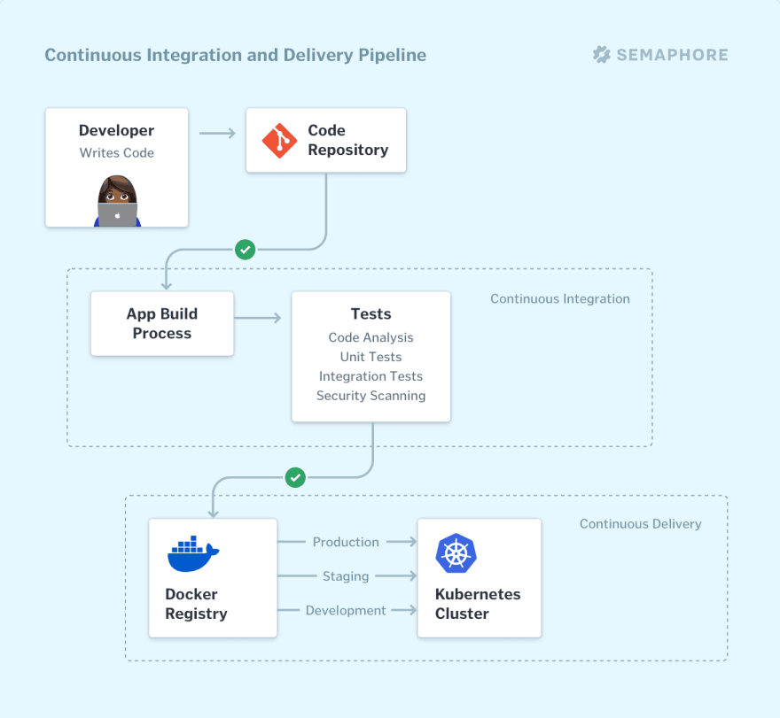

# Integració i entrega/desplegament continus (CI/CD)

## DevOps

El terme DevOps prové de les paraules angleses development 
(desenvolupament) i operations (operacions) i fa referència a la unió de
les diferents persones, processos i tecnologies per oferir solucions
millors de manera més ràpida i eficient.

Anteriorment, cada persona de l'equip exercia un rol diferent de
manera aïllada. Cadascuna controlava de la seva faceta però no sabia
pràcticament res de la resta de passos, de què s'encarregaven altres
persones de l'equip. Amb la implantació de la cultura DevOps, cadascun
dels rols està implicat més o menys en cadascuna de les fases del cicle
de vida d'una aplicació.

Si ens fixem en la línia de DevOps disponible a l'enllaç del mapa de
pràctiques àgils, veiem que aquesta ruta, ens fa referència a quatre
conceptes:

- Control de versions
- Construccions automàtiques
- Integració contínua
- Desplegament continu

El terme de control de versions ja sabem què és i el de construccions
automàtiques l'estudiarem amb més profunditat a l'apartat següent. En
aquest apartat ens centrarem en què són la integració i el desplegament
continus.

Refer imatge (traduccions: planificar, monitoritzar, operar, desplegar,
llançar, proves contínues, construir, codificar)

## Què ésla integració contínua (CI)

La integració continua (CI: continuous integration) és una pràctica de
desenvolupament de programari on cada membre d'un equip integra el
treball amb la resta de manera molt freqüent. Aquesta integració pot
variar, però se sol produir, almenys, una vegada al dia. Cada integració
que es produeix, es verifica mitjançant una construcció i execució de
les proves definides, per detectar errors com més aviat millor. Tant la
construcció com les proves es fan de manera automatitzada, de manera que
el temps que es triga a fer una integració sol ser d'uns minuts.

El codi font s'allotja en un dipòsit compartit per tots els membres de
l'ordinador. Per treballar sobre aquest desenvolupament, cada
desenvolupador obtindrà una còpia local sobre la qual farà les seves
modificacions i proves. Un cop verificat el codi en local, aquest
s'intentarà integrar al repositori comú ja amb els canvis introduïts.
Una integració satisfactòria ens deixarà en situació de passar a les
etapes de desplegament continu següents.

En cas que la integració no sigui satisfactòria, el sistema bloquejarà
el progrés cap a etapes posteriors, de manera que el problema no arriba
arrossegat fins a lusuari final. Quan aquesta situació es produeix, es
rebrà una notificació que la integració ha fallat, de manera que el
problema es resoldrà de forma gairebé immediata, en ser la detecció tan
primerenca.

La integració contínua ve necessàriament acompanyada de transparència,
ja que tots els membres de l'equip participen del procés, i l'estat
d'aquest és normalment reportat a tots ells. Això comporta que quan
salta una alerta provocada per algun error a la integració, tots els
membres de l'equip són informats i poden col·laborar per tornar a
l'estat satisfactori del procés.

## Entrega i desplegament continu (CD)

El lliurament continu (CD) lliurament continu, es refereix al
procés de preparar el llançament de l'aplicació, perquè estigui
disponible i pugui ser utilitzada per l'usuari final. Si a més s'inclou
un procés de desplegament automàtic de l'aplicació, estem davant d'un
procés dedesplegament continu (CD) o desconnecteu
contínuament.

Fins i tot després d'haver provat els nostres desenvolupaments amb
èxit, no podem estar segurs al 100% que funcionarà en producció. Per
això, a la majoria de desplegaments, s'introdueix un pas intermedi
entre la integració i la distribució o desplegament final en un entorn
que imiti al màxim l'entorn final. És freqüent referir-se a aquests
entorns com DEV, PRE de desenvolupament, o de proves i PRO, PROD o de
producció respectivament. Si a més, l'equip local es manté el més
semblant possible a aquests entorns, reduirem les anomalies en desplegar
les nostres aplicacions.

## Flux de CI/CD

Els processos de CI i CD normalment estan presentats com una seqüència
contínua de passos o flux, on el nou codi flueix a través d'una sèrie
de passos o etapes (contrucció, proves, posada en producció...) i es
publica com una nova versió a l'extrem final.

Cada etapa se sol representar com una unitat lògica del procés que es
poden executar seqüencialment i en alguns casos en paral·lel, agilitzant
encara més el procés global.

Totes les empreses competitives practiquen avui dia la integració i
entrega/desplegaments continus.